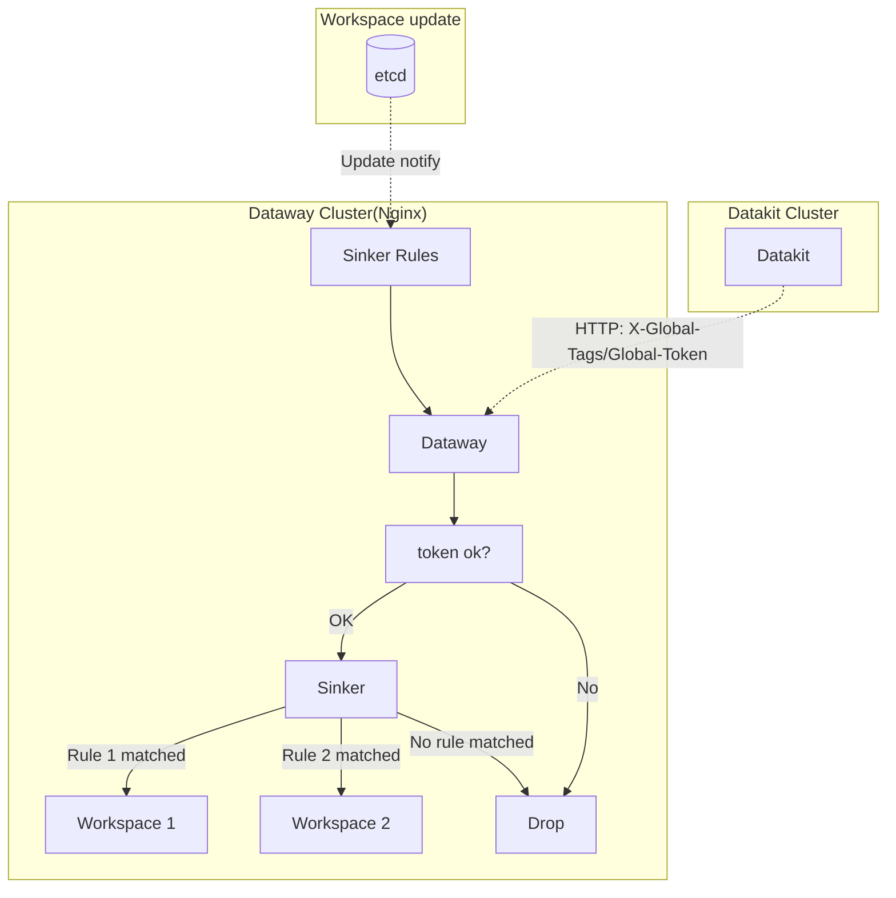

# Dataway Sink
---

[:octicons-tag-24: Version-1.14.0](changelog.md#cl-1.14.0).

---

## Dataway Sinker

In the daily data collection process, there are many different workspaces, we may need to upload different data into different workspaces. For example, in a Kubernetes cluster, the data collected may involve different teams or business units, At this time, we can separate data by specific attributes, and then upload them to different workspaces to achieve fine-grained observability of infrastructures.

Following workflow showing the network topology:



## etcd Settings {#etcd-settings}

> Following operation are under Linux.

As etcd(version 3.5+) client, We can setup following user and role for Dataway, see [here](https://etcd.io/docs/v3.5/op-guide/authentication/rbac/#using-etcdctl-to-authenticate){:target="_blank"} for more details.

Create role `dataway` and the role:

```shell
# Add user name dataway, here will prompt input for password.
$ etcdctl user add dataway 

# Add role `sinker'.
$ etcdctl role add sinker 

# Add user `dataway' to role `sinker'.
$ etcdctl user grant-role dataway sinker

# Limit operation on key `/dw_sinker' and `/ping'
$ etcdctl role grant-permission sinker readwrite /dw_sinker
$ etcdctl role grant-permission sinker readwrite /ping       # used to test if connection ok.
```

<!-- markdownlint-disable MD046 -->
???+ info "Why create the role？"

    Role used to setup permission on specific etcd keys. Here we may use your exist etcd service, and we recommend to setup separated permission to protect your etcd.

???+ attention

    If etcd enabled [authenticate mode](https://etcd.io/docs/v3.5/op-guide/authentication/rbac/#enabling-authentication){:target="_blank"}, we have to run `etcdctl` with username and password:

    ```shell
    $ etcdctl --user name:password ...
    ```
<!-- markdownlint-enable -->

### Prepare Sinker Rules {#prepare-sink-rules}

For example, if you exist *sinker.json* like following:

```json
{
    "strict":true,
    "rules": [
        {
            "rules": [
                "{ host = 'my-host'}"
            ],
            "url": "https://kodo.guance.com?token=tkn_xxxxxxxxxxxxxxxxxxxxxxxxxxxxxxxx"
        },
        {
            "rules": [
                "{ host = 'my-host' OR cluster = 'cluster-A' }"
            ],
            "url": "https://kodo.guance.com?token=tkn_yyyyyyyyyyyyyyyyyyyyyyyyyyyyyyyy"
        }
     ]
}
```

We can import these rules with `etcdctl`:

```shell
$ etcdctl --user dataway:PASSWORD put /dw_sinker "$(<sinker.json)"
OK
```

### Install Dataway {#dw-install}

Install Dataway with following command:

```shell
DW_KODO=https://kodo.guance.com \
DW_TOKEN=tkn_xxxxxxxxxxxxxxxxxxxxxxxxxxxxxxxx \
DW_SECRET_TOKEN=tkn_yyyyyyyyyyyyyyyyyyyyyyyyyyyyyyyy \
DW_UUID=<YOUR-UUID> \
bash -c "$(curl https://static.guance.com/dataway/install.sh)"
```

Available command line environments:

| Name                   | Default                 | Description                                                                                | Examples             |
| ---                    | ---                     | ---                                                                                        | ---                  |
| `DW_SECRET_TOKEN`      | -                       | Dataway `secret_token`                                                                     | Same length as token |
| `DW_HTTP_CLIENT_TRACE` | false                   | Enable HTTP trace metrics                                                                  | `on`/`yes`           |
| `DW_CASCADED`          | false                   | Enable Dataway cascading, If next hop is not Kodo but another Dataway, we MUST enable this | `on`/`yes`           |
| `DW_ETCD_HOST`         | `http://localhost:2379` | Specify etcd host, if there are multiple etcd, we can add them manually in *dataway.yaml*  | `http://ip:port`     |
| `DW_ETCD_USERNAME`     | `dataway`               | etcd username                                                                              |                      |
| `DW_ETCD_PASSWORD`     | -                       | etcd password                                                                              |                      |

## Dataway Settings {#dw-config}

We have to setup following extra configures(default under */usr/local/cloudcare/dataflux/dataway/*):

```yaml
# setup Kodo server, or next cascaded Dataway
remote_host: https://kodo.guance.com

# if remote_host is another Dataway, we must enable cascaded
cascaded: false

# secret_token used to validate incomming datakit request. if not set
# all incomming request are accepted.
secret_token: tkn_xxxxxxxxxxxxxxxxxxxxxxxxxxxxxxxx

# sinker settings
sinker:
  etcd: # etcd
    urls:
    - http://localhost:2379
    dial_timeout: 30s
    key_space: /dw_sinker
    username: "dataway"
    password: "<PASSWORD>"

  #file: # we can setup a local disk file(JSON) for debugging
  #  path: /path/to/sinker.json
```

<!-- markdownlint-disable MD046 -->
???+ attention

    If `secret_token` not set, any request from Datakit are accepted, this is ok for testing, but if Dataway deployed in public network, we recomment setup the `secret_token`.
<!-- markdownlint-enable -->

## Token Naming {#spec-on-secret-token}

Datakit will checking the token, so the `token`(include `secret_token`) must satisfy following format:

> Start with `token_` or `tkn_`, then suffixed with 32 alphanumeric characters.

For invalid token, Datakit installation will fail.

## Datakit Settings{#config-dk}

We need to config Datakit to change it's upload strategy.

- Config GCK(*Global Customer Key*) list

Datakit will construct a fingerprint from collected tags and fields(only accept `string` type) according GCK.

<!-- markdownlint-disable MD046 -->
=== "Host Install"

    See [here](datakit-install.md#env-sink)

=== "Kubernetes"

    See [here](datakit-daemonset-deploy.md#env-sinker)
<!-- markdownlint-enable -->

- Config GHT(*Global Host Tags*) and GET(*Global Election Tags*)

Datakit will attach GHT and GET into fingerprint, and embed the fingerprint in HTTP header `X-Global-Tags` send to Dataway.

<!-- markdownlint-disable MD046 -->
=== "Host Install"

    See [here](datakit-install.md#common-envs)

=== "Kubernetes"

    See [here](datakit-daemonset-deploy.md#env-common)
<!-- markdownlint-enable -->

## Supported Categories {#coverage}

Sinker support [common categories](apis.md#category), also include [Session Replay](../integrations/rum.md#rum-session-replay) and [Profiling](../integrations/profile.md). But Dialtesting are not supported.

## Dataway Metrics {#collect-metrics}

Dataway exported multiple Prometheus metrics, we can collect these metrics via Datakit collector `prom`, this is a example conf:

```toml
[[inputs.prom]]
  ## Exporter URLs.
  urls = [ "http://localhost:9090/metrics", ]

  source = "dataway"

  election = true

  ## we recommend use `dw' as measurement
  measurement_name = "dw"
```

We can search `dataway` in **Inner View**, then we can see the metrics collected by Datakit.

<!-- markdownlint-disable MD046 -->
???+ attention "HTTP Trace Metrics"

    Dataway also upload data to Kodo or next Dataway, so there are HTTP client metrics, these metrics are useful for debugging upload issue. We need to enable these metrics manually, set `http_client_trace` to `ture` or setup `DW_HTTP_CLIENT_TRACE=on` in Dataway install command.
<!-- markdownlint-enable -->

### Dataway Prometheus Metrics{#metrics}

Here are all metrics exported by Dataway, we can request `http://localhost:9090/metrics` to get these metrics. Following `curl` will refresh(at 3 seconds) specific metric: 

> If the metrics not shown, maybe related module not working for now.

```shell
watch -n 3 'curl -s http://localhost:9090/metrics | grep -a <METRIC-NAME>'
```

|TYPE|NAME|LABELS|HELP|
|---|---|---|---|
|COUNTER|`dataway_http_api_dropped_total`|`api,method`|API request dropped when sinker rule match failed|
|COUNTER|`dataway_http_api_signed_total`|`api,method`|API signature count|
|SUMMARY|`dataway_http_api_reusable_body_read_bytes`|`api,method`|API re-read body on forking request|
|COUNTER|`dataway_http_api_forked_total`|`api,method,token`|API request forked total|
|GAUGE|`dataway_http_info`|`cascaded,docker,http_client_trace,listen,release_date,remote,secret,token,version`|Dataway API basic info|
|GAUGE|`dataway_cpu_usage`|`N/A`|Dataway CPU usage(%)|
|GAUGE|`dataway_open_files`|`N/A`|Dataway open files|
|GAUGE|`dataway_cpu_cores`|`N/A`|Dataway CPU cores|
|COUNTER|`dataway_process_ctx_switch_total`|`N/A`|Dataway process context switch count(Linux only)|
|COUNTER|`dataway_process_io_count_total`|`N/A`|Dataway process IO count count|
|COUNTER|`dataway_process_io_bytes_total`|`N/A`|Dataway process IO bytes count|
|GAUGE|`dataway_last_heartbeat_time`|`N/A`|Dataway last heartbeat with Kodo timestamp|
|SUMMARY|`dataway_http_api_dropped_expired_cache`|`api,method`|Dropped expired cache data|
|SUMMARY|`dataway_http_api_elapsed_seconds`|`api,method,status`|API request latency|
|SUMMARY|`dataway_http_api_req_size_bytes`|`api,method,status`|API request size|
|COUNTER|`dataway_http_api_total`|`api,method,status`|API request count|
|COUNTER|`dataway_httpcli_tcp_conn_total`|`server,remote,type`|HTTP TCP connection count|
|COUNTER|`dataway_httpcli_conn_reused_from_idle_total`|`server`|HTTP connection reused from idle count|
|SUMMARY|`dataway_httpcli_conn_idle_time_seconds`|`server`|HTTP connection idle time|
|SUMMARY|`dataway_httpcli_dns_cost_seconds`|`server`|HTTP DNS cost|
|SUMMARY|`dataway_httpcli_tls_handshake_seconds`|`server`|HTTP TLS handshake cost|
|SUMMARY|`dataway_httpcli_http_connect_cost_seconds`|`server`|HTTP connect cost|
|SUMMARY|`dataway_httpcli_got_first_resp_byte_cost_seconds`|`server`|Got first response byte cost|
|COUNTER|`dataway_sinker_pull_total`|`event,source`|Sinker pulled or pushed counter|
|GAUGE|`dataway_sinker_rule_error`|`error`|Rule errors|
|GAUGE|`dataway_sinker_rule_last_applied_time`|`source`|Rule last applied time(Unix timestamp)|
|SUMMARY|`dataway_sinker_rule_cost_seconds`|`N/A`|Rule cost time seconds|
|COUNTER|`diskcache_put_total`|`N/A`|cache Put() count|
|COUNTER|`diskcache_put_bytes_total`|`N/A`|cache Put() bytes count|
|COUNTER|`diskcache_get_total`|`N/A`|cache Get() count|
|COUNTER|`diskcache_wakeup_total`|`N/A`|wakeup count on sleeping write file|
|COUNTER|`diskcache_get_bytes_total`|`N/A`|cache Get() bytes count|
|GAUGE|`diskcache_capacity`|`N/A`|current capacity(in bytes)|
|GAUGE|`diskcache_max_data`|`N/A`|max data to Put(in bytes), default 0|
|GAUGE|`diskcache_batch_size`|`N/A`|data file size(in bytes)|
|GAUGE|`diskcache_size`|`N/A`|current cache size(in bytes)|
|GAUGE|`diskcache_open_time`|`N/A`|current cache Open time in unix timestamp(second)|
|GAUGE|`diskcache_last_close_time`|`N/A`|current cache last Close time in unix timestamp(second)|
|GAUGE|`diskcache_datafiles`|`N/A`|current un-read data files|
|SUMMARY|`diskcache_get_latency`|`N/A`|Get() time cost(micro-second)|
|SUMMARY|`diskcache_put_latency`|`N/A`|Put() time cost(micro-second)|
|COUNTER|`diskcache_dropped_bytes_total`|`N/A`|dropped bytes during Put() when capacity reached.|
|COUNTER|`diskcache_dropped_total`|`N/A`|dropped files during Put() when capacity reached.|
|COUNTER|`diskcache_rotate_total`|`N/A`|cache rotate count, mean file rotate from data to data.0000xxx|
|COUNTER|`diskcache_remove_total`|`N/A`|removed file count, if some file read EOF, remove it from un-read list|

## FAQ {#faq}

### Datakit 403 Error {#dk-403}

If Sinker badly configured on Dataway, all request from Datakit(with the `secret_token`) may pass directly to Kodo, and the `secret_token` is not real token of the workspace, so Kodo responde with a 403 error `kodo.tokenNotFound`.

This maybe cause by a invalid username/password of etcd, and the Dataway failed to load Sinker rules. Check your etcd username and password setting.

### etcd Permission Error {#etcd-permission}

If Dataway log got following error, then etcd permission maybe invalid:

```not-set
sinker ping: etcdserver: permission denied, retrying(97th)
```

We can drop all exist permission and role settings, and re-configure them, see [here](https://etcd.io/docs/v3.5/op-guide/authentication/rbac/#using-etcdctl-to-authenticate){:target="_blank"}

### Priority of Tags {#key-priority}

During constructing the HTTP request fingerprint(in HTTP header `X-Global-Tags`), the key from GCK(*Global Customer Keys*) may also exist in GHT(Global Host Tags) and/or GET(Global Election Tags), for this case, we use key-value in collected data.

For example, if GCK list is `key1,key2,key3`, GHT and GET also got same key, like `key1=value-1`, in collected data, there also got a field `key1=value-from-data`. In this case, we'll use `key1=value-from-data` to build the request fingerprint, and ignore key/values from GHT and GET.

If GHT and GET also got same key, we prefer GET to GHT, and the full priority list below(priority DESC):

- Collected data got keys from GCK
- GET
- GHT

### Reserved GCK {#reserved-customer-keys}

Datakit reserved some GCK(*Global Customer Keys*), these keys are not collected tags/field, but we can apply sinker rules on these keys. We can add these keys in `global_customer_keys` in *datakit.conf*.(By default, these keys are not added)

- `class` for object category(`O::`). If enabled, the object's `class` tag will added to request fingerprint. For example, Kubernetes Pod's class is `kubelet_pod`, then we can apply following sinker rule:

``` json
{
    "strict": true,
    "rules": [
        {
            "rules": [
                "{ class = 'kubelet_pod' AND other_conditon = 'some-value' }",
            ],
            "url": "https://openway.guance.com?token=<YOUR-TOKEN>",
        },
        {
            ... # other rules
        }
    ]
}
```

- `measurement` for metric category(`M::`). If enabled, the metric's measurement name will added to request fingerprint. For example, hard-disk's measurement name is `disk`, then following sinker rule are valid for measurement `disk`:

```json
{
    "strict": true,
    "rules": [
        {
           "rules": [
               "{ measurement = 'disk' AND other_conditon = 'some-value' }",
           ],
           "url": "https://openway.guance.com?token=<YOUR-TOKEN>",
        },
        {
            ... # other rules
        }
    ]
}
```

- `source` for Logging(`L::`), eBPF(`N::`), Event(`E::`) and RUM(`R`)
- `service` for Tracing(`T::`), Scheck(`S::`) and Profiling(`P::`)
- `category` for all [common Categories](apis.md#category), for example, we can apply sinker rule on category `logging`:

``` json
{
    "strict": true,
    "rules": [
        {
            "rules": [
                "{ category = 'logging' AND other_conditon = 'some-value' }",
            ],
            "url": "https://openway.guance.com?token=<YOUR-TOKEN>",
        },
        {
            ... # other rules
        }
    ]
}

```

- `__dataway_api` used in specific API requests, we can redirect(sink) the request to specific URL via sinker rule. For example, to redirect Pipeline pull APIs and election APIs to your workspace, we can do like this(election API refers to 2 APIs)

``` json
{
    "strict": true,
    "rules": [
        {
            "rules": [
                "{ __dataway_api in ['/v1/datakit/pull', '/v1/election', '/v1/election/heartbeat'  }",
            ],
            "url": "https://openway.guance.com?token=<YOUR-TOKEN>",
        }
    ]
}
```

<!-- markdownlint-disable MD046 -->
???+ attention

    Keys added to GCK(*Global Customer Keys*) will split the HTTP request(grouped by different fingerprint) into multiple ones, so do not add more than 3 keys to GCK, or the upload performance will decrease dramatically.
<!-- markdownlint-enable -->
