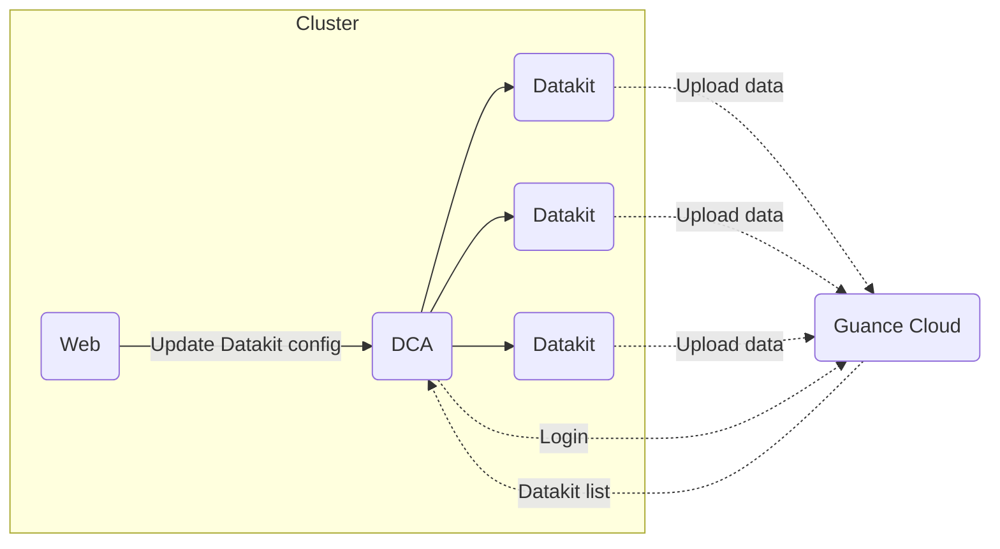

# DCA Client

[:octicons-beaker-24: Experimental](index.md#experimental)

---

:fontawesome-brands-linux: :fontawesome-brands-windows: :fontawesome-brands-apple: :material-kubernetes: :material-docker:

---

DCA is mainly used to manage DataKit, such as DataKit list view, configuration file management, Pipeline management and help document view. At present, it supports two usage modes, namely desktop and web page.

DCA network topology model explained:



## Start DCA Service {#config}

=== "DCA enabled on host installation"

    Add the following environment variables before installing the command:
    
    - `DK_DCA_ENABLE`: Whether to turn on, turn on set to `on`
    - `DK_DCA_WHITE_LIST`: Access service whitelist, support IP address or CIDR format address, multiple addresses separated by commas.
    
    Example:
    
    ```shell
    DK_DCA_ENABLE=on DK_DCA_WHITE_LIST="192.168.1.101,10.100.68.101/24" DK_DATAWAY=https://openway.guance.com?token=<TOKEN> bash -c "$(curl -L https://static.guance.com/datakit/install.sh)"
    ```
    
    After successful installation, the DCA service will start, and the default port is 9531. To modify the listening address and port, set the environment variable `DK_DCA_LISTEN`, for example `DK_DCA_LISTEN=192.168.1.101:9531`。

=== "datakit.conf"

    Modify configuration file `datakit.conf`:
    
    ```toml
    [dca]
        # Open
        enable = true
    
        # Listening for addresses and ports
        listen = "0.0.0.0:9531"
    
        # Whitelist, support specified IP address or CIDR network address
        white_list = ["0.0.0.0/0", "192.168.1.0/24"]
    ```
    
    Once configured, [restart DataKit](datakit-service-how-to.md#manage-service).

=== "Kubernetes"

    See [here](datakit-daemonset-deploy.md#env-dca)

---

???+ Attention

    To open the DCA service, you must configure a whitelist, and if you need to allow access to all addresses, you can either set `DK_DCA_WHITE_LIST=0.0.0.0/0` during installation or `white_list = ["0.0.0.0/0"]` in *datakit.conf*.

## DCA Web Service {#dca-web}

???+ Attention

    Different versions of DataKit interfaces may differ, and it is recommended to upgrade DataKit to the latest version in order to better use DCA. In addition, the Web version of DCA and desktop version still have some missing functions, which will be added slowly later, *and gradually abandon the current desktop version*.

DCA Web is the Web version of DCA client, which provides the interface proxy of DataKit by deploying a back-end service and provides a front-end Web page to access DataKit. 

=== "Docker"

    Docker installation can be found in the document [installing Docker](https://docs.docker.com/desktop/install/linux-install/){:target="_blank"}.

    - Download image

    Before running the container, first download the DCA image through `docker pull`.

    ```shell
    docker pull pubrepo.guance.com/tools/dca
    ```

    - Run the container

    The DCA container is created and started with the `docker run` command, and the default exposed access port of the container is 80.

    ```shell
    docker run -d --name dca -p 8000:80 pubrepo.guance.com/tools/dca
    ```

    - Testing

    After the container runs successfully, it can be accessed through the browser: http://localhost:8000

=== "k8s"

    Create a `dca.yaml` file with the following content:

    ```yaml
    apiVersion: apps/v1
    kind: Deployment
    metadata:
      labels:
        app: utils-dca
      name: dca
      namespace: datakit
    spec:
      replicas: 1
      revisionHistoryLimit: 10
      selector:
        matchLabels:
          app: utils-dca
      strategy:
        rollingUpdate:
          maxSurge: 25%
          maxUnavailable: 25%
        type: RollingUpdate
      template:
        metadata:
          labels:
            app: utils-dca
        spec:
          affinity: {}
          containers:
            - env:
                - name: DCA_INNER_HOST
                  # Hangzhou https://auth-api.guance.com
                  # Ningxia https://aws-auth-api.guance.com
                  # Guangzhou https://cn4-auth-api.guance.com
                  # Oregon https://us1-auth-api.guance.com
                  value: https://auth-api.guance.com
                - name: DCA_FRONT_HOST
                  # Hangzhou  https://console-api.guance.com
                  # Ningxia https://aws-console-api.guance.com/
                  # Guangzhou https://cn4-console-api.guance.com
                  # Oregon https://us1-console-api.guance.com
                  value: https://console-api.guance.com
                - name: DCA_LOG_ENABLE_STDOUT
                  value: 'true'
              image: pubrepo.guance.com/tools/dca:0.0.7
              imagePullPolicy: Always
              name: dca
              ports:
                - containerPort: 80
                  name: http
                  protocol: TCP
              resources:
                limits:
                  cpu: 500m
                  memory: 256Mi   
                requests:
                  cpu: 250m
                  memory: 100Mi              
              resources: {}
              terminationMessagePath: /dev/termination-log
              terminationMessagePolicy: File
          dnsPolicy: ClusterFirst
          restartPolicy: Always
          schedulerName: default-scheduler
          securityContext: {}
          terminationGracePeriodSeconds: 30

    ---
    apiVersion: v1
    kind: Service
    metadata:
      name: dca
      namespace: datakit
    spec:
      ports:
        - name: web
          port: 80
          protocol: TCP
          targetPort: 80
      selector:
        app: utils-dca
      sessionAffinity: None
      type: ClusterIP

    ---
    apiVersion: networking.k8s.io/v1
    kind: Ingress
    metadata:
      name: dca
      namespace: datakit
    spec:
      rules:
        - host: dca.xxxx.com
          http:
            paths:
              - backend:
                  service:
                    name: dca
                    port:
                      number: 80
                path: /
                pathType: Prefix
      # tls:
      #   - hosts:
      #       - dca.xxxx.com
      #     secretName: xxxx

    ```

    Apply `dca.yaml` to your Kubernetes cluster.

    ```shell
    $ kubectl apply -f dca.yaml
    $ kubectl get pod -n datakit
    ```

### Environment Variable Configuration {#envs}

By default, DCA will adopt the default configuration of the system. If you need to customize the configuration, you can modify it by injecting environment variables. The following environment variables are currently supported:

| Environment Variable Name            | Type   | Default Value                         | Description                                                                                            |
| :---------              | ----:  | :---                           | ------                                                                                          |
| `DCA_INNER_HOST`        | string | https://auth-api.guance.com    | auth API address of Guance Cloud                                                                          |
| `DCA_FRONT_HOST`        | string | https://console-api.guance.com | Guance Cloud console API address                                                                         |
| `DCA_CONSOLE_PROXY`     | string | None                              | Guance Cloud API proxy, without proxying the DataKit API |
| `DCA_LOG_LEVEL`         | string |                                | Log level, the value is NONE/DEBUG/INFO/WARN/ERROR. If logging is not required, it can be set to NONE.                  |
| `DCA_LOG_ENABLE_STDOUT` | bool   | false                          | The log is output to a file under `/usr/src/dca/logs`. If you need to write the log to `stdout`, you can set it to `true` |

Example:

```shell
$ docker run -d --name dca -p 8000:80 -e DCA_LOG_ENABLE_STDOUT=true -e DCA_LOG_LEVEL=WARN pubrepo.guance.com/tools/dca
```

### Log in to DCA {#login}

After DCA is opened and installed, you can enter the address `localhost:8000` in the browser to open DCA Web, log in to your account, and start using it. If you don't have an account, you can register [Guance Cloud Account](https://auth.guance.com/register?channel=帮助文档){:target="_blank"}.

<figure markdown>
  { width="800" }
</figure>

After logging in to DCA, you can select the workspace in the upper left corner to manage its corresponding DataKit and collector, which supports quick filtering of host names to be viewed and managed by searching keywords.

Hosts remotely managed through DCA are divided into three states:

- online: indicating that the data report is normal, you can view the operation of DataKit and configure the collector through DCA;
- unknown: indicates that the remote management configuration is not turned on or is not in a local area network;
- offline: It means that the host has not reported data for more than 10 minutes, or after the host name is modified, the original host name will be displayed as offline. Hosts that do not report data normally will be removed from the list if they do not report data for more than 24 hours.

By default, you can only view information of the DataKit in the current workspace. If you need to manage DataKit, such as restarting it, creating, deleting, or modifying DataKit collector config file, pipelines, you need to grant current user DCA configuration management permission. Please refer to [role management](../management/role-management.md) for specific settings.

#### View How DataKit is Running {#view-runtime}

After logging in to DCA, select a workspace to view the hostname and IP information of all DataKits installed in that workspace. Click on the DataKit host to connect to the DataKit remotely, and view the running status of the DataKit on the host, including version, running time, publishing data and collector running status.

<figure markdown>
  { width="800" }
</figure>

#### View Collector Configuration {#view-inputs-conf}

After connecting to the DataKit remotely, click "Collector Configuration" to view the list of collectors and Sample that have been configured (all Sample files that are currently supported by DataKit).

- Configured list: you can view all conf files under it.
- Sample list: You can view all the sample files under it.
- Help: You can view the corresponding collector help document

Note: DCA does not support configuration of collector at present, so it is necessary to log in to the host remotely for configuration operation.

<figure markdown>
  { width="800" }
</figure>

#### View Log Pipeline {#view-pipeline}

After connecting to the DataKit remotely, click「Pipelines」to view the pipeline file that comes with the DataKit by default. Refer to the document [text data processing ](pipeline.md) for pipeline.

<figure markdown>
  { width="800" }
</figure>

#### View the Blacklist {#view-filters}

After connecting to DataKit remotely, click "Blacklist" to view the blacklist configured in the observation cloud. As shown in the following figure, `source = default and (status in [unknown])` is the configured blacklist condition.

Note: The blacklist files created through Guance Cloud are stored in the path: `/usr/local/datakit/data/.pull`.

<figure markdown>
  { width="800" }
</figure>

#### View Collector Help {#view-input-helper}

After connecting to DataKit remotely, click Help to view the list of collector documents. Click the name of the collector you need to view, and jump directly to display the help document of the collector.

For help on how to view more collectors, refer to the document [Collectors](hostobject.md).

<figure markdown>
  { width="800" }
</figure>
