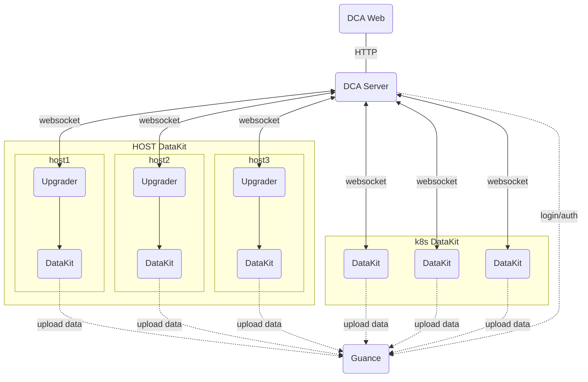

# DCA Client

[:octicons-beaker-24: Experimental](index.md#experimental)

---

:fontawesome-brands-linux: :fontawesome-brands-apple: :material-kubernetes: :material-docker:

---

DCA(DataKit Control App) is a web-based management system for centralized DataKit administration.Utilizing a B/S architecture and WebSocket bidirectional communication protocol, it enables unified management of DataKit, such as DataKit list view, runtime info, configuration file management and Pipeline management.

DCA network topology model explained:



## DCA Web Service {#dca-web}

The DCA web service currently supports deployment via container images only, which can be implemented through either Docker or Kubernetes.

<!-- markdownlint-disable MD046 -->
=== "Docker"

    Docker installation can be found in the document [installing Docker](https://docs.docker.com/desktop/install/linux-install/){:target="_blank"}.

    - Download image

    Before running the container, first download the DCA image through `docker pull`.

    ```shell
    docker pull pubrepo.guance.com/tools/dca
    ```

    - Run the container

    The DCA container is created and started with the `docker run` command, and the default exposed access port of the container is 80.

    ```shell
    docker run -d --name dca -p 8000:80 pubrepo.guance.com/tools/dca
    ```

    - Testing

    After the container runs successfully, it can be accessed through the browser: http://localhost:8000. And the websocket address is `ws://localhost:8000/ws`.

=== "k8s"

    Download [*dca.yaml*](https://static.guance.com/datakit/dca/dca.yaml){:target="_blank"}. Edit the configuration parameters in the file and apply `dca.yaml` to your Kubernetes cluster.

    ```shell
    $ kubectl apply -f dca.yaml
    $ kubectl get pod -n datakit
    ```

<!-- markdownlint-enable -->
### Environment Variable Configuration {#envs}

By default, DCA will adopt the default configuration of the system. If you need to customize the configuration, you can modify it by injecting environment variables. The following environment variables are currently supported:

| Environment Variable Name            | Type   | Default Value                         | Description                                                                                            |
| :---------              | ----:  | :---                           | ------                                                                                          |
| `DCA_CONSOLE_API_URL`        | string | `https://console-api.guance.com` | Guance Cloud console API address, refer [node address](dca.md#node-address) |
| `DCA_CONSOLE_WEB_URL`        | string | `https://console.guance.com` | Guance Cloud page address, refer [node address](dca.md#node-address)                                                                        |
| `DCA_STATIC_BASE_URL`        | string | `https://static.guance.com` | static resource address                                                                         |
| `DCA_CONSOLE_PROXY`     | string | None                              | Guance Cloud API proxy, but does not proxy the DataKit API |
| `DCA_LOG_LEVEL`         | string |  info                              | Log level, the value is debug/info/warn/error.                  |
| `DCA_LOG_PATH` | string   |      None          | The log path. If you need to write the log to `stdout`, you can set it to `stdout` |
| `DCA_TLS_ENABLE`         | string |  None                            | enable TLS when the value is not empty                  |
| `DCA_TLS_CERT_FILE`         | string |  None                            | the cert file path, such as `/etc/ssl/certs/server.crt`                  |
| `DCA_TLS_KEY_FILE`         | string |      None                        | the key file path, such as `/etc/ssl/certs/server.key`                  |

Example:

```shell
docker run -d --name dca -p 8000:80 -e DCA_LOG_PATH=stdout -e DCA_LOG_LEVEL=info pubrepo.guance.com/tools/dca
```

### Node address {#node-address}

| Deploy Type  | Node Name       | `DCA_CONSOLE_API_URL`| `DCA_CONSOLE_WEB_URL`|
|-------|-----------|--------------------------------| --------------------------------|
| SaaS | China 1(Hangzhou)  | `https://console-api.guance.com`     | `https://console.guance.com` |
| SaaS | China 2(Ningxia)   | `https://aws-console-api.guance.com`|`https://aws-console.guance.com` |
| SaaS | China 4(Guangzhou) | `https://cn4-console-api.guance.com`|`https://cn4-console.guance.com` |
| SaaS | China 6(Hong Kong) | `https://cn6-console-api.guance.com`|`https://cn6-console.guance.com` |
| SaaS | Overseas Region1(Oregon) |`https://us1-console-api.guance.com`|`https://us1-console.guance.com` |
| SaaS | European 1(Frankfurt) |`https://eu1-console-api.guance.com`|`https://eu1-console.guance.com` |
| SaaS | Asia 1(Singapore) |`https://ap1-console-api.guance.com`|`https://ap1-console.guance.com` |
| Private | Private     |Deployment address |Deployment address |

## DataKit config {#config}

<!-- markdownlint-disable MD046 -->
???+ Attention

    Different versions of DataKit interfaces may differ, and it is recommended to upgrade DataKit to the latest version in order to better use DCA.

=== "DCA enabled on host installation"

    Add the following environment variables before installing the command:
    
    - `DK_DCA_ENABLE`: Whether to turn on, turn on set to `on`
    - `DK_DCA_WEBSOCKET_SERVER`: DCA websocket server address.([:octicons-tag-24: Version-1.64.0](changelog.md#cl-1.64.0))
    
    Example:
    
    ```shell
    DK_DCA_ENABLE=on DK_DCA_WEBSOCKET_SERVER="ws://<dca_server_address>/ws" DK_DATAWAY=https://openway.guance.com?token=<TOKEN> bash -c "$(curl -L https://static.guance.com/datakit/install.sh)"
    ```
    
    After successful installation, the DataKit will automatically connect to the DCA service.。

=== "Kubernetes"

    Can be turned on by [setting DCA related environment variable](../datakit/datakit-daemonset-deploy.md#env-dca).

=== "`datakit.conf`"

    Modify configuration file `datakit.conf`:
    
    ```toml
    [dca]
        # Open
        enable = true
    
        # websocket server address
        websocket_server = "ws://<dca_server_address>/ws"
    
    ```
    
    Once configured, [restart DataKit](datakit-service-how-to.md#manage-service).

=== "Kubernetes"

    See [here](datakit-daemonset-deploy.md#env-dca)

---

<!-- markdownlint-enable -->
## DCA management {#dca-manage}

### Log in to DCA {#login}

After the DCA is enabled and installed, you can access it by entering the DCA web address in your browser. When you visit it for the first time, the page will redirect you to a login transition page. After clicking the "Go Now" button at the bottom of the page, you will be guided to the GuanceCloud platform. Then, follow the instructions on the page to configure the DCA address. Once the configuration is completed, you will be able to directly access the DCA platform through the Guance Cloud platform without logging in.

<figure markdown>
  { width="800" }
</figure>

### View Datakit list {#datakit-list}

After logging in to DCA, you can select the workspace in the upper left corner to manage its corresponding DataKit and collector, which supports quick filtering of host names to be viewed and managed by searching keywords.

Hosts remotely managed through DCA are divided into three states:

- running: indicating that the data report is normal, you can view the operation of DataKit and configure the collector through DCA;
- offline: It means that the DataKit is off line.
- stopped: It means that the DataKit is stopped.
- upgrading: It means that the DataKit is upgrading.
- restarting: It means that the DataKit is restarting.

By default, you can only view information of the DataKit in the current workspace. If you need to manage DataKit, such as upgrading it, creating, deleting, or modifying DataKit collector config file, pipelines, you need to grant current user DCA configuration management permission. Please refer to [role management](../management/role-management.md) for specific settings.

<figure markdown>
  { width="800" }
</figure>

### View How DataKit is Running {#view-runtime}

After logging in to DCA, select a workspace to view the hostname and IP information of all DataKits installed in that workspace. Click on the DataKit host to connect to the DataKit remotely, and view the running status of the DataKit on the host, including version, running time, publishing data and collector running status.

<figure markdown>
  { width="800" }
</figure>

### View Collector Configuration {#view-inputs-conf}

After connecting to the DataKit remotely, click "Collector Configuration" to view the list of collectors and Sample that have been configured (all Sample files that are currently supported by DataKit).

- Configured list: you can view all conf files under it.
- Sample list: You can view all the sample files under it.
- Help: You can view the corresponding collector help document

Note: DCA does not support configuration of collector at present, so it is necessary to log in to the host remotely for configuration operation.

<figure markdown>
  { width="800" }
</figure>

### View Log Pipeline {#view-pipeline}

After connecting to the DataKit remotely, click「Pipelines」to view the Pipeline file that comes with the DataKit by default. Refer to the document [text data processing](../pipeline/index.md) for Pipeline.

<figure markdown>
  { width="800" }
</figure>

### View the Blacklist {#view-filters}

After connecting to DataKit remotely, click "Blacklist" to view the blacklist configured in the Guance Cloud. As shown in the following figure, `source = default and (status in [unknown])` is the configured blacklist condition.

Note: The blacklist files created through Guance Cloud are stored in the path: `/usr/local/datakit/data/.pull`.

<figure markdown>
  { width="800" }
</figure>

### View DataKit log {#view-log}

After connecting to DataKit remotely, click "Log" to view the logs of DataKit and also the logs can be exported.

<figure markdown>
  { width="800" }
</figure>

## Changelog {#change-log}

### 0.1.0(2024/11/27) {#cl-0.1.0}

- Refactored the DCA underlying framework to use WebSocket protocol for communication, making it easier to manage DataKit in different network environments.
- Added the functionality to manage the main configuration of DataKit.
- Added support for TLS configuration.
- Changed the "Reload" feature of DataKit to "Restart".
