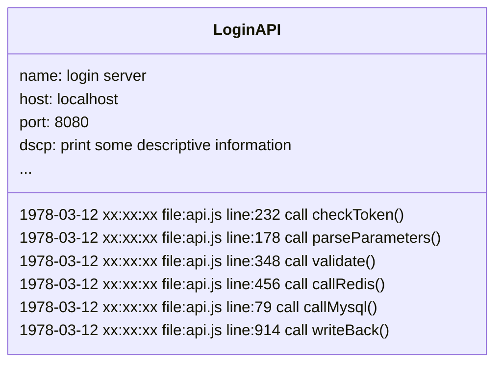
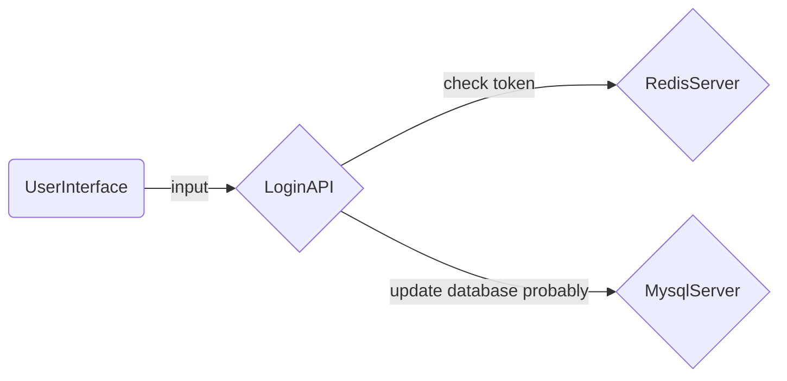

# Brief Introduction of Program Tracing System {#intro}

Program log is the breadcrumbs of code execution process. Searching for these breadcrumbs can not only find bugs hidden in code: Bug:fontawesome-solid-bug:; more importantly, continuous program log tracking provides an observable way to build program execution process.

## Start with the Log {#log}

> Have and only log files

Before the Tracking System, the only way we could get the health of the system was through local logs, `actually logging several generations of iterations of different types of products before the Tracking System`.

By locating the standard output and standard error output to a local file and using the power of the magic operating system, we can ideally get an endless log of program execution. As long as the system does not crash, there is no single error, and there is no process interrupting your file writing stream, you can always get a process execution process file and search for events you care about in the oversized file.

## Before Traceable {#befor}

> Log server

The importance of program logs to programs gives birth to independent log servers. Yes, you don't have to worry about SPoF. The log server is waiting on a fixed port to continuously record the program log sent by the process.

In the early stages of log servers, they work more like file servers, except that the operation interface changes from terminal to browser, and the logs that can be retrieved change from a single program to multiple programs. But the log is still that log that heap of process execution sequence records, as follows simulates a log on the login server.

Only isolated program events can be seen in the log text, but it is difficult to get the running status of the program from an execution document. In the later stage of the file server, a UI for log viewing and a series of program running environment status parameters appeared. The log service in this stage is more like a database service based on log files. Yes, you can search for program events you care about more smoothly.

## Tracing System {##tracing}

> The Rise of Observability

The program tracing system is not a more advanced logging service. It is not even a logging service, but it is a real breadcrumb. Tracing system will generate execution state data structure (Span) in the process of process execution. With the step-by-step advancement of processing flow, a large number of Spans are connected according to their execution order to form the Tracing of the current process, and multiple processes are connected according to their calling order to form the observable execution state of the current system.

Or take a fictitious login service as an example:

The above figure only shows the link diagram generated by the tracing system under multi-process. In fact, you can also see the status of each execution process like a log in the tracing system. If you want, you can customize each field in the reported status data structure (Span) and give them meaning. Tracing system is not used for Debug. `Of course, bugs can't be hidden in tracking system.` Tracing system finds system problems by describing the running state of the system in detail, thus providing a positive feedback mechanism to promote the iteration of versions and continuously improve the system.

Tracing system mainly solves two problems:

`How to collect status data`

Based on the technology stack on which the implementation of the monitored system depends. The common [tracing system solutions](datakit-tracing-introduction.md#sln) in the market provide fully automatic data acquisition and manual data collection. By monitoring the runtime of programs to complete system tracking, such as NodeJS, JAVA, C #, etc., all system implementations based on this kind of technology stack can carry out automatic system tracing. At the same time, the Tracing system provides a Tracing Library for all technology stacks, so that we can track the system manually by introducing dependencies into the project and making simple code editing.

`How to organize state data`

: The natural relationship between calling and being called in the process of program execution makes all tracking systems in the market concatenate the definition of state data structure in a parent-child relationship. Use ParentID and ID to associate Span generated by caller and callee. Different calling procedures in the same process (including threads in concurrent environment here) connect parent procedures and child procedures by passing context containing caller ID; Between different processes, the caller associates the parent process with the child process by sending the context containing his ID between different processes (which can praise the communication of the process through the network or Pipeline, etc.).

## Tracing System Solution {#sln}

Program Performance Monitoring (APM): The ability to track programs in the market can be said to be indispensable. Here is a brief introduction to several common solutions in the market.

[DataDog](https://docs.datadoghq.com/tracing/){:target="_blank"}

: Presently the most complete APM solution provider, providing monitoring and deep visualization capabilities for applications in production environments. Provide out-of-the-box performance monitoring dashboards for network services, message queues, and databases to monitor all program events. Tracing link data can be seamlessly linked across services and containers to sessions, logs, system profiles, comprehensive inspection, networks, processes, and system basic measurements. In DataDog, you can directly locate the code causing the problem when investigating a slow link caused by a system bottleneck.

[Jaeger](https://www.jaegertracing.io/docs/){:target="_blank"}

: Jaeger is an open source distributed program tracing system, inspired by Dapper and OpenZipkin, released by Uber Technologies, especially suitable for monitoring systems based on microservice architecture. It provides the following capabilities
:  - Distributed context propagation
:  - Distributed transaction monitoring
:  - Analytical ability to trace the source
:  - Service dependency analysis
:  - Performance optimization
: If you are interested in Jaeger, you can refer to the [internal practice](https://www.uber.com/blog/distributed-tracing/){:target="_blank"} of Uber's technical team.

[OpenTelemetry](https://opentelemetry.io/docs/){:target="_blank"}

: OpenTelemetry (OTeL) is an open source program visualization framework developed based on third-party tracking protocols that detects, generates, collects, and pumps monitoring data such as tracking links, metrics, logs, etc. As an industry standard, it is natively supported by many service providers.

[SkyWalking](https://skywalking.apache.org/docs/){:target="_blank"}

: SkyWalking is an open source APM system, which provides distributed cloud-based systems with monitoring, tracking, diagnosis and other capabilities. The core capabilities are as follows.
: - Server-side measurement analysis
: - Analytical ability to trace the source
: - Service topology analysis
: - Service dependency analysis
: - Slow service discovery
: - Performance optimization
: - Cache monitoring, read-write performance, and slow access discovery
: - Database monitoring, slow query discovery
: - Message queuing performance monitoring
: - Browser performance detection, root tracing capability
: - Infrastructure monitoring provides support for main streaming cloud vendors
: - System Alarm

[Zipkin](https://zipkin.io/pages/quickstart.html){:target="_blank"}

: Zipkin is a distributed tracing system that collects sequential data for system monitoring and discovery of service-level system problems. Zipkin provides a solution that includes data collection and data query. You can jump directly from log to link based on a TraceID in Zipkin UI and provide retrieval capability based on diversified data.

[Datakit](https://docs.guance.com/datakit/datakit-tracing/){:target="_blank"}

: Different from the above tracking systems, the solution provided by Datakit does not generate any program execution state data (Span) or change the data organization form. Datakit listens to receive link data sent by major tracking systems on network ports. Datakit's tracing module not only provides out-of-the-box capability, but also is almost zero configuration, and users can transition to Datakit without friction from any other tracing system.

: Datakit is a link data processing & analysis network service. As a network application, Datakit has the following characteristics:

: - Datakit can continuously handle high-load traffic data, and the multi-channel local caching technology used in Datakit can maintain a low CPU load in the face of flooded link data in practice.
: - Datakit can work continuously in a highly concurrent network request environment. Datakit uses access policies and thread pools to deal with highly concurrent network requests and can control CPU load in a low range.
: - Datakit can dock with many mainstream tracking systems on the market without friction and is still expanding.

: Datakit as an analytic computing tool has the following features

: - Highly flexible and configurable, you can use Datakit's link data capability with zero configuration, and you can customize the various link computing capabilities provided by Datakit including sampling, rare link picking and resource closing through simple configuration.
: - Efficient and distributed consistent sampling algorithm.
: - A variety of data processing filters in the front section of data processing meet the daily data processing needs.
: - Data processing back-end Pipeline support, which allows you to customize data before it is sent to the hub with the help of [the powerful Pipeline script provided by Guance Cloud](https://docs.guance.com/logs/pipelines/text-processing/){:target="_blank"}.

## Summary {#conclude}

Tracking system provides a multi-dimensional and deep visualization ability of system execution state, which changes the form of system maintenance and development, greatly reduces the cost of development and operation and maintenance, and can provide various analysis tools to find system bottlenecks, which gives valuable clues for subsequent system version iteration.
