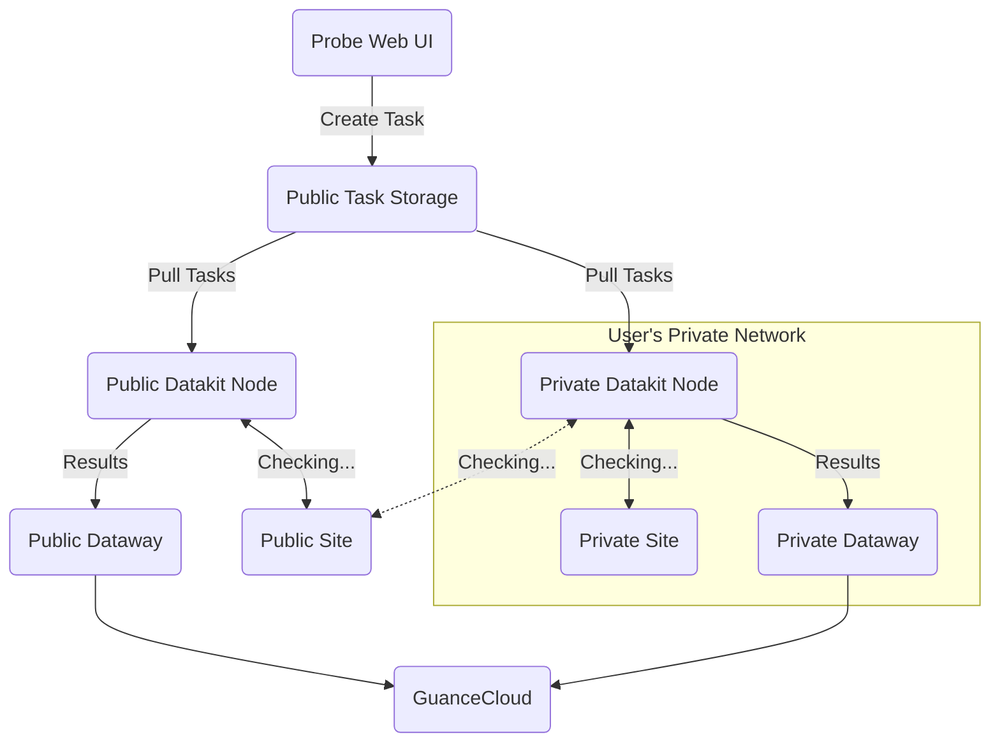

{{.AvailableArchs}}

---

The collector collects the data of network dialing test results, and all the data generated by dialing test are reported to Guance Cloud.

## Configuration {#config}

<!-- markdownlint-disable MD046 -->
=== "host installation"

    To deploy private dial-test nodes, you need to [create private dial-test nodes on Guance Cloud page](../usability-monitoring/self-node.md). When you're done, fill in the page with the relevant information in `conf.d/{{.Catalog}}/{{.InputName}}.conf`:
    
    Go to the `conf.d/{{.Catalog}}` directory under the DataKit installation directory, copy `{{.InputName}}.conf.sample` and name it `{{.InputName}}.conf`. Examples are as follows:
    
    ```toml
    {{ CodeBlock .InputSample 4 }}
    ```
    
    Once configured, [restart DataKit](../datakit/datakit-service-how-to.md#manage-service).

=== "Kubernetes"

    Can be turned on by [ConfigMap Injection Collector Configuration](../datakit/datakit-daemonset-deploy.md#configmap-setting) or [Config ENV_DATAKIT_INPUTS](../datakit/datakit-daemonset-deploy.md#env-setting) .

    Can also be turned on by environment variables, (needs to be added as the default collector in ENV_DEFAULT_ENABLED_INPUTS):
    
{{ CodeBlock .InputENVSample 4 }}

---

???+ attention

    Currently, only Linux dial-up nodes support, and the tracing data is stored in the [traceroute](#traceroute) field of the relevant metrics.
<!-- markdownlint-enable -->

### Dialtesting Node Deployment {#arch}

The following is a network deployment topology for dialtesting nodes, which includes two deployment methods for dialtesting nodes:

- Public Network Nodes: Directly use the nodes deployed globally to check the healthy of **public network** services.
- Private Network Nodes: If you need to check **private network** services, you need to deploy **private** nodes. Of course, if the network allows, these private nodes can also check services deployed on the public network.

Whether it is a public or private node, they can both create probe tasks through the Web page.



## Log {#logging}

All of the following data collections are appended with a global tag named `host` by default (the tag value is the host name of the DataKit), or can be named in the configuration by `[[inputs.{{.InputName}}.tags]]` alternative host.

{{ range $i, $m := .Measurements }}

### `{{$m.Name}}`

- tag

{{$m.TagsMarkdownTable}}

- metric list

{{$m.FieldsMarkdownTable}}

{{ end }}


### `traceroute` {#traceroute}

`traceroute` is the JSON text of the "route trace" data, and the entire data is an array object in which each array element records a route probe, as shown in the following example:

```json
[
    {
        "total": 2,
        "failed": 0,
        "loss": 0,
        "avg_cost": 12700395,
        "min_cost": 11902041,
        "max_cost": 13498750,
        "std_cost": 1129043,
        "items": [
            {
                "ip": "10.8.9.1",
                "response_time": 13498750
            },
            {
                "ip": "10.8.9.1",
                "response_time": 11902041
            }
        ]
    },
    {
        "total": 2,
        "failed": 0,
        "loss": 0,
        "avg_cost": 13775021,
        "min_cost": 13740084,
        "max_cost": 13809959,
        "std_cost": 49409,
        "items": [
            {
                "ip": "10.12.168.218",
                "response_time": 13740084
            },
            {
                "ip": "10.12.168.218",
                "response_time": 13809959
            }
        ]
    }
]
```

**Field description:**

| Field  | Type      | Description            |
| :---       | ---           | ---                         |
| `total`    | number        | Total number of detections |
| `failed`   | number        | Number of failures  |
| `loss`     | number        | Percentage of failure |
| `avg_cost` | number        | Average time spent (μs) |
| `min_cost` | number        | Minimum time consumption (μs) |
| `max_cost` | number        | Maximum time consumption(μs) |
| `std_cost` | number        | Standard deviation of time consumption(μs) |
| `items`    | Array of items | Per probe information (see following items) |

**`items`**

| Field           | Type   | Description                             |
| :-------------- | ------ | --------------------------------------- |
| `ip`            | string | IP address, if it fails, the value is * |
| `response_time` | number | Response time (μs)                      |

## Metric {#metric}

Dialtesting collector could expose some [Prometheus metrics](../datakit/datakit-metrics.md). You can upload these metrics to Guance Cloud through [Datakit collector](dk.md). The relevant configuration is as follows:

```toml
[[inputs.dk]]
  ......

  metric_name_filter = [
  
  ### others...
  
  ### dialtesting
  "datakit_dialtesting_.*",

  ]

  ......

```
