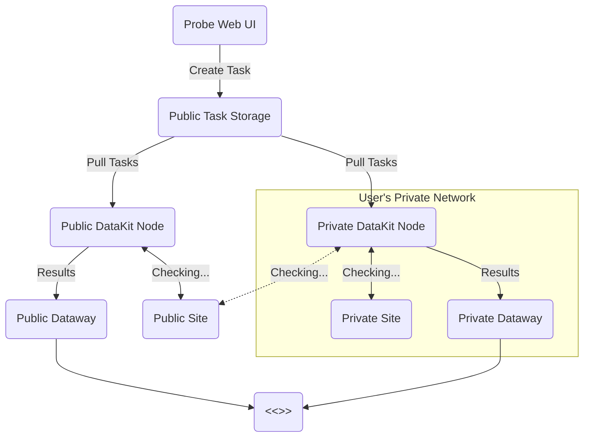

{{.AvailableArchs}}

---

The collector collects the data of network dialing test results, and all the data generated by dialing test are reported to <<<custom_key.brand_name>>>.

## Configuration {#config}

<!-- markdownlint-disable MD046 -->
=== "host installation"

    To deploy private dial-test nodes, you need to [create private dial-test nodes on <<<custom_key.brand_name>>> page](../synthetic-tests/self-node.md). When you're done, fill in the page with the relevant information in `conf.d/samples/{{.InputName}}.conf`:
    
    Go to the `conf.d/samples` directory under the DataKit installation directory, copy `{{.InputName}}.conf.sample` and name it `{{.InputName}}.conf`. Examples are as follows:
    
    ```toml
    {{ CodeBlock .InputSample 4 }}
    ```
    
    Once configured, [restart DataKit](../datakit/datakit-service-how-to.md#manage-service).

=== "Kubernetes"

    Can be turned on by [ConfigMap Injection Collector Configuration](../datakit/datakit-daemonset-deploy.md#configmap-setting) or [Config ENV_DATAKIT_INPUTS](../datakit/datakit-daemonset-deploy.md#env-setting) .

    Can also be turned on by environment variables, (needs to be added as the default collector in ENV_DEFAULT_ENABLED_INPUTS):
    
{{ CodeBlock .InputENVSample 4 }}

---

???+ note

    Currently, only Linux dial-up nodes support, and the tracing data is stored in the [traceroute](#traceroute) field of the relevant metrics.

???+ note

    Browser dialtesting is supported starting from DataKit [:octicons-tag-24: Version-2.1.0](../datakit/changelog-2026.md#cl-2.1.0).

    Browser dial testing tasks (`BROWSER`) run by default on Linux dialtesting nodes. To disable them, set `[inputs.dialtesting.browser].enabled = false`. DataKit must be able to access Lightpanda when running browser tasks. To control resource peaks, set `[inputs.dialtesting.browser].max_concurrency`.

    In Kubernetes, use the `datakit:<version>` image with Lightpanda built in.

    For deployment, task configuration, and troubleshooting details, see [Browser Dialtesting](dialtesting_browser.md).
<!-- markdownlint-enable MD046 -->

### Dialtesting Node Deployment {#arch}

The following is a network deployment topology for dialtesting nodes, which includes two deployment methods for dialtesting nodes:

- Public Network Nodes: Directly use the nodes deployed globally to check the healthy of **public network** services.
- Private Network Nodes: If you need to check **private network** services, you need to deploy **private** nodes. Of course, if the network allows, these private nodes can also check services deployed on the public network.


<!-- markdownlint-disable MD046 -->

???+ note

    When the node is deployed in an internal network environment and unable to access the external network, traffic forwarding can be achieved by configuring a proxy server. For specific configuration steps, please refer to the detailed instructions in the [Use DataKit Proxy](../datakit/datakit-proxy.md#datakit).
<!-- markdownlint-enable MD046 -->

Whether it is a public or private node, they can both create probe tasks through the Web page.

If a dialtesting node needs to run browser dial testing tasks, make sure the node environment meets the following requirements:

- Lightpanda can be accessed by the DataKit process.
- The node can access the target site and the Dataway specified by task `post_url`, which is used to report dial testing results.


```mermaid
graph TD
  %% node definitions
  dt_web(Probe Web UI)
  dt_db(Public Task Storage)
  dt_pub(Public DataKit Node)
  dt_pri(Private DataKit Node)
  site_inner(Private Site)
  site_pub(Public Site)
  dw_inner(Private Dataway)
  dw_pub(Public Dataway)
  server(<<<custom_key.brand_name>>>)

  %%%%%%%%%%%%%%%%%%%%%%%%%%%%%%%%
  dt_web -->|Create Task| dt_db;
  dt_db -->|Pull Tasks| dt_pub -->|Results| dw_pub --> server;
  dt_db -->|Pull Tasks| dt_pri;
  dt_pub <-->|Checking...| site_pub;

  dt_pri <-.->|Checking...| site_pub;
  dw_inner --> server;
  subgraph "User's Private Network"
  dt_pri <-->|Checking...| site_inner;
  dt_pri -->|Results| dw_inner;
  end
```

## Log {#logging}

All of the following data collections are appended with a global tag named `host` by default (the tag value is the host name of the DataKit), or can be named in the configuration by `[[inputs.{{.InputName}}.tags]]` alternative host.

{{ range $i, $m := .Measurements }}

### `{{$m.Name}}`

{{$m.MarkdownTable}}

{{ end }}


### `traceroute` {#traceroute}

`traceroute` is the JSON text of the "route trace" data, and the entire data is an array object in which each array element records a route probe, as shown in the following example:

```json
[
    {
        "total": 2,
        "failed": 0,
        "loss": 0,
        "avg_cost": 12700395,
        "min_cost": 11902041,
        "max_cost": 13498750,
        "std_cost": 1129043,
        "items": [
            {
                "ip": "10.8.9.1",
                "response_time": 13498750
            },
            {
                "ip": "10.8.9.1",
                "response_time": 11902041
            }
        ]
    },
    {
        "total": 2,
        "failed": 0,
        "loss": 0,
        "avg_cost": 13775021,
        "min_cost": 13740084,
        "max_cost": 13809959,
        "std_cost": 49409,
        "items": [
            {
                "ip": "10.12.168.218",
                "response_time": 13740084
            },
            {
                "ip": "10.12.168.218",
                "response_time": 13809959
            }
        ]
    }
]
```

**Field description:**

| Field  | Type      | Description            |
| :---       | ---           | ---                         |
| `total`    | number        | Total number of detections |
| `failed`   | number        | Number of failures  |
| `loss`     | number        | Percentage of failure |
| `avg_cost` | number        | Average time spent (μs) |
| `min_cost` | number        | Minimum time consumption (μs) |
| `max_cost` | number        | Maximum time consumption(μs) |
| `std_cost` | number        | Standard deviation of time consumption(μs) |
| `items`    | Array of items | Per probe information (see following items) |

**`items`**

| Field           | Type   | Description                             |
| :-------------- | ------ | --------------------------------------- |
| `ip`            | string | IP address, if it fails, the value is * |
| `response_time` | number | Response time (μs)                      |

## Metric {#metric}

The dialtesting collector exposes [Prometheus metrics](../datakit/datakit-metrics.md). By default, the [DataKit collector](dk.md) collects and uploads these `datakit_dialtesting_*` metrics to <<<custom_key.brand_name>>> without additional configuration.

## Asynchronous Debug Deployment {#async-debug-deployment}

Asynchronous debug runs are stored only in DataKit process memory. Deploy the dedicated debug DataKit as a single replica and make the backend access that instance directly. Do not put multiple replicas behind a regular load balancer: submission and query requests may reach different memories. Restarting or upgrading DataKit loses pending, running, and retained terminal runs; callers must submit a new run.

The built-in defaults can be overridden at process startup. Empty or invalid values fall back to defaults and durations use Go duration syntax. Values take effect after DataKit restarts.

| Environment variable | Default |
| --- | --- |
| `ENV_DIALTESTING_DEBUG_MAX_CONCURRENT_RUNS` | `100` |
| `ENV_DIALTESTING_DEBUG_MAX_QUEUED_RUNS` | `1000` (preparing plus pending runs) |
| `ENV_DIALTESTING_DEBUG_MAX_QUEUE_WAIT` | `3m` |
| `ENV_DIALTESTING_DEBUG_RESULT_TTL` | `10m` |
| `ENV_DIALTESTING_DEBUG_MAX_LONG_POLL_WAIT` | `10s` (values above 10 seconds are capped) |
| `ENV_DIALTESTING_DEBUG_MAX_RETAINED_TERMINAL_RUNS` | `2000` |

Size concurrency and queue limits according to CPU, memory, file-descriptor usage, and the expected mix of lightweight probes and NetPath runs. At capacity, a new run returns `429 ServerUnavailable` before task preparation. Concurrent retries with the same owner, request ID, and payload share one preparation. Internal-network destinations are validated immediately before execution with a fixed 15-second DNS timeout; validation failures mark the run as `failed`. Terminal results are retained for at most the configured TTL; when the retained-run limit is exceeded, DataKit evicts the oldest result first. Use `dialing_debug_preparing_size` and `dialing_debug_queue_size` to observe preparing and pending runs separately. Debug results are not written to formal dialtesting tasks, Kodo, MySQL, or `D::` data.
