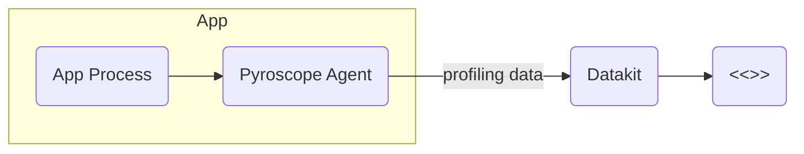

At present, DataKit supports one way to collect C/C + + profiling data, namely [Pyroscope](https://pyroscope.io/){:target="_blank"}.

## Pyroscope {#pyroscope}

[Pyroscope](https://pyroscope.io/){:target="_blank"} is an open source continuous profiling platform, and DataKit already supports displaying its reported profiling data in [<<<custom_key.brand_name>>>](https://www.<<<custom_key.brand_main_domain>>>/){:target="_blank"}。

Pyroscope uses C/S architecture, and its running modes are divided into [Pyroscope Agent](https://pyroscope.io/docs/agent-overview/){:target="_blank"} and [Pyroscope Server](https://pyroscope.io/docs/server-overview/){:target="_blank"}, which are integrated in a binary file and displayed by different command line commands.

What you need here is the Pyroscope Agent pattern. DataKit has integrated the Pyroscope Server functionality and can receive profiling data reported by the Pyroscope Agent by exposing the HTTP interface to the outside world.

Profiling data flow:



### Preconditions {#pyroscope-requirement}

- According to Pyroscope official document [eBPF Profiling](https://pyroscope.io/docs/ebpf/#prerequisites-for-profiling-with-ebpf){:target="_blank"}, Linux kernel version is required >= 4.9 (due to [BPF_PROG_TYPE_PERF_EVENT](https://lkml.org/lkml/2016/9/1/831){:target="_blank"}).

- [DataKit](https://www.<<<custom_key.brand_main_domain>>>/){:target="_blank"} is installed and the [profile](profile.md#config) collector is turned on with the following configuration references:


    ```toml
    [[inputs.profile]]
      ## profile Agent endpoints register by version respectively.
      ## Endpoints can be skipped listen by remove them from the list.
      ## Default value set as below. DO NOT MODIFY THESE ENDPOINTS if not necessary.
      endpoints = ["/profiling/v1/input"]
    
      ## set true to enable election.
      election = true
    
      #  config
      [[inputs.profile.pyroscope]]
      # listen url
      url = "0.0.0.0:4040"
    
      # service name
      service = "pyroscope-demo"
    
      # app env
      env = "dev"
    
      # app version
      version = "0.0.0"
    
      [inputs.profile.pyroscope.tags]
      tag1 = "val1"
    ```

- Install Pyroscope

    Take the Linux AMD64 platform as an example:

    ```sh
    wget https://dl.pyroscope.io/release/pyroscope-0.36.0-linux-amd64.tar.gz
    tar -zxvf pyroscope-0.36.0-linux-amd64.tar.gz
    ```

    The Pyroscope binary file obtained by the above method can be run directly or placed under [PATH](http://www.linfo.org/path_env_var.html){:target="_blank"}.

    For additional platforms and architectures, see [download address](https://pyroscope.io/downloads/){:target="_blank"}.

<!-- markdownlint-disable MD013 -->
### Pyroscope Agent Configures eBPF Collection Mode {#pyroscope-ebpf}
<!-- markdownlint-enable -->

The [eBPF](https://pyroscope.io/docs/ebpf/){:target="_blank"} mode of the Pyroscope Agent supports profiling collection of C/C + + programs.

- Set environment variables:

    ```sh
    export PYROSCOPE_APPLICATION_NAME='my.ebpf.program{host=server-node-1,region=us-west-1,tag2=val2}'
    export PYROSCOPE_SERVER_ADDRESS='http://localhost:4040/' # pyroscope listen url configured by Datakit profile.
    export PYROSCOPE_SPY_NAME='ebpfspy'
    ```

- Use different commands depending on the target you want to profile:

    - profiling the running program (for example, PID `1000`): `sudo -E pyroscope connect --pid 1000`
    - profiling the running specified program (take `mongod` as an example): `sudo -E pyroscope exec mongod`
    - profiling the entire system: `sudo -E pyroscope ebpf`

### View Profile {#pyroscope-view}

After running the above profiling command, the Pyroscope Agent starts collecting the specified profiling data and reports the data to <<<custom_key.brand_name>>>. After a few minutes, you can view the corresponding data in {{ UISteps "APM,Profiling" "," }}.
