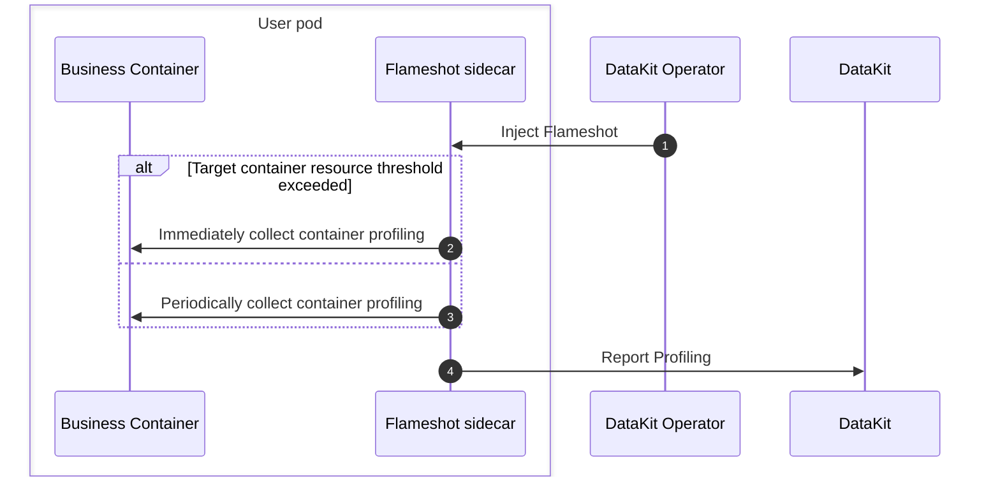

# Injecting Flameshot via DataKit Operator

[:octicons-tag-24: Operator Version-1.8.0](operator-changelog.md#cl-1.8.0)

---

Flameshot is a performance profiling tool introduced by DataKit-Operator, intended to replace original Profilers (async-profiler, py-spy, etc.).



## Prerequisites {#flameshot-prerequisites}

- [DataKit](https://docs.<<<custom_key.brand_main_domain>>>/datakit/datakit-daemonset-deploy/){:target="_blank"} is installed in the cluster.
- The [profile](https://docs.<<<custom_key.brand_main_domain>>>/datakit/datakit-daemonset-deploy/#using-k8-env){:target="_blank"} collector is enabled.
- (Optional) To use the Prometheus Annotations auto-injection feature, you need to enable DataKit's KubernetesPrometheus collector and configure `EnableDiscoveryOfPrometheusPodAnnotations = true` to enable Pod Annotations auto-discovery.

## Usage Instructions {#flameshot-usage}

1. [Download and install DataKit-Operator](datakit-operator.md#install) in the target Kubernetes cluster.
1. Set the `flameshots` array in the DataKit Operator configuration, configure `namespace_selectors`/`label_selectors` matching rules, and specify the processes to monitor using the `processes` field.
1. (Optional) Add the specified Annotation `admission.datakit/flameshot.enabled: "true"` to the Deployment to allow Flameshot injection (if set to `"false"`, injection will be disabled).

Flameshot Configuration Example:

```json
{
    "admission_inject_v2": {
        "flameshots": [
            {
                "namespace_selectors": [],
                "label_selectors":     [],
                "image": "pubrepo.<<<custom_key.brand_main_domain>>>/datakit/flameshot:{{.FlameshotVersion}}",
                "envs": {
                    "FLAMESHOT_DATAKIT_ADDR":     "http://datakit-service.datakit:9529/profiling/v1/input",
                    "FLAMESHOT_MONITOR_INTERVAL": "10s",
                    "FLAMESHOT_LOG_LEVEL":        "info",
                    "FLAMESHOT_PROFILING_PATH":   "/flameshot-data",
                    "FLAMESHOT_LOG_PATH":         "/var/log/flameshot.log",
                    "FLAMESHOT_HTTP_LOCAL_IP":    "{fieldRef:status.podIP}",
                    "FLAMESHOT_HTTP_LOCAL_PORT":  "8089",
                    "FLAMESHOT_SERVICE":  "{fieldRef:metadata.labels['app']}",
                    "FLAMESHOT_TAGS": "pod_name:$(POD_NAME),pod_namespace:$(POD_NAMESPACE),host:$(NODE_NAME)"
                },
                "resources": {
                    "requests": {
                        "cpu":    "100m",
                        "memory": "128Mi"
                    },
                    "limits": {
                        "cpu":    "200m",
                        "memory": "256Mi"
                    }
                },
                "processes": "",
                "enable_prometheus_annotations": true
            }
        ]
    }
}
```

Configuration Field Description:

| Field | Type | Required | Description |
| --- | --- | --- | --- |
| `namespace_selectors` | array | No | Namespace selector array, supports regular expression matching |
| `label_selectors` | array | No | Label selector array, uses Kubernetes Label Selector syntax |
| `image` | string | Yes | Flameshot container image address |
| `envs` | object | No | Environment variable configuration, supports Downward API |
| `resources` | object | No | Resource limit configuration (requests and limits) |
| `processes` | string | Yes | Process monitoring configuration (JSON string), will be injected into the Flameshot container as the `FLAMESHOT_PROCESSES` environment variable. Refer to [Flameshot related documentation](../integrations/flameshot.md) for format |
| `enable_prometheus_annotations` | boolean | No | Whether to automatically add Prometheus-related Annotations. Default is `true` in the configuration template; if custom configuration is used and this field is not set, it defaults to `false`. If the Pod already has any Annotation starting with `prometheus.io/`, injection will not occur |

<!-- markdownlint-disable MD046 -->
???+ important

    **Important Note**: The `processes` field is a JSON string, and its value will be directly injected into the Flameshot container as the `FLAMESHOT_PROCESSES` environment variable. Please refer to [Flameshot related documentation](../integrations/flameshot.md) for the format and meaning of the `processes` field. If `processes` is empty, Flameshot injection will be skipped.
<!-- markdownlint-enable -->

### Environment Variables {#envs}

| Environment Variable Name | Description |
| :--- | :--- |
| `FLAMESHOT_DATAKIT_ADDR` | DataKit profiling receiving address, e.g., `http://datakit-service.datakit:9529/profiling/v1/input` |
| `FLAMESHOT_MONITOR_INTERVAL` | Monitoring interval, e.g., `10s` |
| `FLAMESHOT_LOG_LEVEL` | Log level, e.g., `info` |
| `FLAMESHOT_PROFILING_PATH` | Profiling data storage path, e.g., `/flameshot-data` |
| `FLAMESHOT_LOG_PATH` | Log file path, e.g., `/var/log/flameshot.log` |
| `FLAMESHOT_HTTP_LOCAL_IP` | HTTP service local IP, usually injected via Downward API, e.g., `{fieldRef:status.podIP}` |
| `FLAMESHOT_HTTP_LOCAL_PORT` | HTTP service port, e.g., `8089` |
| `FLAMESHOT_PROCESSES` | Process monitoring configuration (automatically injected by `processes` field), JSON string format |

### Flameshot Self-Metric Collection {#prom-anno}

When `enable_prometheus_annotations` is set to `true` (it is `true` in the default configuration template), DataKit-Operator will automatically add the following Prometheus-related Annotations to Pods injected with Flameshot, facilitating the collection of Flameshot's own metrics (via DataKit's KubernetesPrometheus collector):

- `prometheus.io/scrape: "true"`: Identifies that the Pod needs to be scraped
- `prometheus.io/port: "<port>"`: Metric exposure port, value taken from environment variable `FLAMESHOT_HTTP_LOCAL_PORT` (e.g., `"8089"`)
- `prometheus.io/scheme: "http"`: Metric collection protocol
- `prometheus.io/path: "/metrics"`: Metric path
- `prometheus.io/param_measurement: "flameshot"`: Specifies the measurement name

<!-- markdownlint-disable MD046 -->
???+ warning

    1. If the Pod already has any Annotation starting with `prometheus.io/`, DataKit-Operator will not inject the above Prometheus Annotations to avoid overwriting existing metric collection configurations.
    1. To use this feature, you need to enable the KubernetesPrometheus collector in DataKit and configure `EnableDiscoveryOfPrometheusPodAnnotations = true` to enable Pod Annotations auto-discovery.
<!-- markdownlint-enable -->

## Example Case {#flameshot-example}

<!-- markdownlint-disable MD046 -->
???+ warning

    - Adding only `admission.datakit/flameshot.enabled: "true"` Annotation is not enough to trigger injection; matching `flameshots` rules (including `namespace_selectors`/`label_selectors` and `processes` fields) must also be set in the DataKit-Operator configuration.
    - If the `processes` field is empty, injection will be skipped.
<!-- markdownlint-enable -->

Below is a Deployment example that injects Flameshot into all Pods created by the Deployment (assuming matching rules are set in DataKit-Operator configuration):

```yaml
apiVersion: apps/v1
kind: Deployment
metadata:
  name: app-deployment
  labels:
    app: myapp
spec:
  replicas: 1
  selector:
    matchLabels:
      app: myapp
  template:
    metadata:
      labels:
        app: myapp
      annotations:
        admission.datakit/flameshot.enabled: "true"
    spec:
      containers:
      - name: app
        image: myapp:latest
        ports:
        - containerPort: 8080
```

Create resources using the yaml file:

```shell
$ kubectl apply -f app-deployment.yaml
...
```

Verify as follows:

```shell
$ kubectl get pod

NAME                                   READY   STATUS    RESTARTS      AGE
app-deployment-7bd8dd85f-fzmt2          2/2     Running   0             4s

$ kubectl get pod app-deployment-7bd8dd85f-fzmt2 -o=jsonpath={.spec.containers\[\*\].name}
app datakit-flameshot
```

Wait a few minutes, and you can view application performance data on the <<<custom_key.brand_name>>> console [Application Performance Monitoring - Profiling](https://console.<<<custom_key.brand_main_domain>>>/tracing/profile){:target="_blank"} page.

<!-- markdownlint-disable MD046 -->
???+ note

    If you cannot see data, you can enter the `datakit-flameshot` container to view relevant logs for troubleshooting:

    ```shell
    $ kubectl exec -it app-deployment-7bd8dd85f-fzmt2 -c datakit-flameshot -- bash
    $ cat /var/log/flameshot.log
    ```
<!-- markdownlint-enable -->
