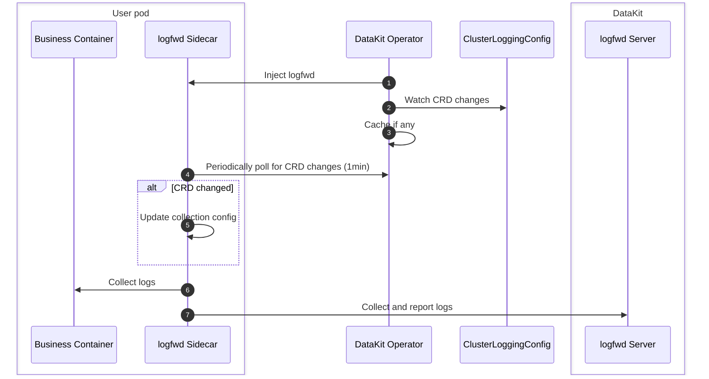

# Injecting logfwd via DataKit Operator

Operator injection of logfwd primarily collects internal Pod logs (logs not retained in container stdout). Its implementation principle is to inject a Sidecar container into the Pod. This Sidecar container directly collects logs from specified commands within the container and sends them to DataKit.

In conjunction with specific CRD configurations, the logfwd method allows for dynamic adjustment of collection settings for target Pods without the need to restart them.



## Prerequisites {#prerequisites}

1. DataKit enables the `logfwdserver` collector, listening on the default port `9533`.
1. DataKit service needs to open port `9533` so that other Pods can access `datakit-service.datakit.svc:9533`.

## Usage Instructions {#datakit-operator-inject-logfwd-instructions}

> For Operator versions <= v1.6.0, please refer to [here](operator-v1.6.0-logfwd.md) for logfwd injection usage.

Use `ClusterLoggingConfig` CRD for centralized log collection management: [:octicons-tag-24: Version-1.7.0](operator-changelog.md#cl-1.7.0)

- **Centralized Collection Configuration Management**: Supports listening to Kubernetes `ClusterLoggingConfig` CRD and exposing matching results for logfwd sidecar polling (sidecar defaults to making an HTTP request to Operator every 60 seconds, logfwd requires [:octicons-tag-24: Version-1.86.0](changelog-2025.md#cl-1.86.0)).
- **Hot Updates & Granular Matching**: CRD selector (Namespace/Pod/Label/Container) changes take effect immediately without rebuilding Workloads.
- **Simplified Configuration**: Log collection configuration is fully managed via CRD, and overriding configuration via Annotation is no longer supported.

> If you are not yet familiar with the definition and writing method of ClusterLoggingConfig, please read the [Container Log Collection CRD Configuration Document](../integrations/container-log-for-k8s-crd.md) first.

Operation Flow:

1. Register `ClusterLoggingConfig` CRD (as described in DataKit documentation).
1. Upgrade/Install DataKit Operator v1.7.0 and add RBAC read permissions for the CRD.
1. Set the `logfwds` array in DataKit Operator configuration, configuring `namespace_selectors`/`label_selectors` matching rules and the `log_configs` field.
1. (Optional) Add Annotation `admission.datakit/logfwd.enabled: "true"` to the target Pod to allow injection (if set to `"false"`, injection will be rejected).
1. Create `ClusterLoggingConfig` resource, and the logfwd sidecar will periodically (default 60 seconds) pull the collection configuration.

Installing the latest `datakit-operator.yaml` will include the necessary permissions, or refer to the following minimal example:

<!-- markdownlint-disable MD046 -->
??? "Minimal Example"

    ```yaml
    apiVersion: rbac.authorization.k8s.io/v1
    kind: ClusterRole
    metadata:
      name: datakit-operator
    rules:
    - apiGroups: ["logging.datakits.io"]
      resources: ["clusterloggingconfigs"]
      verbs: ["get", "list", "watch"]
    
    ---
    apiVersion: rbac.authorization.k8s.io/v1
    kind: ClusterRoleBinding
    metadata:
      name: datakit-operator
    roleRef:
      apiGroup: rbac.authorization.k8s.io
      kind: ClusterRole
      name: datakit-operator
    subjects:
    - kind: ServiceAccount
      name: datakit-operator
      namespace: datakit
    
    ---
    apiVersion: v1
    kind: ServiceAccount
    metadata:
      name: datakit-operator
      namespace: datakit
    
    ---
    apiVersion: apps/v1
    kind: Deployment
    metadata:
      name: datakit-operator
      namespace: datakit
      labels:
        app: datakit-operator
    spec:
      replicas: 1  # Do not change the ReplicaSet number!
      selector:
         matchLabels:
           app: datakit-operator
      template:
        metadata:
          labels:
            app: datakit-operator
        spec:
          serviceAccountName: datakit-operator
          containers:
          - name: operator
            # other..
    ```

## CRD Configuration {#crd-config}

`ClusterLoggingConfig` Example:

```yaml
apiVersion: logging.datakits.io/v1alpha1
kind: ClusterLoggingConfig
metadata:
  name: nginx-logs
spec:
  selector:
    namespaceRegex: "^(middleware)$"
    podLabelSelector: "app=logging"
  podTargetLabels:
    - app
    - env
  configs: # The following configuration corresponds one-to-one with log_configs in ConfigMap
    - type: file
      source: nginx-access
      service: nginx
      path: /var/log/nginx/access.log
      pipeline: nginx-access.p
      storage_index: app-logs
      multiline_match: "^\\d{4}-\\d{2}-\\d{2}"
      tags:
        team: web
```

After applying the above resource, DataKit Operator will:

1. Listen for Deployment creation events and inject the `datakit-logfwd` Sidecar container.
1. Match Pods based on the `ClusterLoggingConfig` selector, continuously maintaining matching results for the Sidecar to read during polling.
1. After the Sidecar starts, it interacts with the Operator via `LOGFWD_DATAKIT_OPERATOR_ENDPOINT`, pulling CRD configuration every 60 seconds and forwarding tasks to DataKit `logfwdserver`.

## Log Collection Configuration {#collection-configs}

To inject logfwd via Operator, add a configuration structure like the following to the Operator's ConfigMap:

```json
{
    "admission_inject_v2": {         // Injection configuration v2
        "logfwds": [
            // Supports multiple logfwd configurations here
            { ... }, // Single logfwd configuration
            { ... }, // Another logfwd configuration
        ],        
    }
}
```

The fields supported by a single logfwd configuration are as follows:

| Field                 | Type     | Description             | Required | Example Value                |
| ------:               | :------: | ------                  | ------   | --------                     |
| `envs`                | object   | Environment variable configuration | Y | See example below |
| `image`               | string   | logfwd image address    | Y        | See example below |
| `label_selectors`     | array    | Label selectors         | Y        | `["logs-enabled=true"]`      |
| `log_configs`         | string   | Log configuration[^log_configs] | Y | `"[{\"type\":\"file\"...}]"` |
| `log_volume_paths`    | array    | Log volume mount paths  | Y        | `["/var/log/app"]`           |
| `namespace_selectors` | array    | Namespace selectors     | Y        | `["default"]`                |
| `resources`           | object   | Resource limit configuration | N   | See example below |

[^log_configs]: Is a complex JSON string; needs escaping when embedded.

### Environment Variable Configuration {#envs}

Logfwd injection adds several environment variables and image version requirements, which can be configured in the `datakit-operator-config` ConfigMap:

```json hl_lines="5-11"
"logfwds": [
    {
        "image": "pubrepo.<<<custom_key.brand_main_domain>>>/datakit/logfwd:{{.Version}}",
        "envs": {
            "LOGFWD_DATAKIT_HOST":              "{fieldRef:status.hostIP}",
            "LOGFWD_DATAKIT_PORT":              "9533",
            "LOGFWD_DATAKIT_OPERATOR_ENDPOINT": "datakit-operator.datakit.svc:443",
            "LOGFWD_GLOBAL_SERVICE":            "{fieldRef:metadata.labels['app']}",
            "LOGFWD_POD_NAME":                  "{fieldRef:metadata.name}",
            "LOGFWD_POD_NAMESPACE":             "{fieldRef:metadata.namespace}",
            "LOGFWD_POD_IP":                    "{fieldRef:status.podIP}"
        },
        "log_configs": "",
        "log_volume_paths": []
    }
]
```

`envs` has the following options:

| Environment Variable Name          | Configuration Item Meaning                                                                                                                                                              |
| ---:                               | :---                                                                                                                                                                                    |
| `LOGFWD_DATAKIT_HOST`              | DataKit instance address (IP or resolvable domain name)                                                                                                                                 |
| `LOGFWD_DATAKIT_PORT`              | DataKit `logfwdserver` listening port, e.g., `9533`                                                                                                                                     |
| `LOGFWD_DATAKIT_OPERATOR_ENDPOINT` | DataKit Operator Endpoint, e.g., `datakit-operator.datakit.svc:443` or `https://datakit-operator.datakit.svc:443`, used to query CRD configuration; leave empty to not attempt pulling. Supports automatic addition of `https://` prefix |
| `LOGFWD_GLOBAL_SOURCE`             | Global `source`, priority higher than `source` field in individual configuration                                                                                                        |
| `LOGFWD_GLOBAL_SERVICE`            | Global `service`, if `service` is not specified in individual configuration, use global value; if global value is also empty, fallback to `source`                                      |
| `LOGFWD_GLOBAL_STORAGE_INDEX`      | Global `storage_index`, priority higher than `storage_index` field in individual configuration                                                                                          |
| `LOGFWD_POD_NAME`                  | Automatically write `pod_name` tag, usually injected via Downward API                                                                                                                    |
| `LOGFWD_POD_NAMESPACE`             | Automatically write `namespace` tag                                                                                                                                                     |
| `LOGFWD_POD_IP`                    | Automatically write `pod_ip` tag, facilitating container instance location                                                                                                              |

### Log Settings {#log-configs}

`log_configs` is used for debugging or overriding CRD content. **If `log_configs` is empty, logfwd injection will be skipped**. Structure example:

```json
[
  {
    "type": "file",
    "disable": false,
    "source": "nginx-access",
    "service": "nginx",
    "path": "/var/log/nginx/access.log",
    "pipeline": "nginx-access.p",
    "storage_index": "app-logs",
    "multiline_match": "^\\d{4}-\\d{2}-\\d{2}",
    "remove_ansi_escape_codes": false,
    "from_beginning": false,
    "character_encoding": "utf-8",
    "tags": {
      "env": "production",
      "team": "backend"
    }
  }
]
```

| Field                            | Type     | Required | Description                                                                                           | Example                                                                                           |
| ------                           : | :------: | ------   | ------                                                                                                | ------                                                                                            |
| `type`                           | string   | Y        | logfwd collection type can only be `"file"`                                                           | `"file"`                                                                                          |
| `source`                         | string   | Y        | Log source identifier, used to distinguish different log streams                                      | `"nginx-access"`                                                                                  |
| `path`                           | string   | Y        | Log file path (supports glob pattern), required when type=file                                        | `"/var/log/nginx/*.log"`                                                                          |
| `disable`                        | boolean  | N        | Whether to disable this collection configuration                                                      | `false`                                                                                           |
| `service`                        | string   | N        | Service the log belongs to, default value is log source (source)                                      | `"nginx"`                                                                                         |
| `multiline_match`                | string   | N        | Regular expression for the start line of multi-line logs, note that backslashes need to be escaped in JSON | `"^\\d{4}-\\d{2}-\\d{2}"`                                                                         |
| `pipeline`                       | string   | N        | Log parsing pipeline configuration file name (needs to be configured on DataKit side)                 | `"nginx-access.p"`                                                                                |
| `storage_index`                  | string   | N        | Index name for log storage                                                                            | `"app-logs"`                                                                                      |
| `remove_ansi_escape_codes`       | boolean  | N        | Whether to remove ANSI escape codes (color codes, etc.) from log data                                 | `false`                                                                                           |
| `from_beginning`                 | boolean  | N        | Whether to start collecting logs from the beginning of the file (default is from the end)             | `false`                                                                                           |
| `from_beginning_threshold_size`  | int      | N        | When a file is found, if file size is smaller than this value, collect from beginning. Unit: bytes, default 20MB | `1000`                                                                                            |
| `character_encoding`             | string   | N        | Character encoding, supports `utf-8`, `utf-16le`, `utf-16be`, `gbk`, `gb18030` or empty string (auto-detect). Default is empty | `"utf-8"`                                                                                         |
| `tags`                           | object   | N        | Additional tag key-value pairs, will be appended to each log record                                   | `{"env": "prod"}`                                                                                 |
| ~~`logfiles`~~                   | array    | Y        | List of files to collect                                                                              | `["<your-logfile-path>"]`  [:octicons-tag-24: Version-1.7.0](operator-changelog.md#cl-1.7.0) Deprecated |
| ~~`ignore`~~                     | array    | Y        | List of files to ignore                                                                               | `["<your-logfile-path>"]`  [:octicons-tag-24: Version-1.7.0](operator-changelog.md#cl-1.7.0) Deprecated |

### Mount Path Settings {#volume-paths}

`log_volume_paths`: List of host paths (string array) that need to be mounted, used to allow the sidecar to access real log files, e.g., `["/var/log", "/data/log"]`. Please avoid having both parent and child paths to prevent Volume conflicts.

## Annotation Support {#anno}

Operator logfwd injection supports adding the following Annotations to application Pods:

- `admission.datakit/logfwd.enabled`: Controls whether injection is allowed. Value `"false"` rejects injection; value `"true"` or unset allows injection (but requires matching rules and `log_configs` field to actually trigger injection).
- ~~`admission.datakit/logfwd.log_configs`~~: [:octicons-tag-24: Version-1.7.0](operator-changelog.md#cl-1.7.0) Removed, log collection configuration should be fully managed via `ClusterLoggingConfig` CRD.
- ~~`admission.datakit/logfwd.volume_paths`~~: [:octicons-tag-24: Version-1.7.0](operator-changelog.md#cl-1.7.0) Removed, log collection configuration should be fully managed via `ClusterLoggingConfig` CRD.

<!-- markdownlint-disable MD046 -->
???+ warning

    If the `log_configs` field in the configuration is empty, logfwd injection will be skipped. Even if the Pod adds Annotation `admission.datakit/logfwd.enabled: "true"` and matches the selector rules, ensure that the `log_configs` field is not empty for successful injection.
<!-- markdownlint-enable -->

## Injection Example {#inject-logfwd-example}

Below is a Deployment example configuring log collection using the CRD method:

```yaml
apiVersion: apps/v1
kind: Deployment
metadata:
    name: logging-demo
    namespace: middleware
    labels:
    app: logging
spec:
    replicas: 1
    selector:
    matchLabels:
        app: logging
    template:
    metadata:
        labels:
        app: logging
        annotations:
        admission.datakit/logfwd.enabled: "true"
    spec:
        containers:
        - name: log-app
        image: nginx:1.25
```

Corresponding `ClusterLoggingConfig` CRD resource also needs to be created to configure log collection rules.

Create resources using the yaml file:

```shell
$ kubectl apply -f logging.yaml
...
```

Verify as follows:

```shell
$ kubectl get pod

NAME                                   READY   STATUS    RESTARTS      AGE
logging-deployment-5d48bf9995-vt6bb       1/1     Running   0             4s

$ kubectl get pod logging-deployment-5d48bf9995-vt6bb -o=jsonpath={.spec.containers\[\*\].name}
log-container datakit-logfwd
```

Finally, you can check on the <<<custom_key.brand_name>>> log platform whether logs are being collected.
