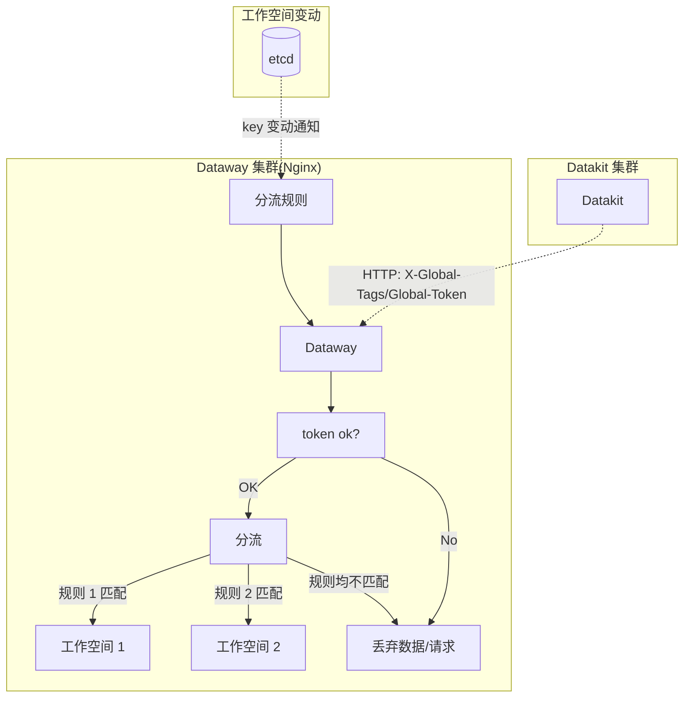

# Dataway Sink
---

[:octicons-tag-24: Version-1.14.0](changelog.md#cl-1.14.0) 版本的 Datakit 才能使用这里的 Sinker 功能。

---

## Dataway Sinker 功能介绍 {#sink-intro}

在日常的数据采集过程中，由于存在多个不同的工作空间，我们可能需要将不同的数据打到不同的工作空间。比如在一个公用的 Kubernetes 集群中，所采集的数据可能涉及不同团队或业务部门，这时候我们可以将带有特定属性的数据分别打到各个不同的工作空间，以实现基础设施公用场景下的细粒度采集。

基础的数据流如下：



## etcd 设置 {#etcd-settings}

> 以下命令均在 Linux 下操作。

Dataway 作为 etcd 客户端，可以在 etcd 中设置如下用户名和角色（etcd 3.5+），参见[这里](https://etcd.io/docs/v3.5/op-guide/authentication/rbac/#using-etcdctl-to-authenticate){:target="_blank"}

创建 `dataway` 账号以及对应角色：

```shell
# 添加用户名，此处会提示输入密码
$ etcdctl user add dataway 

# 添加 sinker 这个角色
$ etcdctl role add sinker 

# 将 dataway 添加到角色中
$ etcdctl user grant-role dataway sinker

# 限制 role 的 key 权限（此处 /dw_sinker 和 /ping 是默认使用的两个 key）
$ etcdctl role grant-permission sinker readwrite /dw_sinker
$ etcdctl role grant-permission sinker readwrite /ping       # 用于检测连通性
```

<!-- markdownlint-disable MD046 -->
???+ info "为什么创建角色？"

    角色用来控制对应用户在某些 key 上的权限，此处我们使用的可能是用户已有的 etcd 服务，有必要限制一下 Dataway 这个用户的数据权限。


???+ attention

    如果 etcd 开启了[认证模式](https://etcd.io/docs/v3.5/op-guide/authentication/rbac/#enabling-authentication){:target="_blank"}，执行 `etcdctl` 命令式，需带上对应的用户名和密码：

    ```shell
    $ etcdctl --user name:password ...
    ```
<!-- markdownlint-enable -->

### 写入 Sinker 规则 {#prepare-sink-rules}

假定 *sinker.json* 规则定义如下：

```json
{
    "strict":true,
    "rules": [
        {
            "rules": [
                "{ host = 'my-host'}"
            ],
            "url": "https://kodo.guance.com?token=tkn_xxxxxxxxxxxxxxxxxxxxxxxxxxxxxxxx"
        },
        {
            "rules": [
                "{ host = 'my-host' OR cluster = 'cluster-A' }"
            ],
            "url": "https://kodo.guance.com?token=tkn_yyyyyyyyyyyyyyyyyyyyyyyyyyyyyyyy"
        }
     ]
}
```

通过如下命令，可写入 Sinker 规则配置：

```shell
$ etcdctl --user dataway:PASSWORD put /dw_sinker "$(<sinker.json)"
OK
```

### Dataway 安装 {#dw-install}

如果如下命令可安装 Dataway：

```shell
DW_KODO=https://kodo.guance.com \
DW_TOKEN=tkn_xxxxxxxxxxxxxxxxxxxxxxxxxxxxxxxx \
DW_SECRET_TOKEN=tkn_yyyyyyyyyyyyyyyyyyyyyyyyyyyyyyyy \
DW_UUID=<YOUR-UUID> \
bash -c "$(curl https://static.guance.com/dataway/install.sh)"
```

支持的环境变量：

| 名称                   | 默认值                  | 说明                                                                                         | 可用取值                       |
| ---                    | ---                     | ---                                                                                          | ---                            |
| `DW_SECRET_TOKEN`      | 无                      | 指定 `secret_token`                                                                          | 跟 token 等长的字符串          |
| `DW_HTTP_CLIENT_TRACE` | false                   | 开启 Dataway HTTP 请求指标                                                                   | 任何非空字符串，如 `on`，`yes` |
| `DW_CASCADED`          | false                   | 开启 Dataway 级联，如果下一跳地址不是 Kodo，而是 Dataway，则必须开启该功能                   | 任何非空字符串，如 `on`，`yes` |
| `DW_ETCD_HOST`         | `http://localhost:2379` | 指定 etcd  服务地址，目前只支持指定单个地址，如有多个地址，需手动编辑安装后的 *dataway.yaml* | 形如 `http://ip:port`          |
| `DW_ETCD_PASSWORD`     | 无                      | 指定 etcd 密码（用户名以默认为 `dataway`）                                                   | 密码字符串                     |
| `DW_ETCD_USERNAME`     | `dataway`               | 指定 etcd  用户名                                                                            | 字符串                         |

> 此处仅列出跟 Dataway sinker 有关的几个安装环境变量，其它[安装设置](../deployment/dataway-install.md)此处不再赘述。

## Dataway 设置 {#dw-config}

除了 Dataway 常规的设置之外，需要额外设置几个配置（位于 */usr/local/cloudcare/dataflux/dataway/* 目录下）：

```yaml
# 此处设置 Dataway 要上传的地址，一般为 Kodo，但也可以是另一个 Dataway
remote_host: https://kodo.guance.com

# 如果上传地址为 Dataway，则此处要置为 true，表示 Dataway 级联
cascaded: false

# 该 token 为 dataway 上随意设置的一段 token，我们需要将其填写到
# Datakit 的 datakit.conf 配置中。这里需保持一定长度和格式。
secret_token: tkn_xxxxxxxxxxxxxxxxxxxxxxxxxxxxxxxx

# sinker 规则设置
sinker:
  etcd: # 支持 etcd
    urls:
    - http://localhost:2379
    dial_timeout: 30s
    key_space: /dw_sinker
    username: "dataway"
    password: "<PASSWORD>"

  #file: # 也支持本地文件方式，常用于调试
  #  path: /path/to/sinker.json
```

<!-- markdownlint-disable MD046 -->
???+ attention

    如果不设置 `secret_token`，则任何 Datakit 发送过来的请求都能通过，这不会造成数据问题。但如果 Dataway 部署在公网，还是建议设置一下 `secret_token`。
<!-- markdownlint-enable -->

## Token 规则 {#spec-on-secret-token}

由于 Datakit 会对 Dataway 上的 token 做检测，故这里设置的 `token`（含 `secret_token`） 需满足如下条件：

> 以 `token_` 或 `tkn_` 开头，后面的字符长度为 32。

对于不满足该条件的 token，Datakit 会安装失败。

## Datakit 端设置 {#config-dk}

在 Datakit 中，我们需要对其做几个设置，让其可以将采集到的数据打上特定的标签以进行分组。

- 配置全局自定义 Key 列表

Datakit 会在其采集的数据中，寻找带有这些 Key 的字段（只寻找字符串类型的字段），并将其提取出来，作为分组发送的依据。

<!-- markdownlint-disable MD046 -->
=== "主机安装"

    参见[这里](datakit-install.md#env-sink)

=== "Kubernetes"

    参见[这里](datakit-daemonset-deploy.md#env-sinker)
<!-- markdownlint-enable -->

- 配置「全局主机 Tag」 以及「全局选举 Tag」

在所有 Datakit 上传的数据中，都会带上配置的这些全局 tag（含 tag key 和 tag value），作为分组发送的依据。

<!-- markdownlint-disable MD046 -->
=== "主机安装"

    参见[这里](datakit-install.md#common-envs)

=== "Kubernetes"

    参见[这里](datakit-daemonset-deploy.md#env-common)
<!-- markdownlint-enable -->

## Sinker 覆盖的数据范围 {#coverage}

除拨测外，[常规的数据分类](apis.md#category)外，还支持 [Session Replay](../integrations/rum.md#rum-session-replay) 以及 [Profiling](../integrations/profile.md) 等二进制文件数据。

## Dataway 指标采集 {#collect-metrics}

Dataway 自身暴露了 Prometheus 指标，通过 Datakit 自带的 `prom` 采集器能采集其指标，采集器示例配置如下：

```toml
[[inputs.prom]]
  ## Exporter URLs.
  urls = [ "http://localhost:9090/metrics", ]

  source = "dataway"

  election = true

  ## dataway 指标集固定为 dw，不要更改
  measurement_name = "dw"
```

配置好以后，即可在内置视图中，搜索 `dataway` 即可看到对应的内置视图。

<!-- markdownlint-disable MD046 -->
???+ attention "HTTP client 指标采集"

    如果要采集 Dataway HTTP 请求 Kodo（或者下一跳 Dataway）的指标，需要手动开启 `http_client_trace` 配置。也可以在安装阶段，指定 `DW_HTTP_CLIENT_TRACE=on`。
<!-- markdownlint-enable -->

### Dataway 指标列表 {#metrics}

以下是 Dataway 暴露的指标，通过请求 `http://localhost:9090/metrics` 即可获取这些指标，可通过如下命令实时查看（3s）某个具体的指标：

> 某些指标如果查询不到，可能是相关业务模块尚未运行所致。

```shell
watch -n 3 'curl -s http://localhost:9090 | grep -a <METRIC-NAME>'
```

|TYPE|NAME|LABELS|HELP|
|---|---|---|---|
|COUNTER|`dataway_http_api_dropped_total`|`api,method`|API request dropped when sinker rule match failed|
|COUNTER|`dataway_http_api_signed_total`|`api,method`|API signature count|
|SUMMARY|`dataway_http_api_reusable_body_read_bytes`|`api,method`|API re-read body on forking request|
|COUNTER|`dataway_http_api_forked_total`|`api,method,token`|API request forked total|
|GAUGE|`dataway_http_info`|`cascaded,docker,http_client_trace,listen,release_date,remote,secret,token,version`|Dataway API basic info|
|GAUGE|`dataway_cpu_usage`|`N/A`|Dataway CPU usage(%)|
|GAUGE|`dataway_open_files`|`N/A`|Dataway open files|
|GAUGE|`dataway_cpu_cores`|`N/A`|Dataway CPU cores|
|COUNTER|`dataway_process_ctx_switch_total`|`N/A`|Dataway process context switch count(Linux only)|
|COUNTER|`dataway_process_io_count_total`|`N/A`|Dataway process IO count count|
|COUNTER|`dataway_process_io_bytes_total`|`N/A`|Dataway process IO bytes count|
|GAUGE|`dataway_last_heartbeat_time`|`N/A`|Dataway last heartbeat with Kodo timestamp|
|SUMMARY|`dataway_http_api_dropped_expired_cache`|`api,method`|Dropped expired cache data|
|SUMMARY|`dataway_http_api_elapsed_seconds`|`api,method,status`|API request latency|
|SUMMARY|`dataway_http_api_req_size_bytes`|`api,method,status`|API request size|
|COUNTER|`dataway_http_api_total`|`api,method,status`|API request count|
|COUNTER|`dataway_httpcli_tcp_conn_total`|`server,remote,type`|HTTP TCP connection count|
|COUNTER|`dataway_httpcli_conn_reused_from_idle_total`|`server`|HTTP connection reused from idle count|
|SUMMARY|`dataway_httpcli_conn_idle_time_seconds`|`server`|HTTP connection idle time|
|SUMMARY|`dataway_httpcli_dns_cost_seconds`|`server`|HTTP DNS cost|
|SUMMARY|`dataway_httpcli_tls_handshake_seconds`|`server`|HTTP TLS handshake cost|
|SUMMARY|`dataway_httpcli_http_connect_cost_seconds`|`server`|HTTP connect cost|
|SUMMARY|`dataway_httpcli_got_first_resp_byte_cost_seconds`|`server`|Got first response byte cost|
|COUNTER|`dataway_sinker_pull_total`|`event,source`|Sinker pulled or pushed counter|
|GAUGE|`dataway_sinker_rule_error`|`error`|Rule errors|
|GAUGE|`dataway_sinker_rule_last_applied_time`|`source`|Rule last applied time(Unix timestamp)|
|SUMMARY|`dataway_sinker_rule_cost_seconds`|`N/A`|Rule cost time seconds|
|COUNTER|`diskcache_put_total`|`N/A`|cache Put() count|
|COUNTER|`diskcache_put_bytes_total`|`N/A`|cache Put() bytes count|
|COUNTER|`diskcache_get_total`|`N/A`|cache Get() count|
|COUNTER|`diskcache_wakeup_total`|`N/A`|wakeup count on sleeping write file|
|COUNTER|`diskcache_get_bytes_total`|`N/A`|cache Get() bytes count|
|GAUGE|`diskcache_capacity`|`N/A`|current capacity(in bytes)|
|GAUGE|`diskcache_max_data`|`N/A`|max data to Put(in bytes), default 0|
|GAUGE|`diskcache_batch_size`|`N/A`|data file size(in bytes)|
|GAUGE|`diskcache_size`|`N/A`|current cache size(in bytes)|
|GAUGE|`diskcache_open_time`|`N/A`|current cache Open time in unix timestamp(second)|
|GAUGE|`diskcache_last_close_time`|`N/A`|current cache last Close time in unix timestamp(second)|
|GAUGE|`diskcache_datafiles`|`N/A`|current un-read data files|
|SUMMARY|`diskcache_get_latency`|`N/A`|Get() time cost(micro-second)|
|SUMMARY|`diskcache_put_latency`|`N/A`|Put() time cost(micro-second)|
|COUNTER|`diskcache_dropped_bytes_total`|`N/A`|dropped bytes during Put() when capacity reached.|
|COUNTER|`diskcache_dropped_total`|`N/A`|dropped files during Put() when capacity reached.|
|COUNTER|`diskcache_rotate_total`|`N/A`|cache rotate count, mean file rotate from data to data.0000xxx|
|COUNTER|`diskcache_remove_total`|`N/A`|removed file count, if some file read EOF, remove it from un-read list|

## FAQ {#faq}

### Datakit 报错 403 {#dk-403}

如果 Dataway 上 sinker 配置有误，导致所有 Datakit 请求都使用 `secret_token`，而这个 token 中心（Kodo）是不认可的，故报告 403 错误 `kodo.tokenNotFound`。

造成这个问题的原因可能是 etcd 用户名密码有误，导致 Dataway 获取不到 Sinker 配置，进而 Dataway 认为当前 sinker 无效，所有数据都直传中心。

### etcd 权限配置问题 {#etcd-permission}

如果 Dataway 日志中有如下报错，说明权限设置可能有问题：

```not-set
sinker ping: etcdserver: permission denied, retrying(97th)
```

如果权限配置不当，可以将已有的基于 Dataway 的权限全部删掉，再重新配置，具体参见[这里](https://etcd.io/docs/v3.5/op-guide/authentication/rbac/#using-etcdctl-to-authenticate){:target="_blank"}

### Datakit 端 Key 的覆盖关系 {#key-priority}

在配置「全局自定义 Key 列表」时，如果同时「全局主机 Tag」 以及「全局选举 Tag」也带有同名的 Key，那么使用采集的数据中对应的 Key-Value 对。

例如，如果配置的「全局自定义 Key 列表」中有 `key1,key2,key3`，而「全局主机 Tag」 或「全局选举 Tag」中也配置了这些 Key 并且指定了对应的值，比如：`key1=value-1`，在某个数据采集中，其中也带有一个字段 `key1=value-from-data`，那么最终的分组依据，使用的是数据中的 `key1=value-from-data`，忽略「全局主机 Tag」 以及「全局选举 Tag」中配置的对应 Key 的 Value。

如果 「全局主机 Tag」 以及「全局选举 Tag」之间有同名的 Key，则优先「全局选举 Tag」中的 Key。总而言之，Key 的取值来源优先级如下（递减）：

- 采集的数据
- 全局选举 Tag
- 全局主机 TAg

### 内置的「全局自定义 Key」 {#reserved-customer-keys}

Datakit 内置了一下几个可用的自定义 Key，它们一般不会出现在采集的数据中，但 Datakit 可以以这些 Key 来对数据进行分组。如果在这些 Key 的维度有分流的需求，可以将它们添加到「全局自定义 Key」列表中（这些 Key 默认都不配置）

我们可以使用如下内置一些自定义 Key 来实现数据分流：

- `class` 针对对象数据，开启后会针对对象的分类来分流。比如 Pod 的对象分类为 `kubelet_pod`，那么可以针对 pod 来制定分流规则：

``` json
{
    "strict": true,
    "rules": [
        {
            "rules": [
                "{ class = 'kubelet_pod' AND other_conditon = 'some-value' }",
            ],
            "url": "https://openway.guance.com?token=<YOUR-TOKEN>",
        },
        {
            ... # other rules
        }
    ]
}
```

- `measurement` 针对指标数据，我们可以将特定的指标集打到特定的工作空间，比如磁盘的指标集名字为 `disk`，我们可以这样写规则：

```json
{
    "strict": true,
    "rules": [
        {
           "rules": [
               "{ measurement = 'disk' AND other_conditon = 'some-value' }",
           ],
           "url": "https://openway.guance.com?token=<YOUR-TOKEN>",
        },
        {
            ... # other rules
        }
    ]
}
```

- `source` 针对日志（L）、eBPF 网络指标（N）、事件（E）以及 RUM 数据
- `service` 针对 Tracing、Scheck 以及 Profiling
- `category` 针对所有[常规数据分类](apis.md#category)，其取值为对应数据分类的「名称」列。以日志为例，我们可以这样来单独针对日志做分流规则：

``` json
{
    "strict": true,
    "rules": [
        {
            "rules": [
                "{ category = 'logging' AND other_conditon = 'some-value' }",
            ],
            "url": "https://openway.guance.com?token=<YOUR-TOKEN>",
        },
        {
            ... # other rules
        }
    ]
}
```

- `__dataway_api` 针对特定的 API 路由，可以实现将指定的规则应用到该请求上。比如针对 Pipeline 的同步请求和选举请求（选举功能涉及两个 API 调用）：

``` json
{
    "strict": true,
    "rules": [
        {
            "rules": [
                "{ __dataway_api in ['/v1/datakit/pull', '/v1/election', '/v1/election/heartbeat'  }",
            ],
            "url": "https://openway.guance.com?token=<YOUR-TOKEN>",
        }
    ]
}
```

<!-- markdownlint-disable MD046 -->
???+ attention

    添加的「全局自定义 Key」会导致数据发送时进行分包，如果粒度太细，会导致 Datakit 上传效率急速降低。一般情况下，「全局自定义 Key」不建议超过 3 个。
<!-- markdownlint-enable -->
