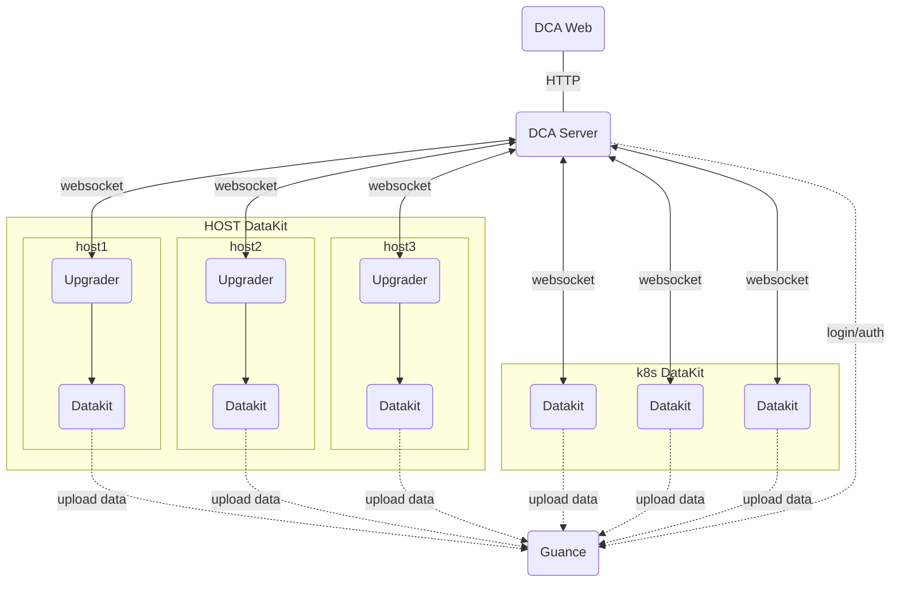

# DCA 客户端

[:octicons-beaker-24: Experimental](index.md#experimental)

---

:fontawesome-brands-linux: :fontawesome-brands-apple: :material-kubernetes: :material-docker:

---

DCA（Datakit Control App）主要用于管理 Datakit，如 Datakit 列表查看、配置文件管理、Pipeline 管理以及帮助文档的查看等功能。

DCA 基本网络拓扑结构如下：



## 开启 DCA 服务 {#config}

<!-- markdownlint-disable MD046 -->
=== "主机安装时启用 DCA 功能"

    在安装命令前添加以下环境变量：
    
    - `DK_DCA_ENABLE`: 是否开启，开启设置为 `on`
    - `DK_DCA_WEBSOCKET_SERVER`: 配置 DCA 的 websocket 服务地址 ([:octicons-tag-24: Version-1.64.0](changelog.md#cl-1.64.0))
    
    示例：
    
    ```shell
    DK_DCA_ENABLE=on DK_DCA_WEBSOCKET_SERVER="ws://127.0.0.1:9000/ws" DK_DATAWAY=https://openway.guance.com?token=<TOKEN> bash -c "$(curl -L https://static.guance.com/datakit/install.sh)"
    ```

    安装成功后，DataKit 将自动连接 DCA 服务。

=== "Kubernetes"

    可通过 [设置 DCA 相关环境变量](../datakit/datakit-daemonset-deploy.md#env-dca) 来开启 DCA 功能。

=== "*datakit.conf*"

    修改配置文件 *datakit.conf*:
    
    ```toml
    [dca]
        # 开启
        enable = true

        # DCA 服务地址
        websocket_server = "ws://127.0.0.1:8000/ws"

    ```

    配置好后，[重启 DataKit](datakit-service-how-to.md#manage-service) 即可。

<!-- markdownlint-enable -->

---

## DCA web 服务 {#dca-web}

<!-- markdownlint-disable MD046 -->
???+ Attention

    不同版本的 DataKit 接口可能存在差异，为了更好地使用 DCA，建议升级 DataKit 为最新版本。

<!-- markdownlint-enable -->

DCA web 是 DCA 客户端的 web 版本，它通过部署一个后端服务来提供 DataKit 的接口代理，并提供前端 Web 页面来实现对 DataKit 的访问。

<!-- markdownlint-disable MD046 -->
=== "Docker"

    Docker 安装，可参考[文档](https://docs.docker.com/desktop/install/linux-install/){:target="_blank"}。

    - 下载镜像

    运行容器之前，首先通过 `docker pull` 下载 DCA 镜像。

    ```shell
    docker pull pubrepo.guance.com/tools/dca:latest
    ```

    - 运行容器

    通过 `docker run` 命令来创建和启动 DCA 容器，容器默认暴露访问端口是 80。

    ```shell
    docker run -d --name dca -p 8000:80 pubrepo.guance.com/tools/dca
    ```

    - 测试

    容器运行成功后，可以通过浏览器进行访问：`http://localhost:8000`

=== "k8s"

    下载 [*dca.yaml*](https://static.guance.com/datakit/dca/dca.yaml){:target="_blank"}，并修改文件里面的相应配置，应用 `dca.yaml` 文件到 Kubernetes 集群中。

    ```shell
    kubectl apply -f dca.yaml
    kubectl get pod -n datakit
    ```
<!-- markdownlint-enable -->

### 环境变量配置 {#envs}

默认情况下，DCA 会采用系统默认的配置，如果需要自定义配置，可以通过注入环境变量方式来进行修改。目前支持以下环境变量：

| 环境变量名称            | 类型   | 默认值                           | 说明                                                                                            |
| ---------:              | ----:  | ---:                             | ------                                                                                          |
| `DCA_CONSOLE_API_URL`        | string | `https://console-api.guance.com` | 观测云 console API 地址                                                                         |
| `DCA_CONSOLE_WEB_URL`        | string | `https://console.guance.com` | 观测云平台地址                                                                         |
| `DCA_STATIC_BASE_URL`        | string | `https://static.guance.com` | 静态文件服务器地址                                                                         |
| `DCA_CONSOLE_PROXY`     | string | 无                               | 观测云 API 代理，不代理 DataKit 接口                                                            |
| `DCA_LOG_LEVEL`         | string | INFO                             | 日志等级，取值为 debug/info/warn/error                  |
| `DCA_LOG_PATH`         | string | INFO                             | 日志路径，如果需要输出到 stdout，则设置为 `stdout`                  |
| `DCA_TLS_ENABLE`         | string |                              | 是否开启 TLS，设置该值表示开启                  |
| `DCA_TLS_CERT_FILE`         | string |                              | 证书文件路径，如： `/etc/ssl/certs/server.crt`                  |
| `DCA_TLS_KEY_FILE`         | string |                              | 私钥文件路径，如： `/etc/ssl/certs/server.key`                  |

示例：

```shell
docker run -d --name dca -p 8000:80 -e DCA_LOG_PATH=stdout -e DCA_LOG_LEVEL=WARN pubrepo.guance.com/tools/dca
```

### 登录 DCA {#login}

DCA 开启和安装以后，您可在浏览器输入地址 `localhost:8000` 进行访问。首次访问时，页面将导向一个登录跳转中转页面。点击页面下方「立即前往」按钮后，您将被引导至观测云平台。接下来，按照页面上的说明指引，配置 DCA 的地址。一旦配置完成，您便能够直接通过观测云平台实现无需登录即可访问 DCA 平台的功能。

<figure markdown>
  { width="800" }
</figure>

### 查看 DataKit 列表 {#datakit-list}

登录到 DCA 后，可在左上角选择工作空间管理其对应 DataKit 及采集器，支持通过搜索关键字快速筛选需要查看和管理的主机名称。

通过 DCA 远程管理的主机分成三种状态：

- running：说明数据上报正常，可通过 DCA 查看 DataKit 的运行情况和配置采集器；
- offline：说明 DataKit 离线状态。
- stopped: DataKit 处于停止状态。
- upgrading： DataKit 处于升级状态。
- restarting： DataKit 处于重启状态。

默认情况下，只能查看当前工作空间里的 DataKit 相关信息，如果需要对 DataKit 进行管理，如 DataKit 升级、采集器、Pipeline 的 新建、删除、修改等，则需要赋予当前帐号**DCA 配置管理**权限，具体设置可参考[角色管理](../management/role-management.md)。

<figure markdown>
  { width="800" }
</figure>

### 查看 DataKit 运行情况 {#view-runtime}

登录到 DCA 后，选择工作空间，即可查看该工作空间下所有已经安装 DataKit 的主机名和 IP 信息。点击 DataKit 主机，即可远程连接到 DataKit ，查看该主机上 DataKit 的运行情况，包括版本、运行时间、发布日期、采集器运行情况等，以及可以对 DataKit 进行重新加载操作。

<figure markdown>
  { width="800" }
</figure>

### 采集器配置管理 {#view-inputs-conf}

远程连接到 DataKit 以后，点击「采集器配置」，即可查看已经配置的采集器列表和 Sample 列表（当前 DataKit 支持配置的所有 Sample 文件）。

- 已配置列表：可查看，编辑和删除其下所有的 conf 文件。
- Sample 列表：可查看和编辑其下所有的 sample 文件。
- 帮助：可查看对应的采集器帮助文档

<figure markdown>
  { width="800" }
</figure>

### Pipelines 管理 {#view-pipeline}

远程连接到 DataKit 以后，点击「Pipelines」，即可查看，编辑和测试 DataKit 默认自带的 Pipeline 文件。关于 Pipeline 可参考文档 [文本数据处理](../pipeline/use-pipeline/index.md) 。

<figure markdown>
  { width="800" }
</figure>

### 查看黑名单 {#view-filters}

远程连接到 DataKit 以后，点击「黑名单」，即可查看在观测云工作配置的黑名单，如下图所示 `source = default and (status in [unknown])` 即为配置的黑名单条件。

注意：通过观测云创建的黑名单文件统一保存在路径：`/usr/local/datakit/data/.pull` 。

<figure markdown>
  { width="800" }
</figure>

### 查看日志 {#view-log}

远程连接到 DataKit 以后，点击「日志」，即可实时查看 DataKit 的日志，并且可以导出相应的日志到本地。

<figure markdown>
  { width="800" }
</figure>

## 更新日志 {#change-log}

### 0.1.0(2024/11/27) {#cl-0.1.0}

- 重构 DCA 底层框架，使用 websocket 协议进行通信，便于管理不同网络环境下的 DataKit。
- 新增管理 DataKit 主配置的功能。
- 新增支持 TLS 配置。
- 调整 DataKit 的”重新加载“功能为“重启“。
