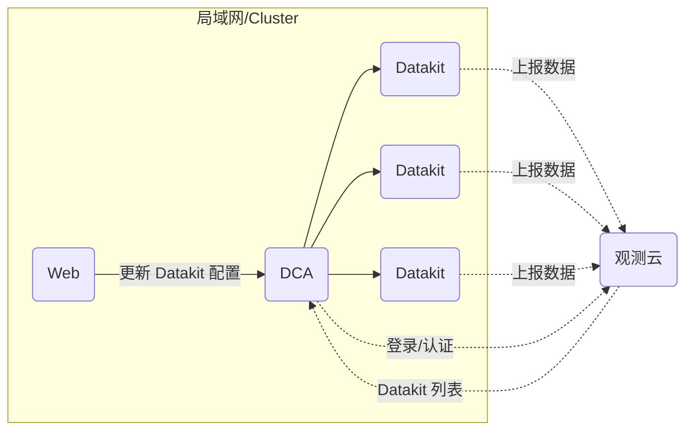

# DCA 客户端

[:octicons-beaker-24: Experimental](index.md#experimental)

---

:fontawesome-brands-linux: :fontawesome-brands-windows: :fontawesome-brands-apple: :material-kubernetes: :material-docker:

---

DCA 主要用于管理 Datakit，如 Datakit 列表查看、配置文件管理、Pipeline 管理以及帮助文档的查看等功能。

DCA 基本网络拓扑结构如下：



## 开启 DCA 服务 {#config}

<!-- markdownlint-disable MD046 -->
=== "主机安装时启用 DCA 功能"

    在安装命令前添加以下环境变量：
    
    - `DK_DCA_ENABLE`: 是否开启，开启设置为 `on`
    - `DK_DCA_WHITE_LIST`: 访问服务白名单，支持 IP 地址或 CIDR 格式地址，多个地址请以逗号分割。
    
    示例：
    
    ```shell
    DK_DCA_ENABLE=on DK_DCA_WHITE_LIST="192.168.1.101,10.100.68.101/24" DK_DATAWAY=https://openway.guance.com?token=<TOKEN> bash -c "$(curl -L https://static.guance.com/datakit/install.sh)"
    ```

    安装成功后，DCA 服务将启动，默认端口是 9531。如需修改监听地址和端口，可设置环境变量 `DK_DCA_LISTEN`，如 `DK_DCA_LISTEN=192.168.1.101:9531`。

=== "*datakit.conf*"

    修改配置文件 *datakit.conf*:
    
    ```toml
    [dca]
        # 开启
        enable = true

        # 监听地址和端口
        listen = "0.0.0.0:9531"

        # 白名单，支持指定 IP 地址或者 CIDR 格式网络地址
        white_list = ["0.0.0.0/0", "192.168.1.0/24"]
    ```

    配置好后，[重启 DataKit](datakit-service-how-to.md#manage-service) 即可。

=== "Kubernetes"

    参见[这里](datakit-daemonset-deploy.md#env-dca)
<!-- markdownlint-enable -->

---

<!-- markdownlint-disable MD046 -->
???+ attention

    开启 DCA 服务，必须要配置白名单，如果需要允许所有地址访问，可在安装过程中设置 `DK_DCA_WHITE_LIST=0.0.0.0/0`，或者在 *datakit.conf* 中配置 `white_list`，如：

    ```toml
    [dca]
      ...
      white_list = ["0.0.0.0/0"]
    ```
<!-- markdownlint-enable -->

## DCA web 服务 {#dca-web}

<!-- markdownlint-disable MD046 -->
???+ Attention

    不同版本的 DataKit 接口可能存在差异，为了更好地使用 DCA，建议升级 DataKit 为最新版本。另外，Web 版的 DCA 跟桌面版之间还存在一些功能的缺失，后面会慢慢增补进来，*并逐步弃用现在的桌面版*。

<!-- markdownlint-enable -->

DCA web 是 DCA 客户端的 web 版本，它通过部署一个后端服务来提供 DataKit 的接口代理，并提供前端 Web 页面来实现对 DataKit 的访问。

<!-- markdownlint-disable MD046 -->
=== "Docker"

    Docker 安装，可参考[文档](https://docs.docker.com/desktop/install/linux-install/){:target="_blank"}。

    - 下载镜像

    运行容器之前，首先通过 `docker pull` 下载 DCA 镜像。

    ```shell
    docker pull pubrepo.guance.com/tools/dca:latest
    ```

    - 运行容器

    通过 `docker run` 命令来创建和启动 DCA 容器，容器默认暴露访问端口是 80。

    ```shell
    docker run -d --name dca -p 8000:80 pubrepo.guance.com/tools/dca
    ```

    - 测试

    容器运行成功后，可以通过浏览器进行访问：`http://localhost:8000`

=== "k8s"

    创建 `dca.yaml` 文件，内容如下：

    ```yaml
    apiVersion: apps/v1
    kind: Deployment
    metadata:
      labels:
        app: utils-dca
      name: dca
      namespace: datakit
    spec:
      replicas: 1
      revisionHistoryLimit: 10
      selector:
        matchLabels:
          app: utils-dca
      strategy:
        rollingUpdate:
          maxSurge: 25%
          maxUnavailable: 25%
        type: RollingUpdate
      template:
        metadata:
          labels:
            app: utils-dca
        spec:
          affinity: {}
          containers:
            - env:
                - name: DCA_INNER_HOST
                  # 杭州 https://auth-api.guance.com
                  # 宁夏 https://aws-auth-api.guance.com
                  # 广州 https://cn4-auth-api.guance.com
                  # 俄勒冈 https://us1-auth-api.guance.com
                  value: https://auth-api.guance.com
                - name: DCA_FRONT_HOST
                  # 杭州 https://console-api.guance.com
                  # 宁夏 https://aws-console-api.guance.com/
                  # 广州 https://cn4-console-api.guance.com
                  # 俄勒冈 https://us1-console-api.guance.com
                  value: https://console-api.guance.com
                - name: DCA_LOG_ENABLE_STDOUT
                  value: 'true'
              image: pubrepo.guance.com/tools/dca:0.0.7
              imagePullPolicy: Always
              name: dca
              ports:
                - containerPort: 80
                  name: http
                  protocol: TCP
              resources:
                limits:
                  cpu: 500m
                  memory: 256Mi   
                requests:
                  cpu: 250m
                  memory: 100Mi              
              resources: {}
              terminationMessagePath: /dev/termination-log
              terminationMessagePolicy: File
          dnsPolicy: ClusterFirst
          restartPolicy: Always
          schedulerName: default-scheduler
          securityContext: {}
          terminationGracePeriodSeconds: 30

    ---
    apiVersion: v1
    kind: Service
    metadata:
      name: dca
      namespace: datakit
    spec:
      ports:
        - name: web
          port: 80
          protocol: TCP
          targetPort: 80
      selector:
        app: utils-dca
      sessionAffinity: None
      type: ClusterIP

    ---
    apiVersion: networking.k8s.io/v1
    kind: Ingress
    metadata:
      name: dca
      namespace: datakit
    spec:
      rules:
        - host: dca.xxxx.com
          http:
            paths:
              - backend:
                  service:
                    name: dca
                    port:
                      number: 80
                path: /
                pathType: Prefix
      # tls:
      #   - hosts:
      #       - dca.xxxx.com
      #     secretName: xxxx

    ```

    应用 `dca.yaml` 文件到 Kubernetes 集群中

    ```shell
    kubectl apply -f dca.yaml
    kubectl get pod -n datakit
    ```
<!-- markdownlint-enable -->

### 环境变量配置 {#envs}

默认情况下，DCA 会采用系统默认的配置，如果需要自定义配置，可以通过注入环境变量方式来进行修改。目前支持以下环境变量：

| 环境变量名称            | 类型   | 默认值                           | 说明                                                                                            |
| ---------:              | ----:  | ---:                             | ------                                                                                          |
| `DCA_INNER_HOST`        | string | `https://auth-api.guance.com`    | 观测云的 auth API 地址                                                                          |
| `DCA_FRONT_HOST`        | string | `https://console-api.guance.com` | 观测云 console API 地址                                                                         |
| `DCA_CONSOLE_PROXY`     | string | 无                               | 观测云 API 代理，不代理 DataKit 接口                                                            |
| `DCA_LOG_LEVEL`         | string | INFO                             | 日志等级，取值为 NONE/DEBUG/INFO/WARN/ERROR，如果不需要记录日志，可设置为 NONE                  |
| `DCA_LOG_ENABLE_STDOUT` | bool   | false                            | 日志会输出至文件中，位于 `/usr/src/dca/logs` 下。如果需要将日志写到 `stdout`，可以设置为 `true` |

示例：

```shell
docker run -d --name dca -p 8000:80 -e DCA_LOG_ENABLE_STDOUT=true -e DCA_LOG_LEVEL=WARN pubrepo.guance.com/tools/dca
```

### 登录 DCA {#login}

DCA 开启和安装以后，即可在浏览器输入地址 `localhost:8000` 打开 DCA  Web 端，登录账号，即可开始使用。若无账号，可先注册 [观测云账号](https://auth.guance.com/register?channel=帮助文档){:target="_blank"}。

<figure markdown>
  { width="800" }
</figure>

登录到 DCA 后，可在左上角选择工作空间管理其对应 DataKit 及采集器，支持通过搜索关键字快速筛选需要查看和管理的主机名称。

通过 DCA 远程管理的主机分成三种状态：

- online：说明数据上报正常，可通过 DCA 查看 DataKit 的运行情况和配置采集器；
- unknown：说明远程管理配置未开启，或者不在一个局域网内；
- offline：说明主机已经超过 10 分钟未上报数据，或者主机名称被修改后，原主机名称会显示成 offline 的状态。未正常上报数据的主机，若超过 24 小时仍未有数据上报，该主机记录将会从列表中移除。

默认情况下，只能查看当前工作空间里的 DataKit 相关信息，如果需要对 DataKit 进行管理，如 DataKit 重启、采集器、Pipeline 的 新建、删除、修改等，则需要赋予当前帐号**DCA 配置管理**权限，具体设置可参考[角色管理](../management/role-management.md)。

#### 查看 DataKit 运行情况 {#view-runtime}

登录到 DCA 后，选择工作空间，即可查看该工作空间下所有已经安装 DataKit 的主机名和 IP 信息。点击 DataKit 主机，即可远程连接到 DataKit ，查看该主机上 DataKit 的运行情况，包括版本、运行时间、发布日期、采集器运行情况等，以及可以对 DataKit 进行重启操作。

<figure markdown>
  { width="800" }
</figure>

#### 采集器配置管理 {#view-inputs-conf}

远程连接到 DataKit 以后，点击「采集器配置」，即可查看已经配置的采集器列表和 Sample 列表（当前 DataKit 支持配置的所有 Sample 文件）。

- 已配置列表：可查看，编辑和删除其下所有的 conf 文件。
- Sample 列表：可查看和编辑其下所有的 sample 文件。
- 帮助：可查看对应的采集器帮助文档

<figure markdown>
  { width="800" }
</figure>

#### Pipelines 管理 {#view-pipeline}

远程连接到 DataKit 以后，点击「Pipelines」，即可查看，编辑和测试 DataKit 默认自带的 Pipeline 文件。关于 Pipeline 可参考文档 [文本数据处理](../developers/pipeline/index.md) 。

<figure markdown>
  { width="800" }
</figure>

#### 查看黑名单 {#view-filters}

远程连接到 DataKit 以后，点击「黑名单」，即可查看在观测云工作配置的黑名单，如下图所示 `source = default and (status in [unknown])` 即为配置的黑名单条件。

注意：通过观测云创建的黑名单文件统一保存在路径：`/usr/local/datakit/data/.pull` 。

<figure markdown>
  { width="800" }
</figure>

#### 查看日志 {#view-log}

远程连接到 DataKit 以后，点击「日志」，即可实时查看 DataKit 的日志，并且可以导出相应的日志到本地。

<figure markdown>
  { width="800" }
</figure>

#### 查看采集器帮助 {#view-input-helper}

远程连接到 DataKit 以后，点击「帮助」，即可查看采集器文档列表。点击需要查看的采集器名称，直接跳转显示该采集器的帮助文档。

关于如何查看更多采集器的帮助文档，可参考文档 [采集器](../integrations/hostobject.md) 。

<figure markdown>
  { width="800" }
</figure>
