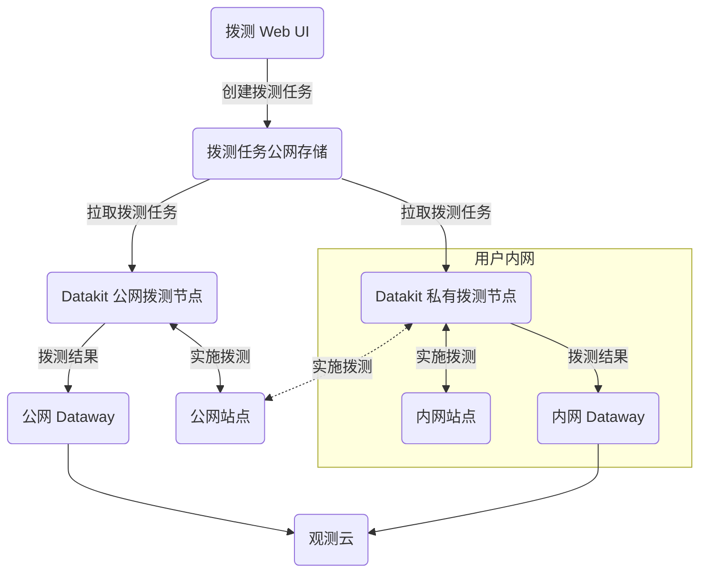

{{.AvailableArchs}}

---

该采集器是网络拨测结果数据采集，所有拨测产生的数据，上报观测云。

## 配置 {#config}

<!-- markdownlint-disable MD046 -->
=== "主机安装"

    私有拨测节点部署，需在 [观测云页面创建私有拨测节点](../usability-monitoring/self-node.md)。创建完成后，将页面上相关信息填入 `conf.d/{{.Catalog}}/{{.InputName}}.conf` 即可：

    进入 DataKit 安装目录下的 `conf.d/{{.Catalog}}` 目录，复制 `{{.InputName}}.conf.sample` 并命名为 `{{.InputName}}.conf`。示例如下：
    
    ```toml
    {{ CodeBlock .InputSample 4 }}
    ```

    配置好后，[重启 DataKit](../datakit/datakit-service-how-to.md#manage-service) 即可。

=== "Kubernetes"

    可通过 [ConfigMap 方式注入采集器配置](../datakit/datakit-daemonset-deploy.md#configmap-setting) 或 [配置 ENV_DATAKIT_INPUTS](../datakit/datakit-daemonset-deploy.md#env-setting) 开启采集器。

    也支持以环境变量的方式修改配置参数（需要在 ENV_DEFAULT_ENABLED_INPUTS 中加为默认采集器）：

{{ CodeBlock .InputENVSampleZh 4 }}

---

???+ attention

    目前只有 Linux 的拨测节点才支持「路由跟踪」，跟踪数据会保存在相关指标的 [`traceroute`](dialtesting.md#fields) 字段中。
<!-- markdownlint-enable -->

### 拨测节点部署 {#arch}

以下是拨测节点的网络部署拓扑图，这里存在两种拨测节点部署方式：

- 公网拨测节点：直接使用观测云在全球部署的拨测节点来检测 **公网** 的服务运行情况。
- 私网拨测节点：如果需要拨测用户 **内网** 的服务，此时需要用户自行部署 **私有** 的拨测节点。当让，如果网络允许，这些私有的拨测节点也能部署公网上的服务。

不管是公网拨测节点，还是私有拨测节点，它们都能通过 Web 页面创建拨测任务。



## 日志 {#logging}

{{ range $i, $m := .Measurements }}

### `{{$m.Name}}`

- 标签

{{$m.TagsMarkdownTable}}

- 指标列表

{{$m.FieldsMarkdownTable}}

{{ end }}

### `traceroute` {#traceroute}

`traceroute` 是「路由跟踪」数据的 JSON 文本，整个数据是一个数组对象，对象中的每个数组元素记录了一次路由探测的相关情况，示例如下：

```json
[
    {
        "total": 2,
        "failed": 0,
        "loss": 0,
        "avg_cost": 12700395,
        "min_cost": 11902041,
        "max_cost": 13498750,
        "std_cost": 1129043,
        "items": [
            {
                "ip": "10.8.9.1",
                "response_time": 13498750
            },
            {
                "ip": "10.8.9.1",
                "response_time": 11902041
            }
        ]
    },
    {
        "total": 2,
        "failed": 0,
        "loss": 0,
        "avg_cost": 13775021,
        "min_cost": 13740084,
        "max_cost": 13809959,
        "std_cost": 49409,
        "items": [
            {
                "ip": "10.12.168.218",
                "response_time": 13740084
            },
            {
                "ip": "10.12.168.218",
                "response_time": 13809959
            }
        ]
    }
]
```

**字段描述：**

| 字段       | 类型          | 说明                        |
| :---       | ---           | ---                         |
| `total`    | number        | 总探测次数                  |
| `failed`   | number        | 失败次数                    |
| `loss`     | number        | 失败百分比                  |
| `avg_cost` | number        | 平均耗时(μs)                |
| `min_cost` | number        | 最小耗时(μs)                |
| `max_cost` | number        | 最大耗时(μs)                |
| `std_cost` | number        | 耗时标准差(μs)              |
| `items`    | Item 的 Array | 每次探测信息(详见下面 `items` 字段说明) |

**`items` 字段说明**

| 字段            | 类型   | 说明                        |
| :---            | ---    | ---                         |
| `ip`            | string | IP 地址，如果失败，值为 `*` |
| `response_time` | number | 响应时间(μs)                |

## 拨测采集器自身指标采集 {#metric}

拨测采集器会暴露 [Prometheus 指标](../datakit/datakit-metrics.md)，如果需要上报这些指标至观测云，可以通过 [DataKit 采集器](dk.md) 进行采集，相关配置参考如下：

```toml
[[inputs.dk]]
  ......

  metric_name_filter = [
  
  ### others...
  
  ### dialtesting
  "datakit_dialtesting_.*",

  ]

  ......

```
