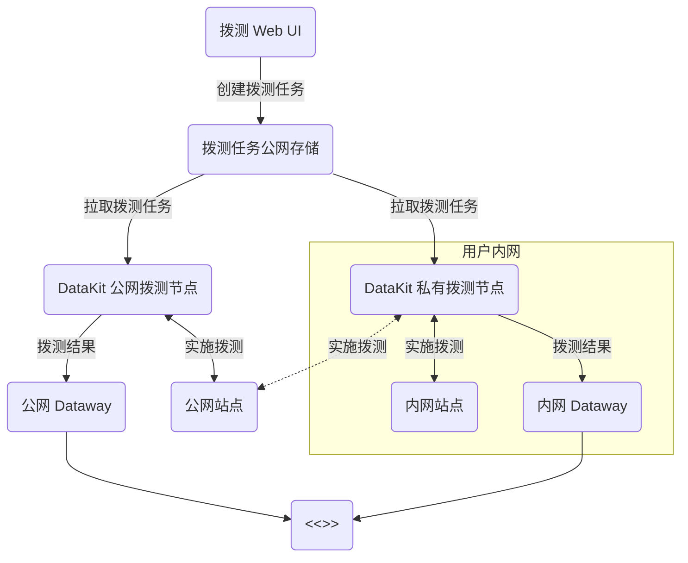

{{.AvailableArchs}}

---

该采集器是网络拨测结果数据采集，所有拨测产生的数据，上报<<<custom_key.brand_name>>>。

## 配置 {#config}

<!-- markdownlint-disable MD046 -->
=== "主机安装"

    私有拨测节点部署，需在 [<<<custom_key.brand_name>>>页面创建私有拨测节点](../synthetic-tests/self-node.md)。创建完成后，将页面上相关信息填入 `conf.d/samples/{{.InputName}}.conf` 即可：

    进入 DataKit 安装目录下的 `conf.d/samples` 目录，复制 `{{.InputName}}.conf.sample` 并命名为 `{{.InputName}}.conf`。示例如下：
    
    ```toml
    {{ CodeBlock .InputSample 4 }}
    ```

    配置好后，[重启 DataKit](../datakit/datakit-service-how-to.md#manage-service) 即可。

=== "Kubernetes"

    可通过 [ConfigMap 方式注入采集器配置](../datakit/datakit-daemonset-deploy.md#configmap-setting) 或 [配置 ENV_DATAKIT_INPUTS](../datakit/datakit-daemonset-deploy.md#env-setting) 开启采集器。

    也支持以环境变量的方式修改配置参数（需要在 ENV_DEFAULT_ENABLED_INPUTS 中加为默认采集器）：

{{ CodeBlock .InputENVSampleZh 4 }}

---

???+ note

    目前只有 Linux 的拨测节点才支持「路由跟踪」，跟踪数据会保存在相关指标的 [`traceroute`](dialtesting.md#fields) 字段中。

???+ note

    浏览器拨测从 DataKit [:octicons-tag-24: Version-2.1.0](../datakit/changelog-2026.md#cl-2.1.0) 开始支持。

    浏览器拨测任务（`BROWSER`）在 Linux 拨测节点上默认执行；如需关闭，可设置 `[inputs.dialtesting.browser].enabled = false`。执行浏览器任务时，DataKit 需能访问 Lightpanda；如需控制资源峰值，可设置 `[inputs.dialtesting.browser].max_concurrency` 限制并发数。

    Kubernetes 中推荐使用内置 Lightpanda 的 `datakit:<version>` 镜像。

    更多部署、任务配置和排查说明，请参考[浏览器拨测](dialtesting_browser.md)。
<!-- markdownlint-enable MD046 -->

### 拨测节点部署 {#arch}

以下是拨测节点的网络部署拓扑图，这里存在两种拨测节点部署方式：

- 公网拨测节点：直接使用<<<custom_key.brand_name>>>在全球部署的拨测节点来检测 **公网** 的服务运行情况。
- 私网拨测节点：如果需要拨测用户 **内网** 的服务，此时需要用户自行部署 **私有** 的拨测节点。当然，如果网络允许，这些私有的拨测节点也能部署公网上的服务。

<!-- markdownlint-disable MD046 -->

???+ note

    当拨测节点部署在内网环境而无法访问外网时，可通过配置代理服务实现流量转发。具体配置方法请参考 [DataKit 内置代理](../datakit/datakit-proxy.md#datakit)的相关说明。

<!-- markdownlint-enable MD046 -->

不管是公网拨测节点，还是私有拨测节点，它们都能通过 Web 页面创建拨测任务。

如果拨测节点需要执行浏览器拨测任务，请确保该节点所在环境满足以下条件：

- Lightpanda 可被 DataKit 进程访问。
- 节点可以访问被测站点，以及任务 `post_url` 对应的 Dataway，用于上报拨测结果。


```mermaid
graph TD
  %% node definitions
  dt_web(拨测 Web UI);
  dt_db(拨测任务公网存储);
  dt_pub(DataKit 公网拨测节点);
  dt_pri(DataKit 私有拨测节点);
  site_inner(内网站点);
  site_pub(公网站点);
  dw_inner(内网 Dataway);
  dw_pub(公网 Dataway);
  server(<<<custom_key.brand_name>>>);

  %%%%%%%%%%%%%%%%%%%%%%%%%%%%%%%

  dt_web -->|创建拨测任务| dt_db;
  dt_db -->|拉取拨测任务| dt_pub -->|拨测结果| dw_pub --> server;
  dt_db -->|拉取拨测任务| dt_pri;
  dt_pub <-->|实施拨测| site_pub;

  dt_pri <-.->|实施拨测| site_pub;
  dw_inner --> server;
  subgraph "用户内网"
  dt_pri <-->|实施拨测| site_inner;
  dt_pri -->|拨测结果| dw_inner;
  end
```

## 日志 {#logging}

{{ range $i, $m := .Measurements }}

### `{{$m.Name}}`

{{$m.MarkdownTable}}

{{ end }}

### `traceroute` {#traceroute}

`traceroute` 是「路由跟踪」数据的 JSON 文本，整个数据是一个数组对象，对象中的每个数组元素记录了一次路由探测的相关情况，示例如下：

```json
[
    {
        "total": 2,
        "failed": 0,
        "loss": 0,
        "avg_cost": 12700395,
        "min_cost": 11902041,
        "max_cost": 13498750,
        "std_cost": 1129043,
        "items": [
            {
                "ip": "10.8.9.1",
                "response_time": 13498750
            },
            {
                "ip": "10.8.9.1",
                "response_time": 11902041
            }
        ]
    },
    {
        "total": 2,
        "failed": 0,
        "loss": 0,
        "avg_cost": 13775021,
        "min_cost": 13740084,
        "max_cost": 13809959,
        "std_cost": 49409,
        "items": [
            {
                "ip": "10.12.168.218",
                "response_time": 13740084
            },
            {
                "ip": "10.12.168.218",
                "response_time": 13809959
            }
        ]
    }
]
```

**字段描述：**

| 字段       | 类型          | 说明                        |
| :---       | ---           | ---                         |
| `total`    | number        | 总探测次数                  |
| `failed`   | number        | 失败次数                    |
| `loss`     | number        | 失败百分比                  |
| `avg_cost` | number        | 平均耗时(μs)                |
| `min_cost` | number        | 最小耗时(μs)                |
| `max_cost` | number        | 最大耗时(μs)                |
| `std_cost` | number        | 耗时标准差(μs)              |
| `items`    | Item 的 Array | 每次探测信息(详见下面 `items` 字段说明) |

**`items` 字段说明**

| 字段            | 类型   | 说明                        |
| :---            | ---    | ---                         |
| `ip`            | string | IP 地址，如果失败，值为 `*` |
| `response_time` | number | 响应时间(μs)                |

## 拨测采集器自身指标采集 {#metric}

拨测采集器会暴露 [Prometheus 指标](../datakit/datakit-metrics.md)。默认情况下，[DataKit 采集器](dk.md) 会采集这些 `datakit_dialtesting_*` 指标并上报至<<<custom_key.brand_name>>>，无需额外配置。

## 异步调试部署 {#async-debug-deployment}

异步调试任务只保存在 DataKit 进程内存中。专用调试 DataKit 必须以单副本部署，并由 Backend 固定访问该实例；不要将多个副本放在普通负载均衡之后，否则提交与查询可能访问不同内存。DataKit 重启或升级后，排队中、执行中以及仍在保留期内的终态任务都会丢失，调用方需要重新提交测试。

以下内置默认值可在进程启动时通过环境变量覆盖。空值或非法值回退默认值，时长使用 Go duration 格式；修改后需重启 DataKit 才能生效。

| 环境变量 | 默认值 |
| --- | --- |
| `ENV_DIALTESTING_DEBUG_MAX_CONCURRENT_RUNS` | `100` |
| `ENV_DIALTESTING_DEBUG_MAX_QUEUED_RUNS` | `1000`（准备中与排队中的任务总数） |
| `ENV_DIALTESTING_DEBUG_MAX_QUEUE_WAIT` | `3m` |
| `ENV_DIALTESTING_DEBUG_RESULT_TTL` | `10m` |
| `ENV_DIALTESTING_DEBUG_MAX_LONG_POLL_WAIT` | `10s`（超过 10 秒时截断） |
| `ENV_DIALTESTING_DEBUG_MAX_RETAINED_TERMINAL_RUNS` | `2000` |

请根据 CPU、内存、文件描述符以及轻量拨测与 NetPath 的任务占比调整并发和队列容量。容量已满时，新任务在执行任务准备之前返回 `429 ServerUnavailable`；相同 owner、request ID 和请求内容的并发重试共用一次准备。DataKit 在任务执行前校验内网目标，DNS 校验使用固定 15 秒超时；校验失败时 run 进入 `failed`。终态结果最多保留至配置的 TTL；超过终态任务保留数量上限时，DataKit 优先淘汰最早结果。可通过 `dialing_debug_preparing_size` 和 `dialing_debug_queue_size` 分别观察准备中与排队中的任务数。即时调试结果不会写入正式拨测任务、Kodo、MySQL 或 `D::` 数据链路。
