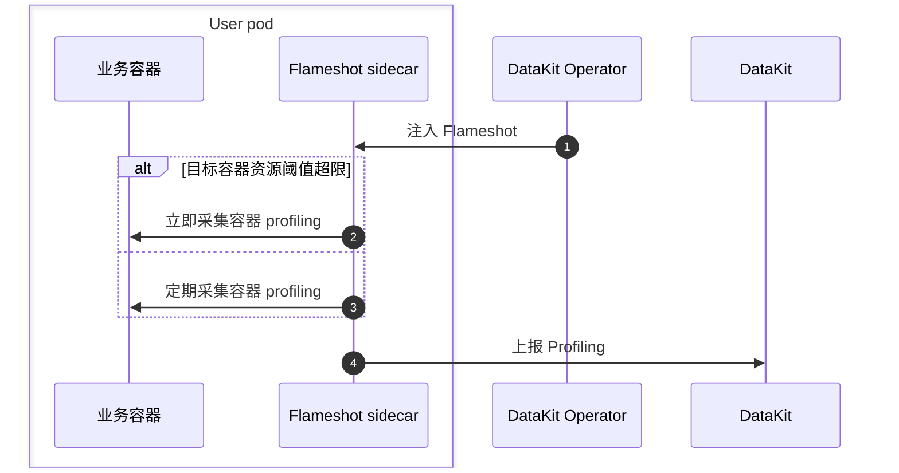

# DataKit Operator 注入 Flameshot

[:octicons-tag-24: Operator Version-1.7.0](operator-changelog.md#cl-1.7.0)

---

Flameshot 是 DataKit-Operator 引入的性能分析工具，用于替代原有的 Profiler（async-profiler、py-spy 等）。



## 前置条件 {#flameshot-prerequisites}

- 集群已安装 [DataKit](https://docs.<<<custom_key.brand_main_domain>>>/datakit/datakit-daemonset-deploy/){:target="_blank"}。
- [开启 profile](https://docs.<<<custom_key.brand_main_domain>>>/datakit/datakit-daemonset-deploy/#using-k8-env){:target="_blank"} 采集器。
- （可选）如需使用 Prometheus Annotations 自动注入功能，需要开启 DataKit 的 KubernetesPrometheus 采集器，并配置 `EnableDiscoveryOfPrometheusPodAnnotations = true` 启用 Pod Annotations 自动发现功能。

## 使用说明 {#flameshot-usage}

1. 在目标 Kubernetes 集群，[下载和安装 DataKit-Operator](datakit-operator.md#install)
1. 在 DataKit Operator 配置中设置 `flameshots` 数组，配置 `namespace_selectors`/`label_selectors` 匹配规则和 `processes` 字段指定要监控的进程。
1. （可选）在 Deployment 添加指定 Annotation `admission.datakit/flameshot.enabled: "true"`，允许注入 Flameshot（如果设置为 `"false"` 则会禁用注入）。

Flameshot 配置示例：

```json
{
    "admission_inject_v2": {
        "flameshots": [
            {
                "namespace_selectors": [],
                "label_selectors":     [],
                "image": "pubrepo.<<<custom_key.brand_main_domain>>>/datakit/flameshot:{{.FlameshotVersion}}",
                "envs": {
                    "FLAMESHOT_DATAKIT_ADDR":     "http://datakit-service.datakit:9529/profiling/v1/input",
                    "FLAMESHOT_MONITOR_INTERVAL": "10s",
                    "FLAMESHOT_LOG_LEVEL":        "info",
                    "FLAMESHOT_PROFILING_PATH":   "/flameshot-data",
                    "FLAMESHOT_LOG_PATH":         "/var/log/flameshot.log",
                    "FLAMESHOT_AUTO_PROFILING":   "10m",
                    "FLAMESHOT_AUTO_PROFILING_DURATION": "15s",
                    "FLAMESHOT_JCMD_SNAPSHOT_ENABLED": "true",
                    "FLAMESHOT_JCMD_TIMEOUT": "20s",
                    "FLAMESHOT_OOM_HPROF_ENABLED": "true",
                    "FLAMESHOT_OOM_HPROF_MATCH_WINDOW": "3m",
                    "FLAMESHOT_POD_MEM_LIMIT": "2048",
                    "FLAMESHOT_HTTP_LOCAL_IP":    "{fieldRef:status.podIP}",
                    "FLAMESHOT_HTTP_LOCAL_PORT":  "8089",
                    "FLAMESHOT_SERVICE":  "{fieldRef:metadata.labels['app']}",
                    "FLAMESHOT_TAGS": "pod_name:$(POD_NAME),pod_namespace:$(POD_NAMESPACE),host:$(NODE_NAME)"
                },
                "resources": {
                    "requests": {
                        "cpu":    "100m",
                        "memory": "128Mi"
                    },
                    "limits": {
                        "cpu":    "200m",
                        "memory": "256Mi"
                    }
                },
                "processes": "",
                "enable_prometheus_annotations": true
            }
        ]
    }
}
```

配置字段说明：

| 字段                            | 类型    | 必填     | 说明                                                                                                  |
| ------                          | ------  | ------   | ------                                                                                                |
| `namespace_selectors`           | array   | 否       | 命名空间选择器数组，支持正则表达式匹配                                                                |
| `label_selectors`               | array   | 否       | 标签选择器数组，使用 Kubernetes Label Selector 语法                                                  |
| `image`                         | string  | 是       | Flameshot 容器镜像地址                                                                                |
| `envs`                          | object  | 否       | 环境变量配置，支持 Downward API                                                                       |
| `resources`                     | object  | 否       | 资源限制配置（requests 和 limits）                                                                   |
| `processes`                     | string  | 是       | 进程监控配置（JSON 字符串），会作为 `FLAMESHOT_PROCESSES` 环境变量注入到 Flameshot 容器中。格式请参考 [Flameshot 相关文档](../integrations/flameshot.md) |
| `enable_prometheus_annotations` | boolean | 否       | 是否自动添加 Prometheus 相关 Annotations。在默认配置模板中为 `true`，如果用户自定义配置且不设置该字段，则默认为 `false`。如果 Pod 已存在任意 `prometheus.io/` 开头的 Annotation，则不会注入 |

<!-- markdownlint-disable MD046 -->
???+ important

    **重要说明**：`processes` 字段是一个 JSON 字符串，该值会直接作为 `FLAMESHOT_PROCESSES` 环境变量注入到 Flameshot 容器中。`processes` 字段的格式和含义请参考 [Flameshot 相关文档](../integrations/flameshot.md)。如果 `processes` 为空，Flameshot 注入将被跳过。
<!-- markdownlint-enable -->

### 环境变量 {#envs}

| 环境变量名                   | 说明                                                                                      |
| :---                         | :---                                                                                      |
| `FLAMESHOT_DATAKIT_ADDR`     | DataKit profiling 接收地址，例如 `http://datakit-service.datakit:9529/profiling/v1/input` |
| `FLAMESHOT_MONITOR_INTERVAL` | 监控间隔，例如 `10s`                                                                      |
| `FLAMESHOT_LOG_LEVEL`        | 日志级别，例如 `info`                                                                     |
| `FLAMESHOT_PROFILING_PATH`   | Profiling 数据存储路径，例如 `/flameshot-data`                                            |
| `FLAMESHOT_LOG_PATH`         | 日志文件路径，例如 `/var/log/flameshot.log`                                               |
| `FLAMESHOT_AUTO_PROFILING`   | 定时采集间隔，例如 `10m`                                                                  |
| `FLAMESHOT_AUTO_PROFILING_DURATION` | 定时采集单次时长，例如 `15s`                                                        |
| `FLAMESHOT_JCMD_SNAPSHOT_ENABLED` | 是否开启高水位 `jcmd` 轻量快照，例如 `true`                                        |
| `FLAMESHOT_JCMD_TIMEOUT`     | 每条 `jcmd` 命令的超时时间，例如 `20s`                                                    |
| `FLAMESHOT_OOM_HPROF_ENABLED` | 是否开启 OOM `.hprof` 摘要恢复，例如 `true`                                            |
| `FLAMESHOT_OOM_HPROF_MATCH_WINDOW` | OOM 事件与 `.hprof` 的匹配窗口，例如 `3m`                                          |
| `FLAMESHOT_POD_MEM_LIMIT`    | Pod 内存 limit，单位 Mi，例如 `2048`                                                      |
| `FLAMESHOT_HTTP_LOCAL_IP`    | HTTP 服务本地 IP，通常通过 Downward API 注入，例如 `{fieldRef:status.podIP}`              |
| `FLAMESHOT_HTTP_LOCAL_PORT`  | HTTP 服务端口，例如 `8089`                                                                |
| `FLAMESHOT_PROCESSES`        | 进程监控配置（由 `processes` 字段自动注入），JSON 字符串格式                              |

### Flameshot 自身直播采集 {#prom-anno}

当 `enable_prometheus_annotations` 设置为 `true` 时（在默认配置模板中为 `true`），DataKit-Operator 会自动为注入 Flameshot 的 Pod 添加以下 Prometheus 相关 Annotations，便于采集 Flameshot 的自身指标（通过 DataKit 的 KubernetesPrometheus 采集）：

- `prometheus.io/scrape: "true"`：标识该 Pod 需要被采集
- `prometheus.io/port: "<port>"`：指标暴露端口，取值来自环境变量 `FLAMESHOT_HTTP_LOCAL_PORT`（例如 `"8089"`）
- `prometheus.io/scheme: "http"`：指标采集协议
- `prometheus.io/path: "/metrics"`：指标路径
- `prometheus.io/param_measurement: "flameshot"`：指定 measurement 名称

<!-- markdownlint-disable MD046 -->
???+ warning

    1. 如果 Pod 已存在任意一个 `prometheus.io/` 开头的 Annotation，DataKit-Operator 将不会注入上述 Prometheus Annotations，避免覆盖已有的指标采集配置
    1. 要使用此功能，需要在 DataKit 中开启 KubernetesPrometheus 采集器，并配置 `EnableDiscoveryOfPrometheusPodAnnotations = true` 启用 Pod Annotations 自动发现功能
<!-- markdownlint-enable -->

## 用例 {#flameshot-example}

> **注解使用说明**：关于 `check_annotation` 配置如何影响版本注解的行为，以及各种注解的详细说明，请参考 [Annotation 配置注入](datakit-operator.md#annotation-injection) 和 [`check_annotation` 配置项说明](datakit-operator.md#check-annotation-config)。

<!-- markdownlint-disable MD046 -->
???+ warning

    - 仅添加 `admission.datakit/flameshot.enabled: "true"` Annotation 不足以触发注入，还需要在 DataKit-Operator 配置中设置匹配的 `flameshots` 规则（包括 `namespace_selectors`/`label_selectors` 和 `processes` 字段）
    - 如果 `processes` 字段为空，注入将被跳过。
<!-- markdownlint-enable -->

下面是一个 Deployment 示例，给 Deployment 创建的所有 Pod 注入 Flameshot（前提是 DataKit-Operator 配置中已设置匹配的规则）：

```yaml
apiVersion: apps/v1
kind: Deployment
metadata:
  name: app-deployment
  labels:
    app: myapp
spec:
  replicas: 1
  selector:
    matchLabels:
      app: myapp
  template:
    metadata:
      labels:
        app: myapp
      annotations:
        admission.datakit/flameshot.enabled: "true"
    spec:
      containers:
      - name: app
        image: myapp:latest
        ports:
        - containerPort: 8080
```

使用 yaml 文件创建资源：

```shell
$ kubectl apply -f app-deployment.yaml
...
```

验证如下：

```shell
$ kubectl get pod

NAME                                   READY   STATUS    RESTARTS      AGE
app-deployment-7bd8dd85f-fzmt2          2/2     Running   0             4s

$ kubectl get pod app-deployment-7bd8dd85f-fzmt2 -o=jsonpath={.spec.containers\[\*\].name}
app datakit-flameshot
```

稍等几分钟后即可在<<<custom_key.brand_name>>>控制台 [应用性能检监测-Profiling](https://console.<<<custom_key.brand_main_domain>>>/tracing/profile){:target="_blank"} 页面查看应用性能数据。

<!-- markdownlint-disable MD046 -->
???+ note

    若无法看到数据，可以进入 `datakit-flameshot` 容器查看相应日志进行排查：

    ```shell
    $ kubectl exec -it app-deployment-7bd8dd85f-fzmt2 -c datakit-flameshot -- bash
    $ cat /var/log/flameshot.log
    ```
<!-- markdownlint-enable -->
