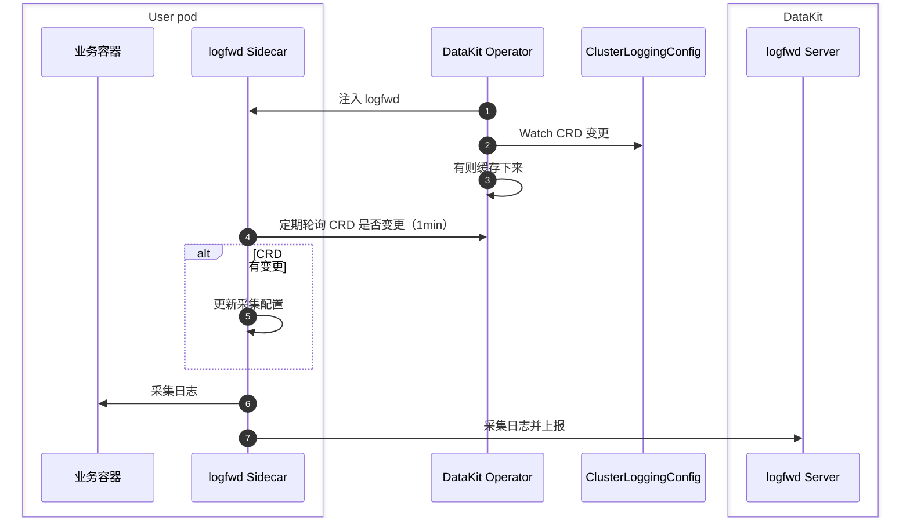

# DataKit Operator 注入 logfwd

Operator 注入 logfwd 采集主要采集 Pod 内部日志（日志没有保留在容器的 stdout），其实现原理是在 Pod 中注入一个 Sidecar 容器，该 Sidecar 容器通过直接采集容器内指定命令的日志，将其发送给 DataKit。

配合特定的 CRD 配置，logfwd 方式能动态调整目标 Pod 的采集设置，而不需要重启目标 Pod。




## 前置条件 {#prerequisites}

1. DataKit 开启 `logfwdserver` 采集器，监听端口默认是 `9533`
1. DataKit service 需要开放 `9533` 端口，使得其它 Pod 能访问 `datakit-service.datakit.svc:9533`

## 使用说明 {#datakit-operator-inject-logfwd-instructions}

> Operator <= v1.6.0 以前的 Operator，其 logfwd 注入使用参见[这里](operator-v1.6.0-logfwd.md)。

采用 `ClusterLoggingConfig` CRD 集中管理日志采集配置：[:octicons-tag-24: Version-1.7.0](operator-changelog.md#cl-1.7.0)

- **集中管理采集配置**：支持监听 Kubernetes `ClusterLoggingConfig` CRD，并暴露匹配结果供 logfwd sidecar 轮询获取（sidecar 默认每 60 秒向 Operator 发起 HTTP 请求，logfwd 需 [:octicons-tag-24: Version-1.86.0](changelog-2025.md#cl-1.86.0)）
- **热更新 & 精细匹配**：CRD selector（Namespace/Pod/Label/Container）随改随生效，无需重建 Workload
- **简化配置**：日志采集配置完全通过 CRD 管理，不再支持通过 Annotation 覆盖配置

> 若尚未了解 ClusterLoggingConfig 的定义及编写方式，请先阅读[容器日志采集 CRD 配置文档](../integrations/container-log-for-k8s-crd.md)。

操作流程：

1. 注册 `ClusterLoggingConfig` CRD（如 DataKit 文档中所述）
1. 升级/安装 DataKit Operator v1.8.0，并添加 CRD 的 RBAC 读权限
1. 在 DataKit Operator 配置中设置 `logfwds` 数组，配置 `namespace_selectors`/`label_selectors` 匹配规则和 `log_configs` 字段
1. （可选）在目标 Pod 添加 Annotation `admission.datakit/logfwd.enabled: "true"` 允许注入（如果设置为 `"false"` 则会拒绝注入）
1. 创建 `ClusterLoggingConfig` 资源，logfwd sidecar 将定期（默认 60 秒）拉取采集配置

安装最新的 `datakit-operator.yaml` 即可带上必要权限，或参考下列最小示例：

<!-- markdownlint-disable MD046 -->
??? "最小示例"

    ```yaml
    apiVersion: rbac.authorization.k8s.io/v1
    kind: ClusterRole
    metadata:
      name: datakit-operator
    rules:
    - apiGroups: ["logging.datakits.io"]
      resources: ["clusterloggingconfigs"]
      verbs: ["get", "list", "watch"]
    
    ---
    apiVersion: rbac.authorization.k8s.io/v1
    kind: ClusterRoleBinding
    metadata:
      name: datakit-operator
    roleRef:
      apiGroup: rbac.authorization.k8s.io
      kind: ClusterRole
      name: datakit-operator
    subjects:
    - kind: ServiceAccount
      name: datakit-operator
      namespace: datakit
    
    ---
    apiVersion: v1
    kind: ServiceAccount
    metadata:
      name: datakit-operator
      namespace: datakit
    
    ---
    apiVersion: apps/v1
    kind: Deployment
    metadata:
      name: datakit-operator
      namespace: datakit
      labels:
        app: datakit-operator
    spec:
      replicas: 1  # Do not change the ReplicaSet number!
      selector:
         matchLabels:
           app: datakit-operator
      template:
        metadata:
          labels:
            app: datakit-operator
        spec:
          serviceAccountName: datakit-operator
          containers:
          - name: operator
            # other..
    ```

## CRD 配置 {#crd-config}

`ClusterLoggingConfig` 示例：

```yaml
apiVersion: logging.datakits.io/v1alpha1
kind: ClusterLoggingConfig
metadata:
  name: nginx-logs
spec:
  selector:
    namespaceRegex: "^(middleware)$"
    podLabelSelector: "app=logging"
  podTargetLabels:
    - app
    - env
  configs: # 以下配置和 ConfigMap 中的 log_configs 一一对应
    - type: file
      source: nginx-access
      service: nginx
      path: /var/log/nginx/access.log
      pipeline: nginx-access.p
      storage_index: app-logs
      multiline_match: "^\\d{4}-\\d{2}-\\d{2}"
      tags:
        team: web
```

应用上述资源后，DataKit Operator 会：

1. 监听 Deployment 创建事件并注入 `datakit-logfwd` Sidecar 容器
1. 根据 `ClusterLoggingConfig` 选择器匹配 Pod，持续维护匹配结果，供 Sidecar 在轮询时读取
1. Sidecar 启动后通过 `LOGFWD_DATAKIT_OPERATOR_ENDPOINT` 与 Operator 交互，每 60 秒拉取一次 CRD 配置，并将任务转发至 DataKit `logfwdserver`

## 日志采集配置 {#collection-configs}

Operator 注入 logfwd，需在 Operator 的 ConfigMap 中增加如下结构的配置：

```json
{
    "admission_inject_v2": {         // 注入配置 v2
        "logfwds": [
            // 此处支持多组 logfwd 配置
            { ... }, // 单个 logfwd 配置
            { ... }, // 另一个 logfwd 配置
        ],        
    }
}
```

其中，单个 logfwd 支持的配置字段如下：

| 字段                  | 类型     | 描述                   | 是否必填 | 示例值                       |
| ------:               | :------: | ------                 | ------   | --------                     |
| `envs`                | object   | 环境变量配置           | Y        | 见下方示例                   |
| `image`               | string   | logfwd 镜像地址        | Y        | 见下方示例                   |
| `label_selectors`     | array    | 标签选择器             | Y        | `["logs-enabled=true"]`      |
| `log_configs`         | string   | 日志配置[^log_configs] | Y        | `"[{\"type\":\"file\"...}]"` |
| `log_volume_paths`    | array    | 日志卷挂载路径         | Y        | `["/var/log/app"]`           |
| `namespace_selectors` | array    | 命名空间选择器         | Y        | `["default"]`                |
| `resources`           | object   | 资源限制配置           | N        | 见下方示例                   |
| `check_annotation`    | boolean  | 注解检查开关（旧版兼容） | N        | `false`                      |

[^log_configs]: 是一个复杂的 JSON 字符串，内嵌的时候，需要做转义。

check_annotation: **logfwd 的 `check_annotation` 主要用于旧版兼容**：
    - 当设置为 `true` 时：需要 Pod 上存在 `admission.datakit/logfwd.instances` 注解才会注入
    - 当设置为 `false` 或未设置时：根据 `admission.datakit/logfwd.enabled` 注解和选择器规则决定是否注入
    - **v1.8.0+ 版本建议保持 `false`**，使用 CRD 方式管理日志采集配置

### 环境变量配置 {#envs}

logfwd 注入新增若干环境变量与镜像版本要求，可在 `datakit-operator-config` ConfigMap 中配置：

```json hl_lines="5-11"
"logfwds": [
    {
        "image": "pubrepo.<<<custom_key.brand_main_domain>>>/datakit/logfwd:{{.Version}}",
        "envs": {
            "LOGFWD_DATAKIT_HOST":              "{fieldRef:status.hostIP}",
            "LOGFWD_DATAKIT_PORT":              "9533",
            "LOGFWD_DATAKIT_OPERATOR_ENDPOINT": "datakit-operator.datakit.svc:443",
            "LOGFWD_GLOBAL_SERVICE":            "{fieldRef:metadata.labels['app']}",
            "LOGFWD_POD_NAME":                  "{fieldRef:metadata.name}",
            "LOGFWD_POD_NAMESPACE":             "{fieldRef:metadata.namespace}",
            "LOGFWD_POD_IP":                    "{fieldRef:status.podIP}"
        },
        "log_configs": "",
        "log_volume_paths": []
    }
]
```

其中 `envs` 有如下可选：

| 环境变量名                         | 配置项含义                                                                                                                                                                              |
| ---:                               | :---                                                                                                                                                                                    |
| `LOGFWD_DATAKIT_HOST`              | DataKit 实例地址（IP 或可解析域名）                                                                                                                                                   |
| `LOGFWD_DATAKIT_PORT`              | DataKit `logfwdserver` 监听端口，例如 `9533`                                                                                                                                          |
| `LOGFWD_DATAKIT_OPERATOR_ENDPOINT` | DataKit Operator Endpoint，形如 `datakit-operator.datakit.svc:443` 或 `https://datakit-operator.datakit.svc:443`，用于查询 CRD 配置；留空则不会尝试拉取。支持自动添加 `https://` 前缀 |
| `LOGFWD_GLOBAL_SOURCE`             | 全局 `source`，优先级高于单条配置中的 `source` 字段                                                                                                                                   |
| `LOGFWD_GLOBAL_SERVICE`            | 全局 `service`，若单条配置中未指定 `service`，则使用全局值；若全局值也为空，则回退为 `source`                                                                                         |
| `LOGFWD_GLOBAL_STORAGE_INDEX`      | 全局 `storage_index`，优先级高于单条配置中的 `storage_index` 字段                                                                                                                     |
| `LOGFWD_POD_NAME`                  | 自动写入 `pod_name` tag，通常通过 Downward API 注入                                                                                                                                   |
| `LOGFWD_POD_NAMESPACE`             | 自动写入 `namespace` tag                                                                                                                                                              |
| `LOGFWD_POD_IP`                    | 自动写入 `pod_ip` tag，便于定位容器实例                                                                                                                                               |

### 日志设置 {#log-configs}

`log_configs` 用于调试或覆盖 CRD 内容。**如果 `log_configs` 为空，logfwd 注入将被跳过**。结构示例：

```json
[
  {
    "type": "file",
    "disable": false,
    "source": "nginx-access",
    "service": "nginx",
    "path": "/var/log/nginx/access.log",
    "pipeline": "nginx-access.p",
    "storage_index": "app-logs",
    "multiline_match": "^\\d{4}-\\d{2}-\\d{2}",
    "remove_ansi_escape_codes": false,
    "from_beginning": false,
    "character_encoding": "utf-8",
    "tags": {
      "env": "production",
      "team": "backend"
    }
  }
]
```

| 字段                             | 类型     | 必填   | 说明                                                                                                  | 示例                                                                                              |
| ------                         : | :------: | ------ | ------                                                                                                | ------                                                                                            |
| `type`                           | string   | Y      | logfwd 采集类型只能是 `"file"`                                                                        | `"file"`                                                                                          |
| `source`                         | string   | Y      | 日志来源标识，用于区分不同日志流                                                                      | `"nginx-access"`                                                                                  |
| `path`                           | string   | Y      | 日志文件路径（支持 glob 模式），type=file 时必填                                                      | `"/var/log/nginx/*.log"`                                                                          |
| `disable`                        | boolean  | N      | 是否禁用此采集配置                                                                                    | `false`                                                                                           |
| `service`                        | string   | N      | 日志隶属的服务，默认值为日志来源（source）                                                            | `"nginx"`                                                                                         |
| `multiline_match`                | string   | N      | 多行日志起始行的正则表达式，注意 JSON 中需要转义反斜杠                                                | `"^\\d{4}-\\d{2}-\\d{2}"`                                                                         |
| `pipeline`                       | string   | N      | 日志解析管道配置文件名称（需在 DataKit 端配置）                                                       | `"nginx-access.p"`                                                                                |
| `storage_index`                  | string   | N      | 日志存储的索引名称                                                                                    | `"app-logs"`                                                                                      |
| `remove_ansi_escape_codes`       | boolean  | N      | 是否删除日志数据的 ANSI 转义字符（颜色代码等）                                                        | `false`                                                                                           |
| `from_beginning`                 | boolean  | N      | 是否从文件首部开始采集日志（默认从文件末尾开始）                                                      | `false`                                                                                           |
| `from_beginning_threshold_size`  | int      | N      | 搜寻到文件时，如果文件 size 小于此值就从文件首部采集日志，单位字节，默认 20MB                         | `1000`                                                                                            |
| `character_encoding`             | string   | N      | 字符编码，支持 `utf-8`, `utf-16le`, `utf-16be`, `gbk`, `gb18030` 或空字符串（自动检测）。默认为空即可 | `"utf-8"`                                                                                         |
| `tags`                           | object   | N      | 额外的标签键值对，会附加到每条日志记录上                                                              | `{"env": "prod"}`                                                                                 |
| ~~`logfiles`~~                   | array    | Y      | 要采集的文件列表                                                                                      | `["<your-logfile-path>"]`  [:octicons-tag-24: Version-1.7.0](operator-changelog.md#cl-1.7.0) 已废弃 |
| ~~`ignore`~~                     | array    | Y      | 要忽略的文件列表                                                                                      | `["<your-logfile-path>"]`  [:octicons-tag-24: Version-1.7.0](operator-changelog.md#cl-1.7.0) 已废弃 |

### 挂载路径设置 {#volume-paths}

`log_volume_paths`：需要挂载的宿主路径列表（字符串数组），用于让 sidecar 能访问真实日志文件，例如 `["/var/log", "/data/log"]`。请避免父子路径同时存在，防止 Volume 冲突。

## Annotation 支持 {#anno}

Operator logfwd 注入支持在应用 Pod 上增加如下 Annotation：

- `admission.datakit/logfwd.enabled`：控制是否允许注入，值为 `"false"` 时拒绝注入，值为 `"true"` 或不设置时允许注入（但需配置匹配规则和 `log_configs` 字段才能实际触发注入）
- ~~`admission.datakit/logfwd.log_configs`~~：[:octicons-tag-24: Version-1.7.0](operator-changelog.md#cl-1.7.0) 已移除，日志采集配置应完全通过 `ClusterLoggingConfig` CRD 进行管理
- ~~`admission.datakit/logfwd.volume_paths`~~：[:octicons-tag-24: Version-1.7.0](operator-changelog.md#cl-1.7.0) 已移除，日志采集配置应完全通过 `ClusterLoggingConfig` CRD 进行管理

> **注解使用说明**：关于 `check_annotation` 配置如何影响版本注解的行为，以及各种注解的详细说明，请参考 [Annotation 配置注入](datakit-operator.md#annotation-injection) 和 [`check_annotation` 配置项说明](datakit-operator.md#check-annotation-config)。

<!-- markdownlint-disable MD046 -->
???+ warning

    如果配置中的 `log_configs` 字段为空，logfwd 注入将被跳过。即使 Pod 添加了 Annotation `admission.datakit/logfwd.enabled: "true"` ，且匹配了选择器规则，也需要确保 `log_configs` 字段不为空才能成功注入。
<!-- markdownlint-enable -->

## 注入用例 {#inject-logfwd-example}

下面是一个 Deployment 示例，使用 CRD 方式配置日志采集：

```yaml
apiVersion: apps/v1
kind: Deployment
metadata:
    name: logging-demo
    namespace: middleware
    labels:
    app: logging
spec:
    replicas: 1
    selector:
    matchLabels:
        app: logging
    template:
    metadata:
        labels:
        app: logging
        annotations:
        admission.datakit/logfwd.enabled: "true"
    spec:
        containers:
        - name: log-app
        image: nginx:1.25
```

同时需要创建对应的 `ClusterLoggingConfig` CRD 资源来配置日志采集规则。

使用 yaml 文件创建资源：

```shell
$ kubectl apply -f logging.yaml
...
```

验证如下：

```shell
$ kubectl get pod

NAME                                   READY   STATUS    RESTARTS      AGE
logging-deployment-5d48bf9995-vt6bb       1/1     Running   0             4s

$ kubectl get pod logging-deployment-5d48bf9995-vt6bb -o=jsonpath={.spec.containers\[\*\].name}
log-container datakit-logfwd
```

最终可以在<<<custom_key.brand_name>>>日志平台查看日志是否采集。
