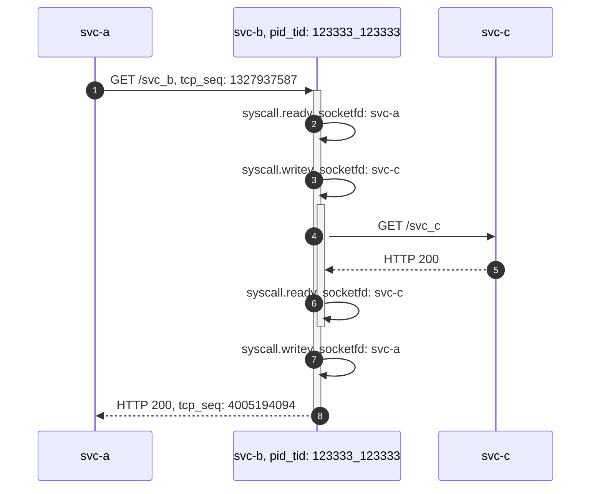

## 基于 eBPF 的链路跟踪


以下为某条链路中的三个服务的时序图，分别是服务 A，B 和 C。

其中服务 A 向服务 B 发起请求，在服务 B 接收到 A 的请求后向 C 发起了请求。

此时我们使用 eBPF 技术对操作 socketfd 的系统调用函数进行系统层面的跟踪（网络层面可创建 PF_PACKET 原始套接字分析链路层的网络包）。

可以在上述服务对应的进程运行过程中采集到 4 个 span，每个请求将在服务端和客户端产生一对可关联的 span 。

在不使用 uprobe 技术修改用户空间进程的内存的情况下，我们可以在客户端和服务端采集如包含 HTTP 请求头的数据包的 tcp 序列号（作为服务端采集的是对上一个数据包的确认号）、包含响应头的数据包的 tcp 序列号（作为客户端采集的是对上一个数据包的确认号），并以此生成基于 TCP 协议的应用层协议的网络请求的跟踪 id ，以此实现请求的调用关系。

如果需要与应用侧的链路进行关联，我们可以让 eBPF 实现的链路继承请求头中包含的应用侧 trace id。

同时我们通过 fd，cpuid，线程 id，自系统启动经过的时间以及一个随机数等来生成线程内的跟踪 id，实现线程内 span 的父子关系的关联。





## 对 eBPF 生成的 span 建立关联

根据上述实现，每个 eBPF span 在实现关联时需要的基础字段有：

```notset
net_trace_id:    网络跟踪 id，可根据请求 seq、响应 seq 等生成。
direction:       以进程本身为参考系，确定请求的调用关系。

thread_trace_id: 在进程中的对请求处理过程的线程跟踪 id。
ebpf_span_type:  通常 direction 为 in 的作为 entry span，
                 此时同线程跟踪 id 的其他 span 作为子 span。

ebpf_span_id:    可在中心进行 eBPF span 关联时生成。
ebpf_trace_id:   查找到 eBPF 链路的 root span 时生成，并向后传播到其他 span。
```

以下为用于链接 eBPF span 的服务端框架图：


我们可使用 SQLite 存储 span 时的数据读写、使用主机内存的 span 链接：

假设设置窗口大小为 1min, 在服务端启动在获取到两个窗口长度的数据后开始链接 span 生成 trace id、parent id 等，并上传第一个窗口的 span；

把第二个窗口的剩余的 span 数据作为第一个窗口，一段时间后再取下一个窗口的数据并进行 span 的链接。

由于内存中存在两个窗口的 span 链接用元数据，span 越多，内存占用越大，支持的链路的最大持续时间越长，范围 `[window ~ 2*window)`

```mermaid
  gantt
      title      Insert&Select timeline
      dateFormat HH:mm
      axisFormat %H:%M

      section  Insert Span
      Span order by time : a1, 17:00 , 8m

      section Select Span
      span 1min && span 2min : b1, 17:00, 2m
      span 3min : b2, 17:02, 1m
      span 4min : b3, 17:03, 1m
      span 5min : b3, 17:04, 1m
      span 6min : b3, 17:05, 1m
      span 7min : b3, 17:06, 1m

```



