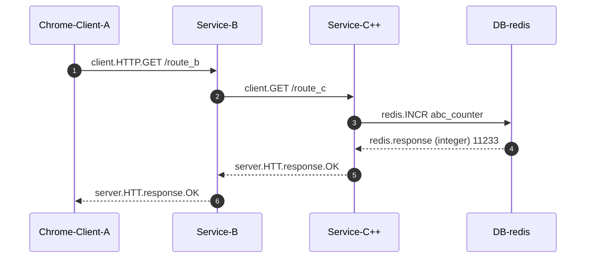
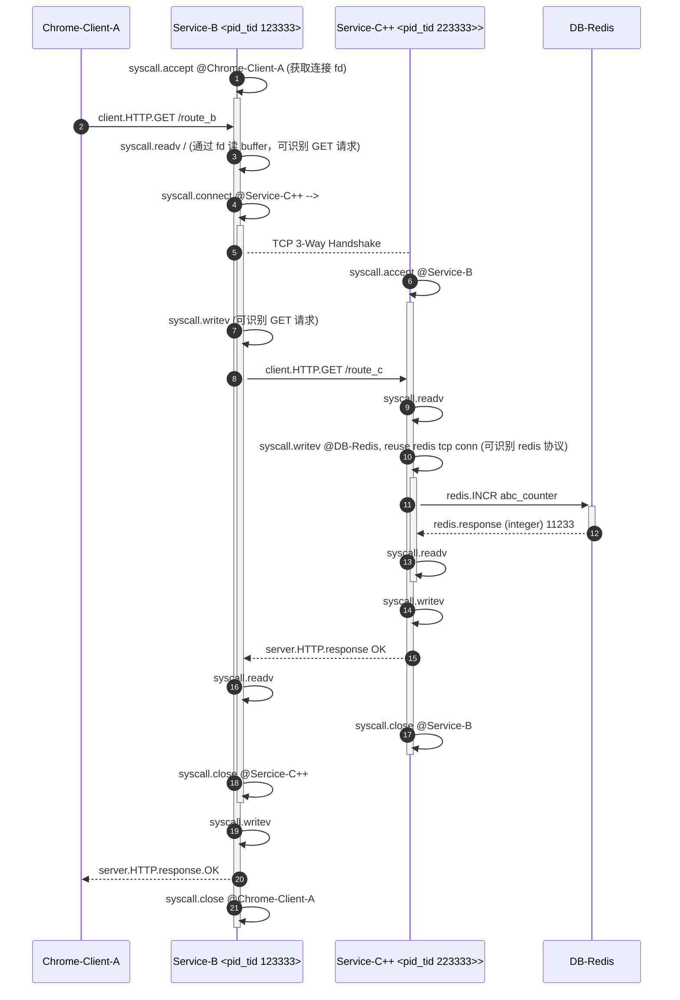
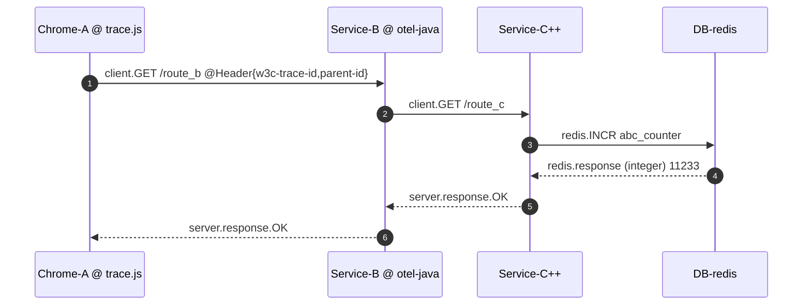
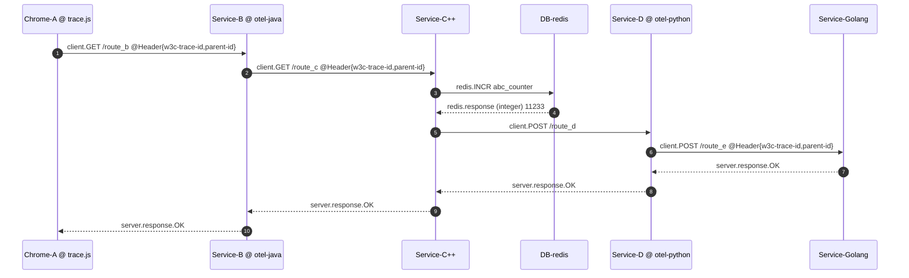

## 背景

1. 使用 eBPF 技术实现无需手动插桩的链路

2. 使用 eBPF 技术实现无插桩服务的与有插桩服务的关联

3. 支持使用白名单/黑名单机制对需要的进程放置探针，标签可以是 K8s annotations 、进程名或PID

以下为几个可能的服务模型：

1. 无任何非eBPF探针放置在任何服务上时，不会生成链路的情况下，通过 eBPF 实现链路：



我们对 `recvfrom`, `sendto`, `readv` 等对 socket fd 操作的 syscall 函数进行插桩，用于获取请求、响应的 payload，对 `accept`, `connect`, `close` 等系统调用进行跟踪，用于分析客户端和服务端进程上的 TCP 连接的生命周期；

根据协议特点分析请求的完整生命周期；如对于 HTTP，Keep-Alive 可通过读写的翻转判断请求是否完成，Pipelining 不考虑实现；

以下为 Service-B 和 Service-C++ 的具体线程的模型：



如图所示，对于服务 `Serice-C++` 和 `Service-B`，每个服务都会产生两个 eBPF 未链接的链路上网络流（视为 Span）行协议数据的部分主要字段(全部视为 field )示例:

- `Service-B`

```noset
// appflow as span

Span_1 <appflow> {
      service: Service-B
      
      resource:  /route_b
      operation: server.HTTP.GET

      start:    10000
      duration: <xxx>
      
      is_entry: true

      // TCP sequence numbers are used to link `Span`(usually is the next entry span) spawned from other processes
      req_tcp_seq:   1122xxxxxxxx
      resp_tcp_seq:  5566xxxxxxxx
      src_ip:        10.10.1.1
      src_port:      80
      dst_ip:        107.21.56.3
      dst_port:      45543

      // Used to link `Span` spawned from current process/thread
      process_ebpf_traceid: is_entry ? gen_app_probe_trace_id(pid, tid, fd<entry>, random32) : use_entry_process_ebpf_traceid(pid, tid)

      pid:           123333
      tid:           123333
      process_name:  server-b

      trace_protocol_provider: datakit-ebpf
}


Span_2 <appflow> {
      service: Service-B
      
      resource:  /route_c
      operation: server.HTTP.GET

      start:    10100
      duration: <xxx>
      
      is_entry: false


      // 可能需要开启 ebpf-conntrack 功能，查看过 NAT 前后的真实 ip/port
      // 因为 4 层的连接和网卡实际数据包上看到的 ip/port 可能不一致
      // 如果内核开启 conntrack 模块，需要考虑开启这个 eBPF 插件

      req_tcp_seq:   2233xxxxxxxx
      resp_tcp_seq:  9922xxxxxxxx
      src_ip:        10.10.1.1
      src_port:      23314
      dst_ip:        10.10.1.2
      dst_port:      8080

      process_ebpf_traceid: is_entry ? gen_app_probe_trace_id(pid, tid, fd<entry>, random32) : use_entry_process_ebpf_traceid(pid, tid)

      pid:           123333
      tid:           123333
      process_name:  server-b

      trace_protocol_provider: datakit-ebpf
}
```

- `Service-C++`

```noset
Span_3 <appflow> {
      service: Service-C++
      
      resource:  /route_c
      operation: server.HTTP.GET

      start:    10200
      duration: <xxx>
      
      is_entry: true

      req_tcp_seq:   2233xxxxxxxx
      resp_tcp_seq:  9922xxxxxxxx
      src_ip:        10.10.1.2
      src_port:      8080
      dst_ip:        10.10.1.1
      dst_port:      23314

      process_ebpf_traceid: is_entry ? gen_app_probe_trace_id(pid, tid, fd<entry>, random32) : use_entry_process_ebpf_traceid(pid, tid)

      pid:           223300
      tid:           223302
      process_name:  server-cpp

      trace_protocol_provider: datakit-ebpf
}

Span_4 <appflow> {
      service: Service-B
      
      resource:  `INCR abc_counter`
      operation: client.redis.INCR

      start:    10220 
      duration: <xxx>
      
      is_entry: false

      req_seq:   3311xxxxxxxx
      resp_seq:  8899xxxxxxxx
      src_ip:        10.10.1.2
      src_port:      33311
      dst_ip:        10.10.1.100
      dst_port:      6379

      process_ebpf_traceid: is_entry ? gen_app_probe_trace_id(pid, tid, fd<entry>, random32) : use_entry_process_ebpf_traceid(pid, tid)

      pid:           223300
      tid:           223302
      process_name:  server-cpp

      trace_protocol_provider: datakit-ebpf
}
```

2. 仅客户端 `Chrome-A` 和 放置 OTEL 探针，会出现以 `Client-A` 为根 Span 的链路：



此时，如果我们开启白名单机制，只对 `Service-C++` 采集的 appflow 进行上报时，由于在 `Service-C++` 接收到的 HTTP 请求头上存在 w3c trace_id 和 parent_id， 此时在对于 `Span_1` 会增加以下信息

```noset
Span_1 {
      ...

      app_trace_id: traceid-1a232xxx1dsadas3123lfsdfkdsf
      app_parent_id: parentid-12ddkaa2asdasds
      ...
}
```

3. **待定**：仅仅服务 `Service-C++` 和 `Service-Golang` 没有放置非 eBPF 探针，会出现两条链路，分别是以 `Client-A` 为根 Span 和 `Service-D` 为根 Span 的链路：



## Server 端的 eBPF Span 链接及应用侧 Trace ID 继承策略

现在有 `Span_1`, `Span_2`, `Span_3`, `Span_4`：

1. 对于模式 1：

   - 进程内： 其中 `Span_1` 和 `Span_2` 在同一进程的同一线程， `Span_3` 和 `Span_4` 在另一进程； 我们通过 `process_ebpf_traceid` 内部线程的跟踪 id 和 `start` 时间确定，这个如来自浏览器等的请求，在进程内的 entry span 下的各个子 span 的并列关系（进程内孙 span 与 entry span 的子 span 的父子关系涉及到请求生命周期的嵌套，需要结合 fd 等关联，当前只是最简单模型）。

   - 跨进程：服务 `Service-B` 的 `Span_2` 和服务 `Service-C++` 的 `Span_3` 可以通过 eBPF 采集的应用流数据中的 `ip + port + requset tcp seq + direction` 实现跨进程关联。

   - 在建立链路关系后，生成 trace/span id，其中 `Span_2` 的 span_id 作为 `Span_3` 的 parent_id

2. 对于模式 2：

   由于 `Chrome-A` 在 HTTP 的请求头上传递了 trace-id 和 parent-id 到  `Service-B` 上，此时 `Span_1` 上记录了来自请求头上的 trace-id 等信息
   
   在链接 span 完成后，**将 trace_id 赋予所有的 eBPF span**，并将 parent span id 赋予 `Service-B` 的 **`Span_1` 这个 entry span**。


**ID 继承策略**：

如果当前 span 有应用侧 trace_id 和 parent_id，则使用应用侧的 trace_id 和 parent_id，但如果前一个 span 有继承 trace_id(app) 和 parent_id 的行为，则使用前一个的 trace_id，并将其的 span_id 作为 parent_id。

我们记录三种 trace_id： `ebpf_trace_id`, `app_trace_id` 和 `trace_id`

## Server 端实现方案

存储上使用 sqlite，在写入相对于当前时间的一定时间跨度的数据后，进行按时间排序读取

假设设置滑动窗口大小为 1min，一个 span 在后 1min 没有任何关联数据时，直接上报；

当数据库写入 3min 中数据后，在第 3 min 开始查询最开始的 第 1, 2 min 数据，并将第 1 min 的数据上传到中心，在第 4 min 查询第 3 min 的数据，并上传第 2 min 的数据。这里只查当前时间减去 1 min 开始的数据的原因是 eBPF 采集上报数据可能不及时。

窗口越大，内存占用越大，eBPF 支持的链路的最大持续时间越长范围 `[window ~ 2*window)`

```mermaid
gantt
      title      SQLite Insert&Query timeline
      dateFormat HH:mm
      axisFormat %H:%M

      section  Insert Span
      Span order by time : a1, 17:00 , 20m

      section Select Span
      SELECT, start_time < current_time - 1 min, total 2 min data : milestone, m1, 17:03, 
      span 1-2min : b1, 17:00, 2m
      span 3min : b2, 17:02, 1m
      span 4min : b3, 17:03, 1m
      span 5min : b3, 17:04, 1m
      span 6min : b3, 17:05, 1m
      span 7min : b3, 17:06, 1m

```



sqlite 只做存储和 span 的查询时的按开始时间排序

我们在内存中通过 hashmap 做 span 的关联