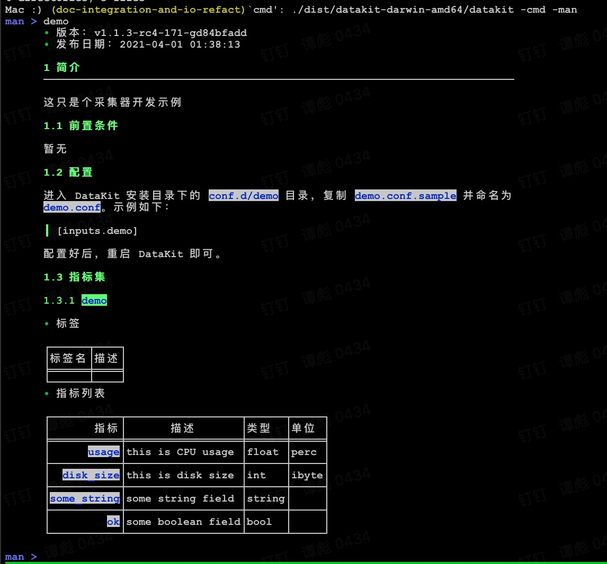

# DataKit 文档集成

将 markdown 文档模板置于  `datakit/man/manuals` 目录下，将其命名为 `<input-name>.md`，示例：

```markdown
- 版本：{{.Version}}
- 发布日期：{{.ReleaseDate}}

# 简介

这只是个采集器开发示例

## 前置条件

暂无

## 配置

进入 DataKit 安装目录下的 `conf.d/{{.InputName}}` 目录，复制 `{{.InputName}}.conf.sample` 并命名为 `{{.InputName}}.conf`。示例如下：

	{{.InputSample}}

配置好后，重启 DataKit 即可。

## 指标集

{{ range $i, $m := .Measurements }}

### `{{$m.Name}}`

-  标签

{{$m.TagsMarkdownTable}}

- 指标列表

{{$m.FieldsMarkdownTable}}

{{ end }}
```

注意：

- _<input-name>.md_ 必须跟对应采集器名字**严格对应**
- 对应采采集器需实现 `SampleMeasurement()` 接口（参见 `plugins/inputs/measurement.go`）
- 需安装 [packr2](https://github.com/gobuffalo/packr/tree/master/v2#binary-installation) 工具将 Markdown 模板打包进 DataKit 二进制中

编译完 datakit 后，即可运行

```shell
./dist/datakit-darwin-amd64/datakit -cmd -man
```

进入交互式界面，输入采集器名字，即可看到对应的 markdown 输出：


