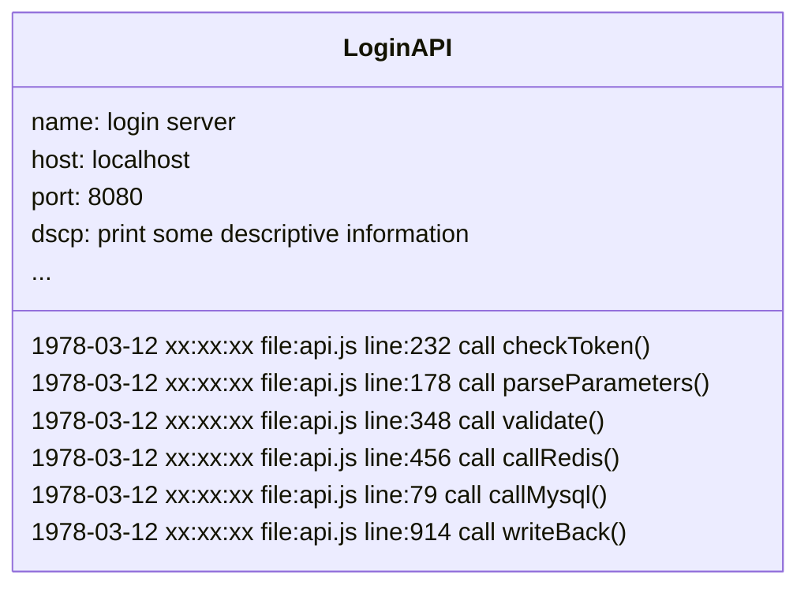
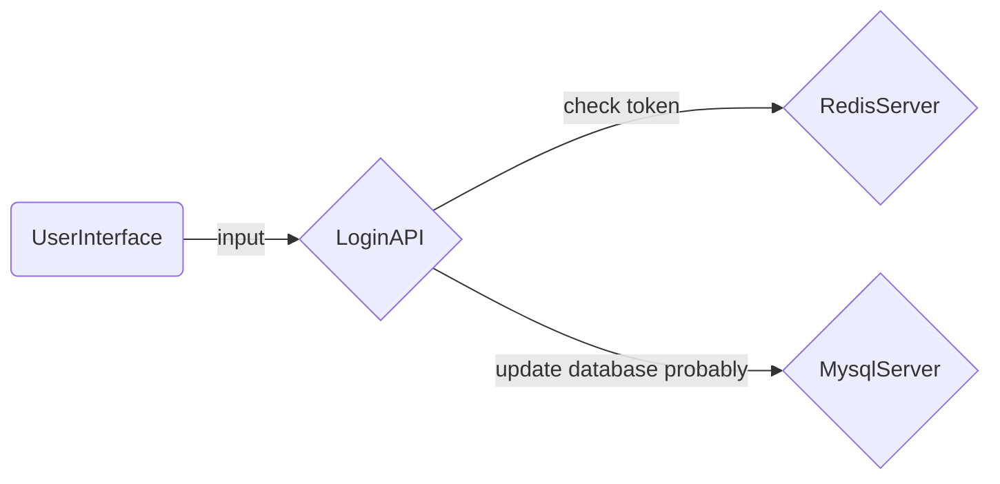

<!-- This file required to translate to EN. -->
# 程序循迹系统（Tracing）简述 {#intro}

程序日志是代码执行过程的面包屑，寻找这些面包屑不但可以找到隐藏在代码中的 Bug:fontawesome-solid-bug: 更重要的是连续的程序日志循迹提供了一种构建程序执行过程可观测的途径。

## 从日志讲起 {#log}

> 有且只有日志文件

在循迹系统出现之前我们唯一获取系统运行状况的途径只能通过本地日志，`实际上在循迹系统之前日志服务经历的好几代不同类型产品的迭代`。

通过将标准输出和标准错误输出定位到一份本地文件并借助神奇的操作系统的力量，理想情况下我们可以得到一份绵绵不绝的程序执行日志。只要系统不崩溃不出现单点错误没有进程打断你的文件写入流，你总能拿到一份进程的执行过程文件并能在超大的文件里搜索到你关心的事件。

## 在可循迹之前 {#befor}

> 日志服务器

程序日志对于程序之重要性催生了独立的日志服务器。是的不必在担心 SPoF 了，日志服务器守候在固定的端口上持续不断的记录进程送过来的程序日志。

在日志服务器的早起阶段它们的工作方式更像是文件服务器，只是操作界面从终端变成了浏览器，可用来检索的日志从单个程序变成了多个程序。但是记录的日志还是那个日志那个一堆一堆的进程执行顺序记录，如下模拟了一个登陆服务器上的日志。

在日志文本中只能看到都孤立的程序事件，而对于了解程序运行状态则是很难从一份执行文档中获得。在文件服务器的后期阶段出现了专门用于日志查看的 UI 和一系列的程序运行环境状态参数，这个阶段的日志服务更像是一个基于日志文件建立的数据库服务，是的你可以更加顺畅的搜索你关心的程序事件了。

## 循迹系统 {##tracing}

> 可观测的崛起

程序循迹系统并不是更高级日志服务它甚至不属于日志范畴，但是它是真正的面包屑。循迹系统会在进程执行过程中产生执行状态数据结构（Span）随着处理流的步步推进大量的 Span 按照其执行顺序连接起来就形成了当前进程的链路（Tracing），多个进程按照其调用顺序连接起来就形成了当前系统的执行状态的可观测。

还是以一个虚构的登录服务为例：

上图只展示了多进程下循迹系统产生的链路图，实际上循迹系统中你同样可以看到像日志一样每一个执行过程的状态，如果你想你可以自定义上报的状态数据结构（Span）中的每一个字段并赋予它们意义。循迹系统并不是用来 Deug 的 `当然 Bug 在循迹系统中无可遁形`，循迹系统通过详尽的描绘系统运行状态来发现系统问题，从而提供一种正反馈机制来推动版本迭代不断的完善系统。

循迹系统主要解决两个层面的问题

`如何收集状态数据`

: 基于被监测系统实现所依赖的技术栈市场上常见的[循迹系统解决方案](#循迹系统解决方案)都提供全自动的数据采集和手动的数据采集方式。通过监测程序的运行时来完成系统循迹例如：NodeJS，JAVA，C# 等，所有基于这类技术栈的系统实现都可以进行全自动的系统循迹。同时循迹系统为所有技术栈提供了 Tracing Library 让我们可以通过在项目中引入依赖并进行简单的代码编辑的方式进行全手动的系统循迹。

`如何组织状态数据`

: 程序执行过程中天然的调用和被调用关系使市场上所有的循迹系统都将状态数据结构定义以父子的关系串联起来。使用 ParentID 和 ID 将调用者和被调用者产生的 Span 进行关联。在同一个进程里不同的调用过程（这里包括并发环境下的线程）通过传递包含了调用者 ID 的上下文（context）将父过程和子过程连接起来；在不同的进程间调用者通过将包含了自己 ID 的上下文在不同的进程间发送（通过网络或通过管道等可以夸进程的通讯）将父进程和子进程关联起来。

## 循迹系统解决方案 {#sln}

程序性能监控（APM）市场上程序循迹能力可以说是不可或缺的，以下简单介绍几种市场上常见的解决方案。

[DataDog](https://docs.datadoghq.com/tracing/)

: 目前最完备的 APM 解决方案提供商，为生产环境下的程序提供监控和深度可视化能力。为网络服务，消息队列，数据库提供开箱即用的性能监控仪表盘用于监控所有的程序事件。循迹链路数据可跨服务，跨容器的无缝关联到会话，日志，系统侧写，综合检测，网络，进程，以及系统基础指标集。在 DataDog 里你可以在调查一个因系统瓶颈造成的慢链路时直接定位造成此问题的代码上。

[Jaeger](https://www.jaegertracing.io/docs/)

: Jaeger 是一个开源的分布式的程序循迹系统，灵感来自 Dapper 和 OpenZipkin 由 Uber Technologies 发布，特别适合用于监控基于微服务架构的系统，并提供以下能力
:  - 分布式的上下文传播
:  - 分布式的事务监控
:  - 追根溯源的分析能力
:  - 服务依赖分析
:  - 性能优化
: 如果对 Jaeger 感兴趣可以参考 Uber 技术团队的[内部实践](https://www.uber.com/blog/distributed-tracing/)。

[OpenTelemetry](https://opentelemetry.io/docs/)

: OpenTelemetry（OTeL）是一个基于第三方循迹协议开发的开源程序可视化框架提供检测，生成，收集和泵出监控数据例如循迹链路，指标集，日志等。作为行业标准它被很多服务提供商原生支持。

[Skywalking](https://skywalking.apache.org/docs/)

: Skywalking 是一个开源的 APM 系统，为分布式云栖系统提供包括监控，循迹，诊断等能力，核心能力如下。
: - 服务端指标集分析
: - 追根溯源的分析能力
: - 服务拓扑分析
: - 服务依赖分析
: - 慢服务发现
: - 性能优化
: - 缓存监控，读写性能和慢访问发现
: - 数据库监控，慢查询发现
: - 消息队列性能监控
: - 浏览器性能检测，根追踪能力
: - 基础设施监控为主流云商提供支持
: - 系统告警

[Zipkin](https://zipkin.io/pages/quickstart.html)

: Zipkin 是一个分布式循迹系统用于收集时序化数据来完成系统监控和发现服务级别的系统问题。Zipkin 提供了包括收集数据和数据查询一体的解决方案，你可以基于一个 TraceID 在 Zipkin 的 UI 直接从日志跳进链路并提供基于多样化数据的检索能力。

[Datakit](https://docs.guance.com/datakit/datakit-tracing/)

: 不同于以上几种循迹系统，Datakit 提供的解决方案本身并不产生任何程序执行状态数据（Span）也不会改变数据组织形态。Datakit 监听在网络端口上接收各大主流循迹系统发送的链路数据。Datakit 的循迹模块不仅仅提供开箱即用的能力同时几乎是零配置的，使用者可以从任何其他循迹系统中无摩擦的过度到 Datakit 中。

: Datakit 是一个链路数据处理&分析网络服务，作为一个网络应用 Datakit 具备以下特点

: - Datakit 可以持续处理高负荷的流量数据，Datakit 内部使用的多路本地缓存技术在实践中面对淹没级别的链路数据也能维持在一个低 CPU 负载的情况下良好运行。
: - Datakit 可以持续工作在高并发的网络请求环境中，Datakit 内部使用了访问策略和线程池来应对高并发的网络请求并能将 CPU 负载控制在较低的范围。
: - Datakit 可以无摩擦对接目前市场上多种主流循迹系统并还在不断扩充中。

: 作为一个分析运算工具 Datakit 具备以下特点

: - 高度灵活的可配置，你可以在零配置的情况下就使用 Datakit 的链路数据能力也可以通过简单的配置定制化的开启 Datakit 提供的包括采样，稀有链路拾取，资源关闭在内的多种链路计算能力。
: - 高效且分布式一致的采样算法。
: - 数据处理前段多种数据处理 Filter 满足日常数据处理需求。
: - 数据处理后段 Pipeline 支持，你可以借助[观测云提供的强大的 Pipeline 脚本](https://docs.guance.com/logs/pipelines/text-processing/)在数据发送到中心之前就对数据进行定制化。

## 总结 {#conclude}

循迹系统提供的是一种系统执行状态多维度深层次的可视化能力，在改变了系统维护开发形态的同时极大的降低了开发运维成本并能提供各种分析工具用来发现系统瓶颈为后续系统版本迭代提供了宝贵的线索。
