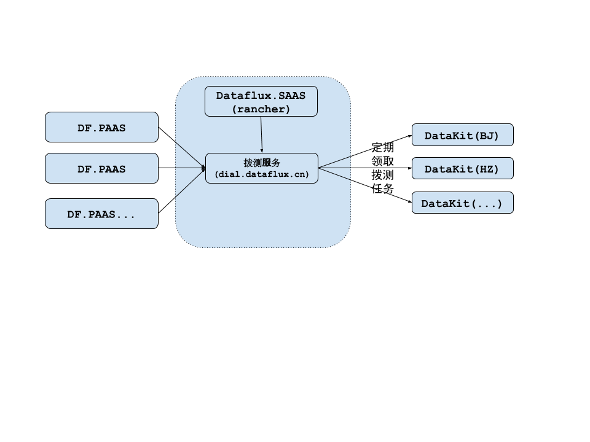

# 网络拨测功能定义

全局定义：

- 所有拨测产生的 **数值数据**，都以行协议方式，通过 `/v1/write/metric` 接口存为指标数据
- 所有拨测产生的 **描述数据**，都以行协议方式，通过 `/v1/write/logging` 接口存为日志数据
	- 所有日志数据均需要一个 `status` 字段，故建议按照不同的协议（HTTP/TCP等），依据拨测结果，来确定 `status` 字段
	- `status` 可用列表，参见[这里](https://gitlab.jiagouyun.com/cloudcare-tools/datakit/-/blob/dev/plugins/inputs/dev.md#fields)
- 所有标记为 `*` 的字段都是必填字段

## HTTP 拨测任务定义

```python
{
	* "url": "http://example.com/some/api",
	* "method": "POST",
	* "external_id": "外部系统中给该任务定义的 ID"

	# 拨测数据的存放地址，对 SAAS 而言，是 openway.guance.com
	# 对 PAAS 而言，需要一个单独的公网可访问的 Dataway。这里的 token
  # 对 SAAS/PASSS 而言，实际上隐含了工作空间信息
	* "post_url": "https://dataway.cn?token=tkn_xxx",

	# 任务状态(OK/stopped)
	"status": "OK", 

	"name": "任务命名",
	"tags": {
		"tag1": "val1",
		"tag2": "val2"
	},

	* "frequency": "1m",   # 1min ~ 1 week

	# 区域：冗余字段，便于调试
	* "regions": "beijing",
	
	"advance_options": [{
		"request_options": {
			"follow_redirect": true,
			"headers": {
				"header1": "value1",
				"header2": "value2"
			},
			"cookies": "",
			"auth": {
				"username": "",
				"password": ""
			}
		},
		"request_body": { 
			"body_type": "text/plain|application/json|text/xml", # 以下几个类型只能单选 或者为空
			"body": ""
		},
		"certificate": {
			"ignore_server_certificate_error": false,
			"private_key": "",
			"certificate": ""
		},
		"proxy": {
			"url": "",
			"headers": {
				"header1": "value1"
			}
		}
	}],

	* "success_when":  [ 
		{

			# body|header|response_time|status_code 都是单个判定条件，它们各自出现的时候，表示 AND 的关系

			"body":{},
			"header": {
				"header-name":{ # 以下几个条件只能单选
					"contains":"",
					"not_contains": "",
					"is": "",
					"is_not": "",
					"match_regex": "",
					"not_match_regex": ""
				},
				"another-header-name": {"..."},
			},
			"response_time":  "100ms",
			"status_code": { # 以下几个条件只能单选
				"is": "200",
				"is_not": "400",
				"match_regex": "ok*",
				"not_match_regex": "*bad"
			}
		},
		
		{
			"AND_another_assert": "..."
		}
	]
}
```

### HTTP 拨测结果数据结构定义

#### 日志

```python
{
	"measurement": "http_dial_testing",
	"tags": { # 基本跟指标数据一样
		"name": "",
		"url": "",
		"用户额外指定的各种": "tags",

		# 每个具体的 datakit 只会在一个 region，故这里只有单个值
		"region": "",

		"status": "OK", # 只有 OK/FAIL 两种状态，便于分组以及过滤查找

		# HTTP 协议版本，HTTP/1.0 HTTP/1.1 等
		"response_dns":  1000 #DNS解析时间,单位 us
		"response_connection": 1000#连接时间（TCP连接）,单位 us
		"response_ssl":  1000#SSL连接时间,单位 us
		"response_ttfb": 1000 #首次回包时间（请求响应时间）,单位 us
		"response_download": 1000 #下载时间,单位 us
		
		"status_code_class": "2xx",
		"status_code_string": "OK"
		"status_code": "200"
		
	},

	"fields": {
		# HTTP 相应时间, 单位 ms
		"response_time": 300,
		"proto": "HTTP/1.0"

		# 返回 body 长度，单位字节。如无 body，则无此指标，或者填 0
		"response_body_size": 1024,

		# 只有 1/-1 两种状态, 1 表示成功, -1 表示失败, 便于 UI 绘制状态跃迁图（TODO: 现在前端图标支持负数么）
		"success": 1,

		# 其它指标可再增加...

		### 在指标数据的基础上，增加如下数据
		"message": "便于做全文: 包括请求头(request_header)/请求体(request_body)/返回头(response_header)/返回体(response_body)/fail_reason 冗余一份",
		"fail_reason": "拨测失败原因(此处无需做全文)",
	},

	"time": time.Now() 
}
```

注意，这里的 `fail_reason` 要描述 `body/header/response_time/status_code` 各自失败的原因。如果可以，所有原因都描述一遍，如 `response time larger than 100ms; status code match regex 4*`

- 请求失败才记录 header/body，body 可截断（最大 32KB）
- 请求成功只记录 body size（如果有 body）

## TCP 拨测任务定义

```python
{
	"id": 12345,                       # 拨测任务 SN
	"uuid": "dialt_xxxxxxxxxxxxxxxxx", # 拨测任务 ID
	"host": "www.example.com",
	"port": "443",
	"name": "give your test a name",

	# 拨测数据的存放地址，对 SAAS 而言，是 openway.guance.com
	# 对 PAAS 而言，需要一个单独的公网可访问的 Dataway
	"post_url": "https://dataway.cn?token=tkn_xxx",

	# 用于更新任务时，停止执行
	"stop": false, 

	"tags": {
		"tag1": "val1",
		"tag2": "val2"
	},

	"frequency": "1m",   # 1min ~ 1 week

  ###############
	# 区域
  ###############

	# 对 push 端而言，可多选
	"regions": ["hangzhou", "beijing", "chengdu"],

	# 对 pull 端而言，只能单选
	"region": "hangzhou"

	"success_when":  [
		{
			"response_time": {
				"less_than": "100ms"
			}
		}
	]
}
```

### TCP 拨测行协议定义

```python
{
	"measurement": "tcp_dial_testing",
	"tags": {
		"name": "",
		"host": "",
		"port": "",
		"用户额外指定的各种": "tags",

		# 每个具体的 datakit 只会在一个 region，这里只有单个值
		"region": "",

		"result": "OK", # 只有 OK/FAIL 两种状态，便于分组以及过滤查找
	},

	"fields": {

		# 如失败，如实描述。如成功，无此指标
		"fail_reason": "字符串描述失败原因"

		# TCP 连接建立时间, 单位 ms
		"dial_time": 30,

		# 域名解析时间，单位 ms
		"resolve_time": 30,

		# 只有 1/-1 两种状态, 1 表示成功, -1 表示失败
		"success": 1,

		# 其它指标可再增加...
	}

	"time": time.Now()
}
```

## DNS 拨测任务定义

```python
{
	"id": 12345,                     # 拨测任务 SN
	"uuid": "dialt_xxxxxxxxxxxxxxxxx", # 拨测任务 ID
	"domain": "www.example.com",
	"dns_server": "",
	"name": "give your test a name",

	# 拨测数据的存放地址，对 SAAS 而言，是 openway.guance.com
	# 对 PAAS 而言，需要一个单独的公网可访问的 Dataway
	"post_url": "https://dataway.cn?token=tkn_xxx",

	# 用于更新任务时，停止执行
	"stop": false, 

	"tags": {
		"tag1": "val1",
		"tag2": "val2"
	},

	"frequency": "1m",   # 1min ~ 1 week
	"regions": ["hangzhou", "beijing", "chengdu"],

	"success_when":  [
		{
			"response_time": {
				"less_than": "100ms"
			},
			"at_least_one_record": {
				"of_type_a": {
					"is": "",
					"contains": "",
					"match_regex": "",
					"not_match_regex": ""
				},
				"of_type_aaaa": {},
				"of_type_cname": {},
				"of_type_mx": {},
				"of_type_txt": {}
			},
			"every_record": {}
		},
		{
			"AND_another_assert": "..."
		}
	]
}
```

关于 DNS 的各种 [`of_type_xxx`](https://support.dnsimple.com/categories/dns/)

### DNS 拨测行协议定义

```python
{
	"measurement": "dns_dial_testing",
	"tags": {
		"name": "",
		"domain": "",
		"dns_server": "",
		"用户额外指定的各种": "tags",

		# 每个具体的 datakit 只会在一个 region，故这里只有单个值
		"region": "", 
		"result": "OK", # 只有 OK/FAIL 两种状态，便于分组以及过滤查找
	},

	"fields": {

		# 如失败，如实描述。如成功，无此指标
		"fail_reason": "字符串描述失败原因"

		# DNS 响应时间, 单位 ms
		"response_time": 30,

		# 只有 1/-1 两种状态, 1 表示成功, -1 表示失败
		"success": 1,

		# 其它指标可再增加...
	},
	"time": time.Now()
}
```

## 架构设计

### 整体架构设计



术语定义：

- dialtesting：拨测服务的中心服务器，它提供一组 HTTP 接口，供授信的第三方推送拨测任务
- datakit: 实际上是 datakit 中开启了具体的拨测采集器，此处统称 datakit，它跟线上的其它 datakit 没有实质区别
- commit: 具体任务的 JSON 描述，它可以维护在 DataFlux 的 MySQL 中，也可以是一个简单的 JSON 文件。commit 和拨测任务之间是 N:1 的关系，即一个拨测任务可以有多个 commit
- push: 任何授信的第三方（dataflux, curl 等），都能通过 HTTP 接口，往 dialtesting **推送**拨测任务
- clone: datakit 上采集器初次启动时，从中心同步**指定 region 上所有任务的 commit**
- pull: datakit 以一定的频率，从中心拉取特定 region 上**最新**的 commit
- region: 拨测服务可能在全球设置 datakit 拨测节点，一个节点就是一个 region。一个节点可能有多个 datakit 参与，此处可设置一定的负载均衡策略（如全量 clone，但等分运行）
- fork: 每个拨测任务可选择在**一个或多个 region**，假定选择了 3 个 region，实际上是该拨测任务的 3 个 fork

### 数据库表定义

```sql
-- 存储拨测任务信息
CREATE TABLE `task` (
  `id` int(16) NOT NULL AUTO_INCREMENT COMMENT '自增 ID',
  `external_id` varchar(128) NOT NULL COMMENT '外部 ID',
  `region` varchar(48) NOT NULL COMMENT '部署区域（只能有一个区域）',
  `class` enum("HTTP", "TCP", "DNS", "OTHER") NOT NULL DEFAULT "OTHER" COMMENT '任务分类',
  `task` text NOT NULL COMMENT '任务的 json 描述',
  `createAt` bigint(16) NOT NULL DEFAULT '-1',
  `updateAt` bigint(16) NOT NULL DEFAULT '-1',
  PRIMARY KEY (`id`),
  UNIQUE KEY `idx_hash` (`hash`) COMMENT '便于鉴定重复推送',
  UNIQUE KEY `uk_uuid` (`uuid`) COMMENT 'UUID 做成全局唯一'
) ENGINE=InnoDB  DEFAULT CHARSET=utf8mb4;

-- 存储 AK/SK 信息
 CREATE TABLE IF NOT EXISTS aksk (
     `id` int(11) NOT NULL AUTO_INCREMENT COMMENT '自增 ID',
     `uuid` varchar(48) NOT NULL COMMENT '全局唯一 ID，带 aksk_ 前缀',
     `accessKey` varchar(20) NOT NULL COMMENT '推送 commit 的 AK',
     `secretKey` varchar(40) NOT NULL COMMENT '推送 commit 的 SK',
     `owner` varchar(128) NOT NULL COMMENT 'AK 归属',
	 `status` enum('OK', 'DISABLED') NOT NULL DEFAULT 'OK' COMMENT 'AK 状态',

     `version` int(11) NOT NULL DEFAULT 1 COMMENT 'AK 版本，便于 AK 验证方式变更（not used）',

     `createAt` int(11) NOT NULL DEFAULT '-1',
     `updateAt` int(11) NOT NULL DEFAULT '-1',
     PRIMARY KEY (`id`),
     UNIQUE KEY `uk_uuid` (`uuid`) COMMENT 'UUID 做成全局唯一',
     UNIQUE KEY `uk_ak` (`accessKey`) COMMENT 'AK 做成全局唯一',
     UNIQUE KEY `uk_sk` (`secretKey`) COMMENT 'SK 做成全局唯一'
     ) ENGINE=InnoDB DEFAULT CHARSET=utf8mb4;
```

### 服务中心 API 定义

#### `/v1/list/region | GET`

获取可用的 region 列表

```
GET /v1/list/region HTTP/1.1
Authorization: DIAL_TESTING <access_key>:<sign>

HTTP/1.1 200 OK

{
	"content": {
		"regions": ["beijing", "hangzhou"]
	}
}
```

#### `/v1/push/:type | POST`

此处 type 支持 `http/https/tcp/dns` 这几种

```
POST /v1/push HTTP/1.1
Authorization: DIAL_TESTING <access_key>:<sign>
Content-Type: application/json

<具体的 task-json>

HTTP/1.1 200 OK  # 无 body 返回
```

#### `/v1/pull | GET`

参数：

- `region`：必填参数，指定拉取区域
- `since`：可选参数，如不填，则拉取指定区域的所有任务（clone）。否则拉取 `update-time >= since` 的所有任务（pull）

示例：

```
GET /v1/pull?region=<region>&since=<us-timestamp> HTTP/1.1
Authorization: DIAL_TESTING <access_key>:<sign>  // 某 PAAS 平台的 AK

HTTP/1.1 200 OK
{
	"http": [ {"http-task"} ] ,
	"tcp":  [ {"tcp-task"} ],
	"dns":  [ {"dns-task"} ]
}
```

注意，datakit 作为客户端 pull 任务，也需通过 AK/SK 签名方式拉取

### 拨测任务策略

dialtesting 任务管理策略

- 任何经过认证的第三方，都可以往 dialtesting 推送（push）拨测任务
- 对任意一个已有任务的更新、删除等操作，都会创建一个新的任务提交（commit），**`id`，`uuud` 等均不同**。但对于同一个任务 commit 的 push，如果 hash 值不变，push 接口直接 200 返回，不会创建新的 任务 commit

说明：

- 解耦考虑：DataFlux 也好，其它第三方也罢，可以各自维护一套自己的拨测任务逻辑，用以管理其拨测任务。比如，SAAS 某工作空间，新建了一个拨测任务 A，在 SAAS 平台，A 可能是 MySQL 中的一条表记录；对 dialtesting 而言，A 只是 SAAS 本地任务的一个 commit，**尚未** push 到 dialtesting
- 便于部署：当 PAAS/SAAS 开通了拨测服务之后，即可将这些拨测任务 push 到 dialtesting 服务端。对于未开通拨测服务的平台，push 接口**应当**报错，但不影响具体 PAAS/SAAS 在 Web 前端提交新的拨测任务。一旦配置了 dialtesting 正确的授信信息，即可开通拨测服务（以 DataFlux 为例，可在拨测任务表中新增一列，代表是否 push 成功）
- 拨测服务暂定域名 `dialtesting.dataflux.cn`，基于跨域的考虑，拨测服务的 API 不会在 Web 页面发起
- 关于授信，可通过 AK/SK 等 API 签名的方式，故 dialtesting 应该提供完整的授权 API 以及开发文档，并尽可能提供常见语言的 SDK
- 关于 fork： 逻辑上，单个任务的多 region fork，多个 region 之间相互独立。当第三方关闭某 region 的 fork 时，比如，原来某任务 A 创建了 hangzhou/chengdu 两个 region 的 fork，但用户取消了 chengdu 的拨测任务后，理应会向 chengdu push 一个新的 commit，该 commit 中 task 的 `stop` 字段为 `true`

datakit 端任务处理流程

1. DataKit 采集器启动时，通过指定 region，从中心 clone 所有该 region 的任务。通过一定的合并策略，采集器**最终执行合并后的具体的任务**。合并策略：
	- 轮询一遍 clone 下来的所有 commit（如总共 10K 个 commit，其中**有效任务** 1K 个）
	- datakit 通过 `access_key + id` 确定一个任务 ID，并以此依据来合并多个 commit 为一个具体拨测任务
	- 结合ak,externalID，即可判定拨测任务是否更新

2. DataKit 采集器启动运行之后，以一定频率，从中心同步最新的任务。
	- 对于更新了配置的任务，直接更新执行（将新的任务 json 发给当前运行的 go routine 即可）
	- 对于删除的任务，停止执行
	- 对于新增的任务，新开任务执行
关于更新频率，可在初次 clone 时，由中心带下去，便于统一调整

### DataKit 配置

开启对应拨测采集器，其 conf 如下

```python
[[inputs.dialtesting]]

	# required
	region = "hangzhou" 

	# default dialtesting.dataflux.cn
	server = "https://dialtesting.dataflux.cn" 

	[[inputs.dialtesting.tags]]
	# 各种可能的 tag
```
